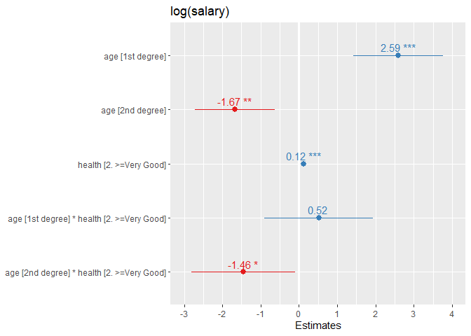

Visualization of regression models
================

Two-part tutorial
([part 1](https://www.youtube.com/watch?v=BNTn_f43U04),
[part 2](https://www.youtube.com/watch?v=wev5a3rwsvo)) by Yury Zablotski
on how to visualize a wide variety of regression models, including
linear, polynomial, logistic, multinomial, mixed models.

He works on the `Wage` data set that comes with the ISLR package. Only
1000 observations from the `Wage` package are sampled.

``` r
library(tidyverse)
library(broom)
library(gt)
library(ISLR)

set.seed(1)

d <- Wage %>% 
  sample_n(1000) %>% 
  rename(salary = wage)
```

# 1\. Simple linear model with one categorical predictor

1.  `effects::allEffects()` computes the mean values for each level of
    the categorical predictor
2.  `lm()` computes mean values for each level of a predictor relative
    to its first level
3.  enclosing`allEffects()` within `base::plot()` allows plotting of the
    mean of the various levels of the predictor

<!-- end list -->

``` r
# 1. simple linear model with one categorical predictor
cat1_m <- lm(salary ~ jobclass, d)

library(effects)

#`allEffects()` computes the mean at each level of the categorical predictor
# `lm()` computes the mean at each level of a predictor relative to its first level
cat1_m %>% allEffects() %>% names()
```

    ## [1] "jobclass"

``` r
cat1_m %>% allEffects() %>% pluck("jobclass") %>% as_tibble() %>% gt()
```

<style>html {
  font-family: -apple-system, BlinkMacSystemFont, 'Segoe UI', Roboto, Oxygen, Ubuntu, Cantarell, 'Helvetica Neue', 'Fira Sans', 'Droid Sans', Arial, sans-serif;
}

#ohoujcwyin .gt_table {
  display: table;
  border-collapse: collapse;
  margin-left: auto;
  margin-right: auto;
  color: #333333;
  font-size: 16px;
  font-weight: normal;
  font-style: normal;
  background-color: #FFFFFF;
  width: auto;
  border-top-style: solid;
  border-top-width: 2px;
  border-top-color: #A8A8A8;
  border-right-style: none;
  border-right-width: 2px;
  border-right-color: #D3D3D3;
  border-bottom-style: solid;
  border-bottom-width: 2px;
  border-bottom-color: #A8A8A8;
  border-left-style: none;
  border-left-width: 2px;
  border-left-color: #D3D3D3;
}

#ohoujcwyin .gt_heading {
  background-color: #FFFFFF;
  text-align: center;
  border-bottom-color: #FFFFFF;
  border-left-style: none;
  border-left-width: 1px;
  border-left-color: #D3D3D3;
  border-right-style: none;
  border-right-width: 1px;
  border-right-color: #D3D3D3;
}

#ohoujcwyin .gt_title {
  color: #333333;
  font-size: 125%;
  font-weight: initial;
  padding-top: 4px;
  padding-bottom: 4px;
  border-bottom-color: #FFFFFF;
  border-bottom-width: 0;
}

#ohoujcwyin .gt_subtitle {
  color: #333333;
  font-size: 85%;
  font-weight: initial;
  padding-top: 0;
  padding-bottom: 4px;
  border-top-color: #FFFFFF;
  border-top-width: 0;
}

#ohoujcwyin .gt_bottom_border {
  border-bottom-style: solid;
  border-bottom-width: 2px;
  border-bottom-color: #D3D3D3;
}

#ohoujcwyin .gt_col_headings {
  border-top-style: solid;
  border-top-width: 2px;
  border-top-color: #D3D3D3;
  border-bottom-style: solid;
  border-bottom-width: 2px;
  border-bottom-color: #D3D3D3;
  border-left-style: none;
  border-left-width: 1px;
  border-left-color: #D3D3D3;
  border-right-style: none;
  border-right-width: 1px;
  border-right-color: #D3D3D3;
}

#ohoujcwyin .gt_col_heading {
  color: #333333;
  background-color: #FFFFFF;
  font-size: 100%;
  font-weight: normal;
  text-transform: inherit;
  border-left-style: none;
  border-left-width: 1px;
  border-left-color: #D3D3D3;
  border-right-style: none;
  border-right-width: 1px;
  border-right-color: #D3D3D3;
  vertical-align: bottom;
  padding-top: 5px;
  padding-bottom: 6px;
  padding-left: 5px;
  padding-right: 5px;
  overflow-x: hidden;
}

#ohoujcwyin .gt_column_spanner_outer {
  color: #333333;
  background-color: #FFFFFF;
  font-size: 100%;
  font-weight: normal;
  text-transform: inherit;
  padding-top: 0;
  padding-bottom: 0;
  padding-left: 4px;
  padding-right: 4px;
}

#ohoujcwyin .gt_column_spanner_outer:first-child {
  padding-left: 0;
}

#ohoujcwyin .gt_column_spanner_outer:last-child {
  padding-right: 0;
}

#ohoujcwyin .gt_column_spanner {
  border-bottom-style: solid;
  border-bottom-width: 2px;
  border-bottom-color: #D3D3D3;
  vertical-align: bottom;
  padding-top: 5px;
  padding-bottom: 6px;
  overflow-x: hidden;
  display: inline-block;
  width: 100%;
}

#ohoujcwyin .gt_group_heading {
  padding: 8px;
  color: #333333;
  background-color: #FFFFFF;
  font-size: 100%;
  font-weight: initial;
  text-transform: inherit;
  border-top-style: solid;
  border-top-width: 2px;
  border-top-color: #D3D3D3;
  border-bottom-style: solid;
  border-bottom-width: 2px;
  border-bottom-color: #D3D3D3;
  border-left-style: none;
  border-left-width: 1px;
  border-left-color: #D3D3D3;
  border-right-style: none;
  border-right-width: 1px;
  border-right-color: #D3D3D3;
  vertical-align: middle;
}

#ohoujcwyin .gt_empty_group_heading {
  padding: 0.5px;
  color: #333333;
  background-color: #FFFFFF;
  font-size: 100%;
  font-weight: initial;
  border-top-style: solid;
  border-top-width: 2px;
  border-top-color: #D3D3D3;
  border-bottom-style: solid;
  border-bottom-width: 2px;
  border-bottom-color: #D3D3D3;
  vertical-align: middle;
}

#ohoujcwyin .gt_from_md > :first-child {
  margin-top: 0;
}

#ohoujcwyin .gt_from_md > :last-child {
  margin-bottom: 0;
}

#ohoujcwyin .gt_row {
  padding-top: 8px;
  padding-bottom: 8px;
  padding-left: 5px;
  padding-right: 5px;
  margin: 10px;
  border-top-style: solid;
  border-top-width: 1px;
  border-top-color: #D3D3D3;
  border-left-style: none;
  border-left-width: 1px;
  border-left-color: #D3D3D3;
  border-right-style: none;
  border-right-width: 1px;
  border-right-color: #D3D3D3;
  vertical-align: middle;
  overflow-x: hidden;
}

#ohoujcwyin .gt_stub {
  color: #333333;
  background-color: #FFFFFF;
  font-size: 100%;
  font-weight: initial;
  text-transform: inherit;
  border-right-style: solid;
  border-right-width: 2px;
  border-right-color: #D3D3D3;
  padding-left: 12px;
}

#ohoujcwyin .gt_summary_row {
  color: #333333;
  background-color: #FFFFFF;
  text-transform: inherit;
  padding-top: 8px;
  padding-bottom: 8px;
  padding-left: 5px;
  padding-right: 5px;
}

#ohoujcwyin .gt_first_summary_row {
  padding-top: 8px;
  padding-bottom: 8px;
  padding-left: 5px;
  padding-right: 5px;
  border-top-style: solid;
  border-top-width: 2px;
  border-top-color: #D3D3D3;
}

#ohoujcwyin .gt_grand_summary_row {
  color: #333333;
  background-color: #FFFFFF;
  text-transform: inherit;
  padding-top: 8px;
  padding-bottom: 8px;
  padding-left: 5px;
  padding-right: 5px;
}

#ohoujcwyin .gt_first_grand_summary_row {
  padding-top: 8px;
  padding-bottom: 8px;
  padding-left: 5px;
  padding-right: 5px;
  border-top-style: double;
  border-top-width: 6px;
  border-top-color: #D3D3D3;
}

#ohoujcwyin .gt_striped {
  background-color: rgba(128, 128, 128, 0.05);
}

#ohoujcwyin .gt_table_body {
  border-top-style: solid;
  border-top-width: 2px;
  border-top-color: #D3D3D3;
  border-bottom-style: solid;
  border-bottom-width: 2px;
  border-bottom-color: #D3D3D3;
}

#ohoujcwyin .gt_footnotes {
  color: #333333;
  background-color: #FFFFFF;
  border-bottom-style: none;
  border-bottom-width: 2px;
  border-bottom-color: #D3D3D3;
  border-left-style: none;
  border-left-width: 2px;
  border-left-color: #D3D3D3;
  border-right-style: none;
  border-right-width: 2px;
  border-right-color: #D3D3D3;
}

#ohoujcwyin .gt_footnote {
  margin: 0px;
  font-size: 90%;
  padding: 4px;
}

#ohoujcwyin .gt_sourcenotes {
  color: #333333;
  background-color: #FFFFFF;
  border-bottom-style: none;
  border-bottom-width: 2px;
  border-bottom-color: #D3D3D3;
  border-left-style: none;
  border-left-width: 2px;
  border-left-color: #D3D3D3;
  border-right-style: none;
  border-right-width: 2px;
  border-right-color: #D3D3D3;
}

#ohoujcwyin .gt_sourcenote {
  font-size: 90%;
  padding: 4px;
}

#ohoujcwyin .gt_left {
  text-align: left;
}

#ohoujcwyin .gt_center {
  text-align: center;
}

#ohoujcwyin .gt_right {
  text-align: right;
  font-variant-numeric: tabular-nums;
}

#ohoujcwyin .gt_font_normal {
  font-weight: normal;
}

#ohoujcwyin .gt_font_bold {
  font-weight: bold;
}

#ohoujcwyin .gt_font_italic {
  font-style: italic;
}

#ohoujcwyin .gt_super {
  font-size: 65%;
}

#ohoujcwyin .gt_footnote_marks {
  font-style: italic;
  font-size: 65%;
}
</style>
<div id="ohoujcwyin" style="overflow-x:auto;overflow-y:auto;width:auto;height:auto;"><table class="gt_table">
  
  <thead class="gt_col_headings">
    <tr>
      <th class="gt_col_heading gt_columns_bottom_border gt_center" rowspan="1" colspan="1">jobclass</th>
      <th class="gt_col_heading gt_columns_bottom_border gt_right" rowspan="1" colspan="1">fit</th>
      <th class="gt_col_heading gt_columns_bottom_border gt_right" rowspan="1" colspan="1">se</th>
      <th class="gt_col_heading gt_columns_bottom_border gt_right" rowspan="1" colspan="1">lower</th>
      <th class="gt_col_heading gt_columns_bottom_border gt_right" rowspan="1" colspan="1">upper</th>
    </tr>
  </thead>
  <tbody class="gt_table_body">
    <tr>
      <td class="gt_row gt_center">1. Industrial</td>
      <td class="gt_row gt_right">103.1695</td>
      <td class="gt_row gt_right">1.879378</td>
      <td class="gt_row gt_right">99.48154</td>
      <td class="gt_row gt_right">106.8575</td>
    </tr>
    <tr>
      <td class="gt_row gt_center">2. Information</td>
      <td class="gt_row gt_right">121.1306</td>
      <td class="gt_row gt_right">1.894474</td>
      <td class="gt_row gt_right">117.41297</td>
      <td class="gt_row gt_right">124.8482</td>
    </tr>
  </tbody>
  
  
</table></div>

``` r
cat1_m %>% tidy() %>% gt()
```

<style>html {
  font-family: -apple-system, BlinkMacSystemFont, 'Segoe UI', Roboto, Oxygen, Ubuntu, Cantarell, 'Helvetica Neue', 'Fira Sans', 'Droid Sans', Arial, sans-serif;
}

#swxzhpmios .gt_table {
  display: table;
  border-collapse: collapse;
  margin-left: auto;
  margin-right: auto;
  color: #333333;
  font-size: 16px;
  font-weight: normal;
  font-style: normal;
  background-color: #FFFFFF;
  width: auto;
  border-top-style: solid;
  border-top-width: 2px;
  border-top-color: #A8A8A8;
  border-right-style: none;
  border-right-width: 2px;
  border-right-color: #D3D3D3;
  border-bottom-style: solid;
  border-bottom-width: 2px;
  border-bottom-color: #A8A8A8;
  border-left-style: none;
  border-left-width: 2px;
  border-left-color: #D3D3D3;
}

#swxzhpmios .gt_heading {
  background-color: #FFFFFF;
  text-align: center;
  border-bottom-color: #FFFFFF;
  border-left-style: none;
  border-left-width: 1px;
  border-left-color: #D3D3D3;
  border-right-style: none;
  border-right-width: 1px;
  border-right-color: #D3D3D3;
}

#swxzhpmios .gt_title {
  color: #333333;
  font-size: 125%;
  font-weight: initial;
  padding-top: 4px;
  padding-bottom: 4px;
  border-bottom-color: #FFFFFF;
  border-bottom-width: 0;
}

#swxzhpmios .gt_subtitle {
  color: #333333;
  font-size: 85%;
  font-weight: initial;
  padding-top: 0;
  padding-bottom: 4px;
  border-top-color: #FFFFFF;
  border-top-width: 0;
}

#swxzhpmios .gt_bottom_border {
  border-bottom-style: solid;
  border-bottom-width: 2px;
  border-bottom-color: #D3D3D3;
}

#swxzhpmios .gt_col_headings {
  border-top-style: solid;
  border-top-width: 2px;
  border-top-color: #D3D3D3;
  border-bottom-style: solid;
  border-bottom-width: 2px;
  border-bottom-color: #D3D3D3;
  border-left-style: none;
  border-left-width: 1px;
  border-left-color: #D3D3D3;
  border-right-style: none;
  border-right-width: 1px;
  border-right-color: #D3D3D3;
}

#swxzhpmios .gt_col_heading {
  color: #333333;
  background-color: #FFFFFF;
  font-size: 100%;
  font-weight: normal;
  text-transform: inherit;
  border-left-style: none;
  border-left-width: 1px;
  border-left-color: #D3D3D3;
  border-right-style: none;
  border-right-width: 1px;
  border-right-color: #D3D3D3;
  vertical-align: bottom;
  padding-top: 5px;
  padding-bottom: 6px;
  padding-left: 5px;
  padding-right: 5px;
  overflow-x: hidden;
}

#swxzhpmios .gt_column_spanner_outer {
  color: #333333;
  background-color: #FFFFFF;
  font-size: 100%;
  font-weight: normal;
  text-transform: inherit;
  padding-top: 0;
  padding-bottom: 0;
  padding-left: 4px;
  padding-right: 4px;
}

#swxzhpmios .gt_column_spanner_outer:first-child {
  padding-left: 0;
}

#swxzhpmios .gt_column_spanner_outer:last-child {
  padding-right: 0;
}

#swxzhpmios .gt_column_spanner {
  border-bottom-style: solid;
  border-bottom-width: 2px;
  border-bottom-color: #D3D3D3;
  vertical-align: bottom;
  padding-top: 5px;
  padding-bottom: 6px;
  overflow-x: hidden;
  display: inline-block;
  width: 100%;
}

#swxzhpmios .gt_group_heading {
  padding: 8px;
  color: #333333;
  background-color: #FFFFFF;
  font-size: 100%;
  font-weight: initial;
  text-transform: inherit;
  border-top-style: solid;
  border-top-width: 2px;
  border-top-color: #D3D3D3;
  border-bottom-style: solid;
  border-bottom-width: 2px;
  border-bottom-color: #D3D3D3;
  border-left-style: none;
  border-left-width: 1px;
  border-left-color: #D3D3D3;
  border-right-style: none;
  border-right-width: 1px;
  border-right-color: #D3D3D3;
  vertical-align: middle;
}

#swxzhpmios .gt_empty_group_heading {
  padding: 0.5px;
  color: #333333;
  background-color: #FFFFFF;
  font-size: 100%;
  font-weight: initial;
  border-top-style: solid;
  border-top-width: 2px;
  border-top-color: #D3D3D3;
  border-bottom-style: solid;
  border-bottom-width: 2px;
  border-bottom-color: #D3D3D3;
  vertical-align: middle;
}

#swxzhpmios .gt_from_md > :first-child {
  margin-top: 0;
}

#swxzhpmios .gt_from_md > :last-child {
  margin-bottom: 0;
}

#swxzhpmios .gt_row {
  padding-top: 8px;
  padding-bottom: 8px;
  padding-left: 5px;
  padding-right: 5px;
  margin: 10px;
  border-top-style: solid;
  border-top-width: 1px;
  border-top-color: #D3D3D3;
  border-left-style: none;
  border-left-width: 1px;
  border-left-color: #D3D3D3;
  border-right-style: none;
  border-right-width: 1px;
  border-right-color: #D3D3D3;
  vertical-align: middle;
  overflow-x: hidden;
}

#swxzhpmios .gt_stub {
  color: #333333;
  background-color: #FFFFFF;
  font-size: 100%;
  font-weight: initial;
  text-transform: inherit;
  border-right-style: solid;
  border-right-width: 2px;
  border-right-color: #D3D3D3;
  padding-left: 12px;
}

#swxzhpmios .gt_summary_row {
  color: #333333;
  background-color: #FFFFFF;
  text-transform: inherit;
  padding-top: 8px;
  padding-bottom: 8px;
  padding-left: 5px;
  padding-right: 5px;
}

#swxzhpmios .gt_first_summary_row {
  padding-top: 8px;
  padding-bottom: 8px;
  padding-left: 5px;
  padding-right: 5px;
  border-top-style: solid;
  border-top-width: 2px;
  border-top-color: #D3D3D3;
}

#swxzhpmios .gt_grand_summary_row {
  color: #333333;
  background-color: #FFFFFF;
  text-transform: inherit;
  padding-top: 8px;
  padding-bottom: 8px;
  padding-left: 5px;
  padding-right: 5px;
}

#swxzhpmios .gt_first_grand_summary_row {
  padding-top: 8px;
  padding-bottom: 8px;
  padding-left: 5px;
  padding-right: 5px;
  border-top-style: double;
  border-top-width: 6px;
  border-top-color: #D3D3D3;
}

#swxzhpmios .gt_striped {
  background-color: rgba(128, 128, 128, 0.05);
}

#swxzhpmios .gt_table_body {
  border-top-style: solid;
  border-top-width: 2px;
  border-top-color: #D3D3D3;
  border-bottom-style: solid;
  border-bottom-width: 2px;
  border-bottom-color: #D3D3D3;
}

#swxzhpmios .gt_footnotes {
  color: #333333;
  background-color: #FFFFFF;
  border-bottom-style: none;
  border-bottom-width: 2px;
  border-bottom-color: #D3D3D3;
  border-left-style: none;
  border-left-width: 2px;
  border-left-color: #D3D3D3;
  border-right-style: none;
  border-right-width: 2px;
  border-right-color: #D3D3D3;
}

#swxzhpmios .gt_footnote {
  margin: 0px;
  font-size: 90%;
  padding: 4px;
}

#swxzhpmios .gt_sourcenotes {
  color: #333333;
  background-color: #FFFFFF;
  border-bottom-style: none;
  border-bottom-width: 2px;
  border-bottom-color: #D3D3D3;
  border-left-style: none;
  border-left-width: 2px;
  border-left-color: #D3D3D3;
  border-right-style: none;
  border-right-width: 2px;
  border-right-color: #D3D3D3;
}

#swxzhpmios .gt_sourcenote {
  font-size: 90%;
  padding: 4px;
}

#swxzhpmios .gt_left {
  text-align: left;
}

#swxzhpmios .gt_center {
  text-align: center;
}

#swxzhpmios .gt_right {
  text-align: right;
  font-variant-numeric: tabular-nums;
}

#swxzhpmios .gt_font_normal {
  font-weight: normal;
}

#swxzhpmios .gt_font_bold {
  font-weight: bold;
}

#swxzhpmios .gt_font_italic {
  font-style: italic;
}

#swxzhpmios .gt_super {
  font-size: 65%;
}

#swxzhpmios .gt_footnote_marks {
  font-style: italic;
  font-size: 65%;
}
</style>
<div id="swxzhpmios" style="overflow-x:auto;overflow-y:auto;width:auto;height:auto;"><table class="gt_table">
  
  <thead class="gt_col_headings">
    <tr>
      <th class="gt_col_heading gt_columns_bottom_border gt_left" rowspan="1" colspan="1">term</th>
      <th class="gt_col_heading gt_columns_bottom_border gt_right" rowspan="1" colspan="1">estimate</th>
      <th class="gt_col_heading gt_columns_bottom_border gt_right" rowspan="1" colspan="1">std.error</th>
      <th class="gt_col_heading gt_columns_bottom_border gt_right" rowspan="1" colspan="1">statistic</th>
      <th class="gt_col_heading gt_columns_bottom_border gt_right" rowspan="1" colspan="1">p.value</th>
    </tr>
  </thead>
  <tbody class="gt_table_body">
    <tr>
      <td class="gt_row gt_left">(Intercept)</td>
      <td class="gt_row gt_right">103.16953</td>
      <td class="gt_row gt_right">1.879378</td>
      <td class="gt_row gt_right">54.89557</td>
      <td class="gt_row gt_right">9.528595e-304</td>
    </tr>
    <tr>
      <td class="gt_row gt_left">jobclass2. Information</td>
      <td class="gt_row gt_right">17.96105</td>
      <td class="gt_row gt_right">2.668538</td>
      <td class="gt_row gt_right">6.73067</td>
      <td class="gt_row gt_right">2.843598e-11</td>
    </tr>
  </tbody>
  
  
</table></div>

``` r
plot(allEffects(cat1_m)) 
```

<!-- -->

# 2\. Simple linear model with one numeric predictor

1.  `allEffects()` derives fitted-y values against multiple equidistant
    values (“pseudo-levels”) of the numeric predictor, thus plotting the
    effect of the predictor at multiple levels
2.  `lm()` estimates the slope of the whole line (i.e. it estimates
    model coefficient not fitted values)

<!-- end list -->

``` r
# 2. simple linear model with one numeric predictor
num1_m <- lm(salary ~ age, d)

#allEffects() derives fitted-y values against multiple equidistant values ("pseudo-levels") of the numeric predictor, thus plotting the effect of the predictor at multiple levels 
# `lm()` estimates the slope of the whole line (i.e. it estimates model coefficient not fitted values)
num1_m %>% allEffects() %>% names()
```

    ## [1] "age"

``` r
num1_m %>% allEffects() %>% pluck("age") %>% as_tibble() %>% gt()
```

<style>html {
  font-family: -apple-system, BlinkMacSystemFont, 'Segoe UI', Roboto, Oxygen, Ubuntu, Cantarell, 'Helvetica Neue', 'Fira Sans', 'Droid Sans', Arial, sans-serif;
}

#ckrocsnwdo .gt_table {
  display: table;
  border-collapse: collapse;
  margin-left: auto;
  margin-right: auto;
  color: #333333;
  font-size: 16px;
  font-weight: normal;
  font-style: normal;
  background-color: #FFFFFF;
  width: auto;
  border-top-style: solid;
  border-top-width: 2px;
  border-top-color: #A8A8A8;
  border-right-style: none;
  border-right-width: 2px;
  border-right-color: #D3D3D3;
  border-bottom-style: solid;
  border-bottom-width: 2px;
  border-bottom-color: #A8A8A8;
  border-left-style: none;
  border-left-width: 2px;
  border-left-color: #D3D3D3;
}

#ckrocsnwdo .gt_heading {
  background-color: #FFFFFF;
  text-align: center;
  border-bottom-color: #FFFFFF;
  border-left-style: none;
  border-left-width: 1px;
  border-left-color: #D3D3D3;
  border-right-style: none;
  border-right-width: 1px;
  border-right-color: #D3D3D3;
}

#ckrocsnwdo .gt_title {
  color: #333333;
  font-size: 125%;
  font-weight: initial;
  padding-top: 4px;
  padding-bottom: 4px;
  border-bottom-color: #FFFFFF;
  border-bottom-width: 0;
}

#ckrocsnwdo .gt_subtitle {
  color: #333333;
  font-size: 85%;
  font-weight: initial;
  padding-top: 0;
  padding-bottom: 4px;
  border-top-color: #FFFFFF;
  border-top-width: 0;
}

#ckrocsnwdo .gt_bottom_border {
  border-bottom-style: solid;
  border-bottom-width: 2px;
  border-bottom-color: #D3D3D3;
}

#ckrocsnwdo .gt_col_headings {
  border-top-style: solid;
  border-top-width: 2px;
  border-top-color: #D3D3D3;
  border-bottom-style: solid;
  border-bottom-width: 2px;
  border-bottom-color: #D3D3D3;
  border-left-style: none;
  border-left-width: 1px;
  border-left-color: #D3D3D3;
  border-right-style: none;
  border-right-width: 1px;
  border-right-color: #D3D3D3;
}

#ckrocsnwdo .gt_col_heading {
  color: #333333;
  background-color: #FFFFFF;
  font-size: 100%;
  font-weight: normal;
  text-transform: inherit;
  border-left-style: none;
  border-left-width: 1px;
  border-left-color: #D3D3D3;
  border-right-style: none;
  border-right-width: 1px;
  border-right-color: #D3D3D3;
  vertical-align: bottom;
  padding-top: 5px;
  padding-bottom: 6px;
  padding-left: 5px;
  padding-right: 5px;
  overflow-x: hidden;
}

#ckrocsnwdo .gt_column_spanner_outer {
  color: #333333;
  background-color: #FFFFFF;
  font-size: 100%;
  font-weight: normal;
  text-transform: inherit;
  padding-top: 0;
  padding-bottom: 0;
  padding-left: 4px;
  padding-right: 4px;
}

#ckrocsnwdo .gt_column_spanner_outer:first-child {
  padding-left: 0;
}

#ckrocsnwdo .gt_column_spanner_outer:last-child {
  padding-right: 0;
}

#ckrocsnwdo .gt_column_spanner {
  border-bottom-style: solid;
  border-bottom-width: 2px;
  border-bottom-color: #D3D3D3;
  vertical-align: bottom;
  padding-top: 5px;
  padding-bottom: 6px;
  overflow-x: hidden;
  display: inline-block;
  width: 100%;
}

#ckrocsnwdo .gt_group_heading {
  padding: 8px;
  color: #333333;
  background-color: #FFFFFF;
  font-size: 100%;
  font-weight: initial;
  text-transform: inherit;
  border-top-style: solid;
  border-top-width: 2px;
  border-top-color: #D3D3D3;
  border-bottom-style: solid;
  border-bottom-width: 2px;
  border-bottom-color: #D3D3D3;
  border-left-style: none;
  border-left-width: 1px;
  border-left-color: #D3D3D3;
  border-right-style: none;
  border-right-width: 1px;
  border-right-color: #D3D3D3;
  vertical-align: middle;
}

#ckrocsnwdo .gt_empty_group_heading {
  padding: 0.5px;
  color: #333333;
  background-color: #FFFFFF;
  font-size: 100%;
  font-weight: initial;
  border-top-style: solid;
  border-top-width: 2px;
  border-top-color: #D3D3D3;
  border-bottom-style: solid;
  border-bottom-width: 2px;
  border-bottom-color: #D3D3D3;
  vertical-align: middle;
}

#ckrocsnwdo .gt_from_md > :first-child {
  margin-top: 0;
}

#ckrocsnwdo .gt_from_md > :last-child {
  margin-bottom: 0;
}

#ckrocsnwdo .gt_row {
  padding-top: 8px;
  padding-bottom: 8px;
  padding-left: 5px;
  padding-right: 5px;
  margin: 10px;
  border-top-style: solid;
  border-top-width: 1px;
  border-top-color: #D3D3D3;
  border-left-style: none;
  border-left-width: 1px;
  border-left-color: #D3D3D3;
  border-right-style: none;
  border-right-width: 1px;
  border-right-color: #D3D3D3;
  vertical-align: middle;
  overflow-x: hidden;
}

#ckrocsnwdo .gt_stub {
  color: #333333;
  background-color: #FFFFFF;
  font-size: 100%;
  font-weight: initial;
  text-transform: inherit;
  border-right-style: solid;
  border-right-width: 2px;
  border-right-color: #D3D3D3;
  padding-left: 12px;
}

#ckrocsnwdo .gt_summary_row {
  color: #333333;
  background-color: #FFFFFF;
  text-transform: inherit;
  padding-top: 8px;
  padding-bottom: 8px;
  padding-left: 5px;
  padding-right: 5px;
}

#ckrocsnwdo .gt_first_summary_row {
  padding-top: 8px;
  padding-bottom: 8px;
  padding-left: 5px;
  padding-right: 5px;
  border-top-style: solid;
  border-top-width: 2px;
  border-top-color: #D3D3D3;
}

#ckrocsnwdo .gt_grand_summary_row {
  color: #333333;
  background-color: #FFFFFF;
  text-transform: inherit;
  padding-top: 8px;
  padding-bottom: 8px;
  padding-left: 5px;
  padding-right: 5px;
}

#ckrocsnwdo .gt_first_grand_summary_row {
  padding-top: 8px;
  padding-bottom: 8px;
  padding-left: 5px;
  padding-right: 5px;
  border-top-style: double;
  border-top-width: 6px;
  border-top-color: #D3D3D3;
}

#ckrocsnwdo .gt_striped {
  background-color: rgba(128, 128, 128, 0.05);
}

#ckrocsnwdo .gt_table_body {
  border-top-style: solid;
  border-top-width: 2px;
  border-top-color: #D3D3D3;
  border-bottom-style: solid;
  border-bottom-width: 2px;
  border-bottom-color: #D3D3D3;
}

#ckrocsnwdo .gt_footnotes {
  color: #333333;
  background-color: #FFFFFF;
  border-bottom-style: none;
  border-bottom-width: 2px;
  border-bottom-color: #D3D3D3;
  border-left-style: none;
  border-left-width: 2px;
  border-left-color: #D3D3D3;
  border-right-style: none;
  border-right-width: 2px;
  border-right-color: #D3D3D3;
}

#ckrocsnwdo .gt_footnote {
  margin: 0px;
  font-size: 90%;
  padding: 4px;
}

#ckrocsnwdo .gt_sourcenotes {
  color: #333333;
  background-color: #FFFFFF;
  border-bottom-style: none;
  border-bottom-width: 2px;
  border-bottom-color: #D3D3D3;
  border-left-style: none;
  border-left-width: 2px;
  border-left-color: #D3D3D3;
  border-right-style: none;
  border-right-width: 2px;
  border-right-color: #D3D3D3;
}

#ckrocsnwdo .gt_sourcenote {
  font-size: 90%;
  padding: 4px;
}

#ckrocsnwdo .gt_left {
  text-align: left;
}

#ckrocsnwdo .gt_center {
  text-align: center;
}

#ckrocsnwdo .gt_right {
  text-align: right;
  font-variant-numeric: tabular-nums;
}

#ckrocsnwdo .gt_font_normal {
  font-weight: normal;
}

#ckrocsnwdo .gt_font_bold {
  font-weight: bold;
}

#ckrocsnwdo .gt_font_italic {
  font-style: italic;
}

#ckrocsnwdo .gt_super {
  font-size: 65%;
}

#ckrocsnwdo .gt_footnote_marks {
  font-style: italic;
  font-size: 65%;
}
</style>
<div id="ckrocsnwdo" style="overflow-x:auto;overflow-y:auto;width:auto;height:auto;"><table class="gt_table">
  
  <thead class="gt_col_headings">
    <tr>
      <th class="gt_col_heading gt_columns_bottom_border gt_right" rowspan="1" colspan="1">age</th>
      <th class="gt_col_heading gt_columns_bottom_border gt_right" rowspan="1" colspan="1">fit</th>
      <th class="gt_col_heading gt_columns_bottom_border gt_right" rowspan="1" colspan="1">se</th>
      <th class="gt_col_heading gt_columns_bottom_border gt_right" rowspan="1" colspan="1">lower</th>
      <th class="gt_col_heading gt_columns_bottom_border gt_right" rowspan="1" colspan="1">upper</th>
    </tr>
  </thead>
  <tbody class="gt_table_body">
    <tr>
      <td class="gt_row gt_right">20</td>
      <td class="gt_row gt_right">93.14476</td>
      <td class="gt_row gt_right">2.950247</td>
      <td class="gt_row gt_right">87.35536</td>
      <td class="gt_row gt_right">98.93416</td>
    </tr>
    <tr>
      <td class="gt_row gt_right">30</td>
      <td class="gt_row gt_right">101.52165</td>
      <td class="gt_row gt_right">1.981192</td>
      <td class="gt_row gt_right">97.63387</td>
      <td class="gt_row gt_right">105.40943</td>
    </tr>
    <tr>
      <td class="gt_row gt_right">50</td>
      <td class="gt_row gt_right">118.27543</td>
      <td class="gt_row gt_right">1.585014</td>
      <td class="gt_row gt_right">115.16509</td>
      <td class="gt_row gt_right">121.38577</td>
    </tr>
    <tr>
      <td class="gt_row gt_right">60</td>
      <td class="gt_row gt_right">126.65232</td>
      <td class="gt_row gt_right">2.424510</td>
      <td class="gt_row gt_right">121.89460</td>
      <td class="gt_row gt_right">131.41004</td>
    </tr>
    <tr>
      <td class="gt_row gt_right">80</td>
      <td class="gt_row gt_right">143.40610</td>
      <td class="gt_row gt_right">4.555769</td>
      <td class="gt_row gt_right">134.46612</td>
      <td class="gt_row gt_right">152.34609</td>
    </tr>
  </tbody>
  
  
</table></div>

``` r
num1_m %>% tidy() %>% gt()
```

<style>html {
  font-family: -apple-system, BlinkMacSystemFont, 'Segoe UI', Roboto, Oxygen, Ubuntu, Cantarell, 'Helvetica Neue', 'Fira Sans', 'Droid Sans', Arial, sans-serif;
}

#mkheaqvpap .gt_table {
  display: table;
  border-collapse: collapse;
  margin-left: auto;
  margin-right: auto;
  color: #333333;
  font-size: 16px;
  font-weight: normal;
  font-style: normal;
  background-color: #FFFFFF;
  width: auto;
  border-top-style: solid;
  border-top-width: 2px;
  border-top-color: #A8A8A8;
  border-right-style: none;
  border-right-width: 2px;
  border-right-color: #D3D3D3;
  border-bottom-style: solid;
  border-bottom-width: 2px;
  border-bottom-color: #A8A8A8;
  border-left-style: none;
  border-left-width: 2px;
  border-left-color: #D3D3D3;
}

#mkheaqvpap .gt_heading {
  background-color: #FFFFFF;
  text-align: center;
  border-bottom-color: #FFFFFF;
  border-left-style: none;
  border-left-width: 1px;
  border-left-color: #D3D3D3;
  border-right-style: none;
  border-right-width: 1px;
  border-right-color: #D3D3D3;
}

#mkheaqvpap .gt_title {
  color: #333333;
  font-size: 125%;
  font-weight: initial;
  padding-top: 4px;
  padding-bottom: 4px;
  border-bottom-color: #FFFFFF;
  border-bottom-width: 0;
}

#mkheaqvpap .gt_subtitle {
  color: #333333;
  font-size: 85%;
  font-weight: initial;
  padding-top: 0;
  padding-bottom: 4px;
  border-top-color: #FFFFFF;
  border-top-width: 0;
}

#mkheaqvpap .gt_bottom_border {
  border-bottom-style: solid;
  border-bottom-width: 2px;
  border-bottom-color: #D3D3D3;
}

#mkheaqvpap .gt_col_headings {
  border-top-style: solid;
  border-top-width: 2px;
  border-top-color: #D3D3D3;
  border-bottom-style: solid;
  border-bottom-width: 2px;
  border-bottom-color: #D3D3D3;
  border-left-style: none;
  border-left-width: 1px;
  border-left-color: #D3D3D3;
  border-right-style: none;
  border-right-width: 1px;
  border-right-color: #D3D3D3;
}

#mkheaqvpap .gt_col_heading {
  color: #333333;
  background-color: #FFFFFF;
  font-size: 100%;
  font-weight: normal;
  text-transform: inherit;
  border-left-style: none;
  border-left-width: 1px;
  border-left-color: #D3D3D3;
  border-right-style: none;
  border-right-width: 1px;
  border-right-color: #D3D3D3;
  vertical-align: bottom;
  padding-top: 5px;
  padding-bottom: 6px;
  padding-left: 5px;
  padding-right: 5px;
  overflow-x: hidden;
}

#mkheaqvpap .gt_column_spanner_outer {
  color: #333333;
  background-color: #FFFFFF;
  font-size: 100%;
  font-weight: normal;
  text-transform: inherit;
  padding-top: 0;
  padding-bottom: 0;
  padding-left: 4px;
  padding-right: 4px;
}

#mkheaqvpap .gt_column_spanner_outer:first-child {
  padding-left: 0;
}

#mkheaqvpap .gt_column_spanner_outer:last-child {
  padding-right: 0;
}

#mkheaqvpap .gt_column_spanner {
  border-bottom-style: solid;
  border-bottom-width: 2px;
  border-bottom-color: #D3D3D3;
  vertical-align: bottom;
  padding-top: 5px;
  padding-bottom: 6px;
  overflow-x: hidden;
  display: inline-block;
  width: 100%;
}

#mkheaqvpap .gt_group_heading {
  padding: 8px;
  color: #333333;
  background-color: #FFFFFF;
  font-size: 100%;
  font-weight: initial;
  text-transform: inherit;
  border-top-style: solid;
  border-top-width: 2px;
  border-top-color: #D3D3D3;
  border-bottom-style: solid;
  border-bottom-width: 2px;
  border-bottom-color: #D3D3D3;
  border-left-style: none;
  border-left-width: 1px;
  border-left-color: #D3D3D3;
  border-right-style: none;
  border-right-width: 1px;
  border-right-color: #D3D3D3;
  vertical-align: middle;
}

#mkheaqvpap .gt_empty_group_heading {
  padding: 0.5px;
  color: #333333;
  background-color: #FFFFFF;
  font-size: 100%;
  font-weight: initial;
  border-top-style: solid;
  border-top-width: 2px;
  border-top-color: #D3D3D3;
  border-bottom-style: solid;
  border-bottom-width: 2px;
  border-bottom-color: #D3D3D3;
  vertical-align: middle;
}

#mkheaqvpap .gt_from_md > :first-child {
  margin-top: 0;
}

#mkheaqvpap .gt_from_md > :last-child {
  margin-bottom: 0;
}

#mkheaqvpap .gt_row {
  padding-top: 8px;
  padding-bottom: 8px;
  padding-left: 5px;
  padding-right: 5px;
  margin: 10px;
  border-top-style: solid;
  border-top-width: 1px;
  border-top-color: #D3D3D3;
  border-left-style: none;
  border-left-width: 1px;
  border-left-color: #D3D3D3;
  border-right-style: none;
  border-right-width: 1px;
  border-right-color: #D3D3D3;
  vertical-align: middle;
  overflow-x: hidden;
}

#mkheaqvpap .gt_stub {
  color: #333333;
  background-color: #FFFFFF;
  font-size: 100%;
  font-weight: initial;
  text-transform: inherit;
  border-right-style: solid;
  border-right-width: 2px;
  border-right-color: #D3D3D3;
  padding-left: 12px;
}

#mkheaqvpap .gt_summary_row {
  color: #333333;
  background-color: #FFFFFF;
  text-transform: inherit;
  padding-top: 8px;
  padding-bottom: 8px;
  padding-left: 5px;
  padding-right: 5px;
}

#mkheaqvpap .gt_first_summary_row {
  padding-top: 8px;
  padding-bottom: 8px;
  padding-left: 5px;
  padding-right: 5px;
  border-top-style: solid;
  border-top-width: 2px;
  border-top-color: #D3D3D3;
}

#mkheaqvpap .gt_grand_summary_row {
  color: #333333;
  background-color: #FFFFFF;
  text-transform: inherit;
  padding-top: 8px;
  padding-bottom: 8px;
  padding-left: 5px;
  padding-right: 5px;
}

#mkheaqvpap .gt_first_grand_summary_row {
  padding-top: 8px;
  padding-bottom: 8px;
  padding-left: 5px;
  padding-right: 5px;
  border-top-style: double;
  border-top-width: 6px;
  border-top-color: #D3D3D3;
}

#mkheaqvpap .gt_striped {
  background-color: rgba(128, 128, 128, 0.05);
}

#mkheaqvpap .gt_table_body {
  border-top-style: solid;
  border-top-width: 2px;
  border-top-color: #D3D3D3;
  border-bottom-style: solid;
  border-bottom-width: 2px;
  border-bottom-color: #D3D3D3;
}

#mkheaqvpap .gt_footnotes {
  color: #333333;
  background-color: #FFFFFF;
  border-bottom-style: none;
  border-bottom-width: 2px;
  border-bottom-color: #D3D3D3;
  border-left-style: none;
  border-left-width: 2px;
  border-left-color: #D3D3D3;
  border-right-style: none;
  border-right-width: 2px;
  border-right-color: #D3D3D3;
}

#mkheaqvpap .gt_footnote {
  margin: 0px;
  font-size: 90%;
  padding: 4px;
}

#mkheaqvpap .gt_sourcenotes {
  color: #333333;
  background-color: #FFFFFF;
  border-bottom-style: none;
  border-bottom-width: 2px;
  border-bottom-color: #D3D3D3;
  border-left-style: none;
  border-left-width: 2px;
  border-left-color: #D3D3D3;
  border-right-style: none;
  border-right-width: 2px;
  border-right-color: #D3D3D3;
}

#mkheaqvpap .gt_sourcenote {
  font-size: 90%;
  padding: 4px;
}

#mkheaqvpap .gt_left {
  text-align: left;
}

#mkheaqvpap .gt_center {
  text-align: center;
}

#mkheaqvpap .gt_right {
  text-align: right;
  font-variant-numeric: tabular-nums;
}

#mkheaqvpap .gt_font_normal {
  font-weight: normal;
}

#mkheaqvpap .gt_font_bold {
  font-weight: bold;
}

#mkheaqvpap .gt_font_italic {
  font-style: italic;
}

#mkheaqvpap .gt_super {
  font-size: 65%;
}

#mkheaqvpap .gt_footnote_marks {
  font-style: italic;
  font-size: 65%;
}
</style>
<div id="mkheaqvpap" style="overflow-x:auto;overflow-y:auto;width:auto;height:auto;"><table class="gt_table">
  
  <thead class="gt_col_headings">
    <tr>
      <th class="gt_col_heading gt_columns_bottom_border gt_left" rowspan="1" colspan="1">term</th>
      <th class="gt_col_heading gt_columns_bottom_border gt_right" rowspan="1" colspan="1">estimate</th>
      <th class="gt_col_heading gt_columns_bottom_border gt_right" rowspan="1" colspan="1">std.error</th>
      <th class="gt_col_heading gt_columns_bottom_border gt_right" rowspan="1" colspan="1">statistic</th>
      <th class="gt_col_heading gt_columns_bottom_border gt_right" rowspan="1" colspan="1">p.value</th>
    </tr>
  </thead>
  <tbody class="gt_table_body">
    <tr>
      <td class="gt_row gt_left">(Intercept)</td>
      <td class="gt_row gt_right">76.390979</td>
      <td class="gt_row gt_right">5.1387200</td>
      <td class="gt_row gt_right">14.865760</td>
      <td class="gt_row gt_right">2.648873e-45</td>
    </tr>
    <tr>
      <td class="gt_row gt_left">age</td>
      <td class="gt_row gt_right">0.837689</td>
      <td class="gt_row gt_right">0.1165105</td>
      <td class="gt_row gt_right">7.189817</td>
      <td class="gt_row gt_right">1.270634e-12</td>
    </tr>
  </tbody>
  
  
</table></div>

``` r
plot(allEffects(num1_m))
```

<!-- -->

``` r
# plot(allEffects(num1_m), grid = TRUE) # overlays a grid on the plot
```

# 3\. Multiple linear model with two categorical predictors

``` r
# 3. multiple linear model with two categorical predictors
cat2_m <- lm(salary ~ jobclass + education, d)

#makes two plots: one for each categorical predictor
plot(allEffects(cat2_m)) 
```

<!-- -->

``` r
#makes one plot: for the specified predictor
plot(predictorEffect(predictor = "education", mod = cat2_m))
```

<!-- -->

## Only the way `allEffects()` & `lm()` display their results differs, the underlying estimates (coefficients) are same

1.  with `lm()` the output is NOT displayed in terms of estimates
    (coefficients), rather each factor gets a separate baseline and the
    values of all other levels within a factor are displayed relative to
    the within-factor baseline (i.e. against the respective first
    level). Thus, `lm()` puts out effects sizes rather than
    coefficients.
2.  with 0 or -1 in the formula, `lm()` does not give the first factor a
    baseline, i.e. the values of its levels are displayed relative to
    zero; however, the second factor still gets a baseline, i.e. its
    values are displayed relative to its first level.
3.  with `allEffects()`, neither of the factors get a baseline and the
    values of all levels within a factor are displayed relative to zero
4.  irrespective of the displayed values, all the effects (i.e. pairwise
    difference relative to baseline) are identical for `lm()` and
    `allEffects()`. Only the estimate (i.e. the coefficient) of the
    first level of the first factor is different.
5.  to calculate the estimates (coefficients) from the `lm()` output
    just add the relevant values together summary: `lm()` and
    `allEffects()` produce the same pairwise effects within all factors
    (i.e. differences from the respective baselines), but the estimate
    of first level of the first factor is different

<!-- end list -->

``` r
#proof that estimate of the first level of the first factor differs between `lm()` and `allEffects()`
f1l1_allEffects <- cat2_m %>% allEffects() %>% pluck("education") %>% as_tibble() %>% filter(education == '1. < HS Grad') %>%  select(fit)

f1l1_lm <- cat2_m %>% tidy() %>% filter(term == '(Intercept)') %>%  select(estimate)

isTRUE(f1l1_allEffects != f1l1_lm)
```

    ## [1] TRUE

## The effects values produced by the additive and the standalone models differ

1.  the value of `jobclass` when education is present in the model is
    different from its value when education is absent
2.  the value of education when `jobclass` is present in the model is
    different from its value when `jobclass` is absent

<!-- end list -->

``` r
lm(salary ~ jobclass, d) %>% allEffects() %>% pluck("jobclass")  %>% as_tibble() %>% gt() %>% tab_header(data = ., title = "job_alone_allEffects")
```

<style>html {
  font-family: -apple-system, BlinkMacSystemFont, 'Segoe UI', Roboto, Oxygen, Ubuntu, Cantarell, 'Helvetica Neue', 'Fira Sans', 'Droid Sans', Arial, sans-serif;
}

#kpspxdeqzj .gt_table {
  display: table;
  border-collapse: collapse;
  margin-left: auto;
  margin-right: auto;
  color: #333333;
  font-size: 16px;
  font-weight: normal;
  font-style: normal;
  background-color: #FFFFFF;
  width: auto;
  border-top-style: solid;
  border-top-width: 2px;
  border-top-color: #A8A8A8;
  border-right-style: none;
  border-right-width: 2px;
  border-right-color: #D3D3D3;
  border-bottom-style: solid;
  border-bottom-width: 2px;
  border-bottom-color: #A8A8A8;
  border-left-style: none;
  border-left-width: 2px;
  border-left-color: #D3D3D3;
}

#kpspxdeqzj .gt_heading {
  background-color: #FFFFFF;
  text-align: center;
  border-bottom-color: #FFFFFF;
  border-left-style: none;
  border-left-width: 1px;
  border-left-color: #D3D3D3;
  border-right-style: none;
  border-right-width: 1px;
  border-right-color: #D3D3D3;
}

#kpspxdeqzj .gt_title {
  color: #333333;
  font-size: 125%;
  font-weight: initial;
  padding-top: 4px;
  padding-bottom: 4px;
  border-bottom-color: #FFFFFF;
  border-bottom-width: 0;
}

#kpspxdeqzj .gt_subtitle {
  color: #333333;
  font-size: 85%;
  font-weight: initial;
  padding-top: 0;
  padding-bottom: 4px;
  border-top-color: #FFFFFF;
  border-top-width: 0;
}

#kpspxdeqzj .gt_bottom_border {
  border-bottom-style: solid;
  border-bottom-width: 2px;
  border-bottom-color: #D3D3D3;
}

#kpspxdeqzj .gt_col_headings {
  border-top-style: solid;
  border-top-width: 2px;
  border-top-color: #D3D3D3;
  border-bottom-style: solid;
  border-bottom-width: 2px;
  border-bottom-color: #D3D3D3;
  border-left-style: none;
  border-left-width: 1px;
  border-left-color: #D3D3D3;
  border-right-style: none;
  border-right-width: 1px;
  border-right-color: #D3D3D3;
}

#kpspxdeqzj .gt_col_heading {
  color: #333333;
  background-color: #FFFFFF;
  font-size: 100%;
  font-weight: normal;
  text-transform: inherit;
  border-left-style: none;
  border-left-width: 1px;
  border-left-color: #D3D3D3;
  border-right-style: none;
  border-right-width: 1px;
  border-right-color: #D3D3D3;
  vertical-align: bottom;
  padding-top: 5px;
  padding-bottom: 6px;
  padding-left: 5px;
  padding-right: 5px;
  overflow-x: hidden;
}

#kpspxdeqzj .gt_column_spanner_outer {
  color: #333333;
  background-color: #FFFFFF;
  font-size: 100%;
  font-weight: normal;
  text-transform: inherit;
  padding-top: 0;
  padding-bottom: 0;
  padding-left: 4px;
  padding-right: 4px;
}

#kpspxdeqzj .gt_column_spanner_outer:first-child {
  padding-left: 0;
}

#kpspxdeqzj .gt_column_spanner_outer:last-child {
  padding-right: 0;
}

#kpspxdeqzj .gt_column_spanner {
  border-bottom-style: solid;
  border-bottom-width: 2px;
  border-bottom-color: #D3D3D3;
  vertical-align: bottom;
  padding-top: 5px;
  padding-bottom: 6px;
  overflow-x: hidden;
  display: inline-block;
  width: 100%;
}

#kpspxdeqzj .gt_group_heading {
  padding: 8px;
  color: #333333;
  background-color: #FFFFFF;
  font-size: 100%;
  font-weight: initial;
  text-transform: inherit;
  border-top-style: solid;
  border-top-width: 2px;
  border-top-color: #D3D3D3;
  border-bottom-style: solid;
  border-bottom-width: 2px;
  border-bottom-color: #D3D3D3;
  border-left-style: none;
  border-left-width: 1px;
  border-left-color: #D3D3D3;
  border-right-style: none;
  border-right-width: 1px;
  border-right-color: #D3D3D3;
  vertical-align: middle;
}

#kpspxdeqzj .gt_empty_group_heading {
  padding: 0.5px;
  color: #333333;
  background-color: #FFFFFF;
  font-size: 100%;
  font-weight: initial;
  border-top-style: solid;
  border-top-width: 2px;
  border-top-color: #D3D3D3;
  border-bottom-style: solid;
  border-bottom-width: 2px;
  border-bottom-color: #D3D3D3;
  vertical-align: middle;
}

#kpspxdeqzj .gt_from_md > :first-child {
  margin-top: 0;
}

#kpspxdeqzj .gt_from_md > :last-child {
  margin-bottom: 0;
}

#kpspxdeqzj .gt_row {
  padding-top: 8px;
  padding-bottom: 8px;
  padding-left: 5px;
  padding-right: 5px;
  margin: 10px;
  border-top-style: solid;
  border-top-width: 1px;
  border-top-color: #D3D3D3;
  border-left-style: none;
  border-left-width: 1px;
  border-left-color: #D3D3D3;
  border-right-style: none;
  border-right-width: 1px;
  border-right-color: #D3D3D3;
  vertical-align: middle;
  overflow-x: hidden;
}

#kpspxdeqzj .gt_stub {
  color: #333333;
  background-color: #FFFFFF;
  font-size: 100%;
  font-weight: initial;
  text-transform: inherit;
  border-right-style: solid;
  border-right-width: 2px;
  border-right-color: #D3D3D3;
  padding-left: 12px;
}

#kpspxdeqzj .gt_summary_row {
  color: #333333;
  background-color: #FFFFFF;
  text-transform: inherit;
  padding-top: 8px;
  padding-bottom: 8px;
  padding-left: 5px;
  padding-right: 5px;
}

#kpspxdeqzj .gt_first_summary_row {
  padding-top: 8px;
  padding-bottom: 8px;
  padding-left: 5px;
  padding-right: 5px;
  border-top-style: solid;
  border-top-width: 2px;
  border-top-color: #D3D3D3;
}

#kpspxdeqzj .gt_grand_summary_row {
  color: #333333;
  background-color: #FFFFFF;
  text-transform: inherit;
  padding-top: 8px;
  padding-bottom: 8px;
  padding-left: 5px;
  padding-right: 5px;
}

#kpspxdeqzj .gt_first_grand_summary_row {
  padding-top: 8px;
  padding-bottom: 8px;
  padding-left: 5px;
  padding-right: 5px;
  border-top-style: double;
  border-top-width: 6px;
  border-top-color: #D3D3D3;
}

#kpspxdeqzj .gt_striped {
  background-color: rgba(128, 128, 128, 0.05);
}

#kpspxdeqzj .gt_table_body {
  border-top-style: solid;
  border-top-width: 2px;
  border-top-color: #D3D3D3;
  border-bottom-style: solid;
  border-bottom-width: 2px;
  border-bottom-color: #D3D3D3;
}

#kpspxdeqzj .gt_footnotes {
  color: #333333;
  background-color: #FFFFFF;
  border-bottom-style: none;
  border-bottom-width: 2px;
  border-bottom-color: #D3D3D3;
  border-left-style: none;
  border-left-width: 2px;
  border-left-color: #D3D3D3;
  border-right-style: none;
  border-right-width: 2px;
  border-right-color: #D3D3D3;
}

#kpspxdeqzj .gt_footnote {
  margin: 0px;
  font-size: 90%;
  padding: 4px;
}

#kpspxdeqzj .gt_sourcenotes {
  color: #333333;
  background-color: #FFFFFF;
  border-bottom-style: none;
  border-bottom-width: 2px;
  border-bottom-color: #D3D3D3;
  border-left-style: none;
  border-left-width: 2px;
  border-left-color: #D3D3D3;
  border-right-style: none;
  border-right-width: 2px;
  border-right-color: #D3D3D3;
}

#kpspxdeqzj .gt_sourcenote {
  font-size: 90%;
  padding: 4px;
}

#kpspxdeqzj .gt_left {
  text-align: left;
}

#kpspxdeqzj .gt_center {
  text-align: center;
}

#kpspxdeqzj .gt_right {
  text-align: right;
  font-variant-numeric: tabular-nums;
}

#kpspxdeqzj .gt_font_normal {
  font-weight: normal;
}

#kpspxdeqzj .gt_font_bold {
  font-weight: bold;
}

#kpspxdeqzj .gt_font_italic {
  font-style: italic;
}

#kpspxdeqzj .gt_super {
  font-size: 65%;
}

#kpspxdeqzj .gt_footnote_marks {
  font-style: italic;
  font-size: 65%;
}
</style>
<div id="kpspxdeqzj" style="overflow-x:auto;overflow-y:auto;width:auto;height:auto;"><table class="gt_table">
  <thead class="gt_header">
    <tr>
      <th colspan="5" class="gt_heading gt_title gt_font_normal" style>job_alone_allEffects</th>
    </tr>
    <tr>
      <th colspan="5" class="gt_heading gt_subtitle gt_font_normal gt_bottom_border" style></th>
    </tr>
  </thead>
  <thead class="gt_col_headings">
    <tr>
      <th class="gt_col_heading gt_columns_bottom_border gt_center" rowspan="1" colspan="1">jobclass</th>
      <th class="gt_col_heading gt_columns_bottom_border gt_right" rowspan="1" colspan="1">fit</th>
      <th class="gt_col_heading gt_columns_bottom_border gt_right" rowspan="1" colspan="1">se</th>
      <th class="gt_col_heading gt_columns_bottom_border gt_right" rowspan="1" colspan="1">lower</th>
      <th class="gt_col_heading gt_columns_bottom_border gt_right" rowspan="1" colspan="1">upper</th>
    </tr>
  </thead>
  <tbody class="gt_table_body">
    <tr>
      <td class="gt_row gt_center">1. Industrial</td>
      <td class="gt_row gt_right">103.1695</td>
      <td class="gt_row gt_right">1.879378</td>
      <td class="gt_row gt_right">99.48154</td>
      <td class="gt_row gt_right">106.8575</td>
    </tr>
    <tr>
      <td class="gt_row gt_center">2. Information</td>
      <td class="gt_row gt_right">121.1306</td>
      <td class="gt_row gt_right">1.894474</td>
      <td class="gt_row gt_right">117.41297</td>
      <td class="gt_row gt_right">124.8482</td>
    </tr>
  </tbody>
  
  
</table></div>

``` r
lm(salary ~ jobclass + education, d) %>% allEffects() %>% pluck("jobclass")  %>% as_tibble() %>% gt() %>% tab_header(data = ., title = "job_additive_allEffects")
```

<style>html {
  font-family: -apple-system, BlinkMacSystemFont, 'Segoe UI', Roboto, Oxygen, Ubuntu, Cantarell, 'Helvetica Neue', 'Fira Sans', 'Droid Sans', Arial, sans-serif;
}

#ebpkluigod .gt_table {
  display: table;
  border-collapse: collapse;
  margin-left: auto;
  margin-right: auto;
  color: #333333;
  font-size: 16px;
  font-weight: normal;
  font-style: normal;
  background-color: #FFFFFF;
  width: auto;
  border-top-style: solid;
  border-top-width: 2px;
  border-top-color: #A8A8A8;
  border-right-style: none;
  border-right-width: 2px;
  border-right-color: #D3D3D3;
  border-bottom-style: solid;
  border-bottom-width: 2px;
  border-bottom-color: #A8A8A8;
  border-left-style: none;
  border-left-width: 2px;
  border-left-color: #D3D3D3;
}

#ebpkluigod .gt_heading {
  background-color: #FFFFFF;
  text-align: center;
  border-bottom-color: #FFFFFF;
  border-left-style: none;
  border-left-width: 1px;
  border-left-color: #D3D3D3;
  border-right-style: none;
  border-right-width: 1px;
  border-right-color: #D3D3D3;
}

#ebpkluigod .gt_title {
  color: #333333;
  font-size: 125%;
  font-weight: initial;
  padding-top: 4px;
  padding-bottom: 4px;
  border-bottom-color: #FFFFFF;
  border-bottom-width: 0;
}

#ebpkluigod .gt_subtitle {
  color: #333333;
  font-size: 85%;
  font-weight: initial;
  padding-top: 0;
  padding-bottom: 4px;
  border-top-color: #FFFFFF;
  border-top-width: 0;
}

#ebpkluigod .gt_bottom_border {
  border-bottom-style: solid;
  border-bottom-width: 2px;
  border-bottom-color: #D3D3D3;
}

#ebpkluigod .gt_col_headings {
  border-top-style: solid;
  border-top-width: 2px;
  border-top-color: #D3D3D3;
  border-bottom-style: solid;
  border-bottom-width: 2px;
  border-bottom-color: #D3D3D3;
  border-left-style: none;
  border-left-width: 1px;
  border-left-color: #D3D3D3;
  border-right-style: none;
  border-right-width: 1px;
  border-right-color: #D3D3D3;
}

#ebpkluigod .gt_col_heading {
  color: #333333;
  background-color: #FFFFFF;
  font-size: 100%;
  font-weight: normal;
  text-transform: inherit;
  border-left-style: none;
  border-left-width: 1px;
  border-left-color: #D3D3D3;
  border-right-style: none;
  border-right-width: 1px;
  border-right-color: #D3D3D3;
  vertical-align: bottom;
  padding-top: 5px;
  padding-bottom: 6px;
  padding-left: 5px;
  padding-right: 5px;
  overflow-x: hidden;
}

#ebpkluigod .gt_column_spanner_outer {
  color: #333333;
  background-color: #FFFFFF;
  font-size: 100%;
  font-weight: normal;
  text-transform: inherit;
  padding-top: 0;
  padding-bottom: 0;
  padding-left: 4px;
  padding-right: 4px;
}

#ebpkluigod .gt_column_spanner_outer:first-child {
  padding-left: 0;
}

#ebpkluigod .gt_column_spanner_outer:last-child {
  padding-right: 0;
}

#ebpkluigod .gt_column_spanner {
  border-bottom-style: solid;
  border-bottom-width: 2px;
  border-bottom-color: #D3D3D3;
  vertical-align: bottom;
  padding-top: 5px;
  padding-bottom: 6px;
  overflow-x: hidden;
  display: inline-block;
  width: 100%;
}

#ebpkluigod .gt_group_heading {
  padding: 8px;
  color: #333333;
  background-color: #FFFFFF;
  font-size: 100%;
  font-weight: initial;
  text-transform: inherit;
  border-top-style: solid;
  border-top-width: 2px;
  border-top-color: #D3D3D3;
  border-bottom-style: solid;
  border-bottom-width: 2px;
  border-bottom-color: #D3D3D3;
  border-left-style: none;
  border-left-width: 1px;
  border-left-color: #D3D3D3;
  border-right-style: none;
  border-right-width: 1px;
  border-right-color: #D3D3D3;
  vertical-align: middle;
}

#ebpkluigod .gt_empty_group_heading {
  padding: 0.5px;
  color: #333333;
  background-color: #FFFFFF;
  font-size: 100%;
  font-weight: initial;
  border-top-style: solid;
  border-top-width: 2px;
  border-top-color: #D3D3D3;
  border-bottom-style: solid;
  border-bottom-width: 2px;
  border-bottom-color: #D3D3D3;
  vertical-align: middle;
}

#ebpkluigod .gt_from_md > :first-child {
  margin-top: 0;
}

#ebpkluigod .gt_from_md > :last-child {
  margin-bottom: 0;
}

#ebpkluigod .gt_row {
  padding-top: 8px;
  padding-bottom: 8px;
  padding-left: 5px;
  padding-right: 5px;
  margin: 10px;
  border-top-style: solid;
  border-top-width: 1px;
  border-top-color: #D3D3D3;
  border-left-style: none;
  border-left-width: 1px;
  border-left-color: #D3D3D3;
  border-right-style: none;
  border-right-width: 1px;
  border-right-color: #D3D3D3;
  vertical-align: middle;
  overflow-x: hidden;
}

#ebpkluigod .gt_stub {
  color: #333333;
  background-color: #FFFFFF;
  font-size: 100%;
  font-weight: initial;
  text-transform: inherit;
  border-right-style: solid;
  border-right-width: 2px;
  border-right-color: #D3D3D3;
  padding-left: 12px;
}

#ebpkluigod .gt_summary_row {
  color: #333333;
  background-color: #FFFFFF;
  text-transform: inherit;
  padding-top: 8px;
  padding-bottom: 8px;
  padding-left: 5px;
  padding-right: 5px;
}

#ebpkluigod .gt_first_summary_row {
  padding-top: 8px;
  padding-bottom: 8px;
  padding-left: 5px;
  padding-right: 5px;
  border-top-style: solid;
  border-top-width: 2px;
  border-top-color: #D3D3D3;
}

#ebpkluigod .gt_grand_summary_row {
  color: #333333;
  background-color: #FFFFFF;
  text-transform: inherit;
  padding-top: 8px;
  padding-bottom: 8px;
  padding-left: 5px;
  padding-right: 5px;
}

#ebpkluigod .gt_first_grand_summary_row {
  padding-top: 8px;
  padding-bottom: 8px;
  padding-left: 5px;
  padding-right: 5px;
  border-top-style: double;
  border-top-width: 6px;
  border-top-color: #D3D3D3;
}

#ebpkluigod .gt_striped {
  background-color: rgba(128, 128, 128, 0.05);
}

#ebpkluigod .gt_table_body {
  border-top-style: solid;
  border-top-width: 2px;
  border-top-color: #D3D3D3;
  border-bottom-style: solid;
  border-bottom-width: 2px;
  border-bottom-color: #D3D3D3;
}

#ebpkluigod .gt_footnotes {
  color: #333333;
  background-color: #FFFFFF;
  border-bottom-style: none;
  border-bottom-width: 2px;
  border-bottom-color: #D3D3D3;
  border-left-style: none;
  border-left-width: 2px;
  border-left-color: #D3D3D3;
  border-right-style: none;
  border-right-width: 2px;
  border-right-color: #D3D3D3;
}

#ebpkluigod .gt_footnote {
  margin: 0px;
  font-size: 90%;
  padding: 4px;
}

#ebpkluigod .gt_sourcenotes {
  color: #333333;
  background-color: #FFFFFF;
  border-bottom-style: none;
  border-bottom-width: 2px;
  border-bottom-color: #D3D3D3;
  border-left-style: none;
  border-left-width: 2px;
  border-left-color: #D3D3D3;
  border-right-style: none;
  border-right-width: 2px;
  border-right-color: #D3D3D3;
}

#ebpkluigod .gt_sourcenote {
  font-size: 90%;
  padding: 4px;
}

#ebpkluigod .gt_left {
  text-align: left;
}

#ebpkluigod .gt_center {
  text-align: center;
}

#ebpkluigod .gt_right {
  text-align: right;
  font-variant-numeric: tabular-nums;
}

#ebpkluigod .gt_font_normal {
  font-weight: normal;
}

#ebpkluigod .gt_font_bold {
  font-weight: bold;
}

#ebpkluigod .gt_font_italic {
  font-style: italic;
}

#ebpkluigod .gt_super {
  font-size: 65%;
}

#ebpkluigod .gt_footnote_marks {
  font-style: italic;
  font-size: 65%;
}
</style>
<div id="ebpkluigod" style="overflow-x:auto;overflow-y:auto;width:auto;height:auto;"><table class="gt_table">
  <thead class="gt_header">
    <tr>
      <th colspan="5" class="gt_heading gt_title gt_font_normal" style>job_additive_allEffects</th>
    </tr>
    <tr>
      <th colspan="5" class="gt_heading gt_subtitle gt_font_normal gt_bottom_border" style></th>
    </tr>
  </thead>
  <thead class="gt_col_headings">
    <tr>
      <th class="gt_col_heading gt_columns_bottom_border gt_center" rowspan="1" colspan="1">jobclass</th>
      <th class="gt_col_heading gt_columns_bottom_border gt_right" rowspan="1" colspan="1">fit</th>
      <th class="gt_col_heading gt_columns_bottom_border gt_right" rowspan="1" colspan="1">se</th>
      <th class="gt_col_heading gt_columns_bottom_border gt_right" rowspan="1" colspan="1">lower</th>
      <th class="gt_col_heading gt_columns_bottom_border gt_right" rowspan="1" colspan="1">upper</th>
    </tr>
  </thead>
  <tbody class="gt_table_body">
    <tr>
      <td class="gt_row gt_center">1. Industrial</td>
      <td class="gt_row gt_right">109.0801</td>
      <td class="gt_row gt_right">1.747736</td>
      <td class="gt_row gt_right">105.6504</td>
      <td class="gt_row gt_right">112.5098</td>
    </tr>
    <tr>
      <td class="gt_row gt_center">2. Information</td>
      <td class="gt_row gt_right">115.1247</td>
      <td class="gt_row gt_right">1.762527</td>
      <td class="gt_row gt_right">111.6660</td>
      <td class="gt_row gt_right">118.5834</td>
    </tr>
  </tbody>
  
  
</table></div>

``` r
lm(salary ~ education, d) %>% allEffects() %>% pluck("education") %>% as_tibble() %>% gt() %>% tab_header(data = ., title = "edu_alone_allEffects")
```

<style>html {
  font-family: -apple-system, BlinkMacSystemFont, 'Segoe UI', Roboto, Oxygen, Ubuntu, Cantarell, 'Helvetica Neue', 'Fira Sans', 'Droid Sans', Arial, sans-serif;
}

#gbqwiwruxz .gt_table {
  display: table;
  border-collapse: collapse;
  margin-left: auto;
  margin-right: auto;
  color: #333333;
  font-size: 16px;
  font-weight: normal;
  font-style: normal;
  background-color: #FFFFFF;
  width: auto;
  border-top-style: solid;
  border-top-width: 2px;
  border-top-color: #A8A8A8;
  border-right-style: none;
  border-right-width: 2px;
  border-right-color: #D3D3D3;
  border-bottom-style: solid;
  border-bottom-width: 2px;
  border-bottom-color: #A8A8A8;
  border-left-style: none;
  border-left-width: 2px;
  border-left-color: #D3D3D3;
}

#gbqwiwruxz .gt_heading {
  background-color: #FFFFFF;
  text-align: center;
  border-bottom-color: #FFFFFF;
  border-left-style: none;
  border-left-width: 1px;
  border-left-color: #D3D3D3;
  border-right-style: none;
  border-right-width: 1px;
  border-right-color: #D3D3D3;
}

#gbqwiwruxz .gt_title {
  color: #333333;
  font-size: 125%;
  font-weight: initial;
  padding-top: 4px;
  padding-bottom: 4px;
  border-bottom-color: #FFFFFF;
  border-bottom-width: 0;
}

#gbqwiwruxz .gt_subtitle {
  color: #333333;
  font-size: 85%;
  font-weight: initial;
  padding-top: 0;
  padding-bottom: 4px;
  border-top-color: #FFFFFF;
  border-top-width: 0;
}

#gbqwiwruxz .gt_bottom_border {
  border-bottom-style: solid;
  border-bottom-width: 2px;
  border-bottom-color: #D3D3D3;
}

#gbqwiwruxz .gt_col_headings {
  border-top-style: solid;
  border-top-width: 2px;
  border-top-color: #D3D3D3;
  border-bottom-style: solid;
  border-bottom-width: 2px;
  border-bottom-color: #D3D3D3;
  border-left-style: none;
  border-left-width: 1px;
  border-left-color: #D3D3D3;
  border-right-style: none;
  border-right-width: 1px;
  border-right-color: #D3D3D3;
}

#gbqwiwruxz .gt_col_heading {
  color: #333333;
  background-color: #FFFFFF;
  font-size: 100%;
  font-weight: normal;
  text-transform: inherit;
  border-left-style: none;
  border-left-width: 1px;
  border-left-color: #D3D3D3;
  border-right-style: none;
  border-right-width: 1px;
  border-right-color: #D3D3D3;
  vertical-align: bottom;
  padding-top: 5px;
  padding-bottom: 6px;
  padding-left: 5px;
  padding-right: 5px;
  overflow-x: hidden;
}

#gbqwiwruxz .gt_column_spanner_outer {
  color: #333333;
  background-color: #FFFFFF;
  font-size: 100%;
  font-weight: normal;
  text-transform: inherit;
  padding-top: 0;
  padding-bottom: 0;
  padding-left: 4px;
  padding-right: 4px;
}

#gbqwiwruxz .gt_column_spanner_outer:first-child {
  padding-left: 0;
}

#gbqwiwruxz .gt_column_spanner_outer:last-child {
  padding-right: 0;
}

#gbqwiwruxz .gt_column_spanner {
  border-bottom-style: solid;
  border-bottom-width: 2px;
  border-bottom-color: #D3D3D3;
  vertical-align: bottom;
  padding-top: 5px;
  padding-bottom: 6px;
  overflow-x: hidden;
  display: inline-block;
  width: 100%;
}

#gbqwiwruxz .gt_group_heading {
  padding: 8px;
  color: #333333;
  background-color: #FFFFFF;
  font-size: 100%;
  font-weight: initial;
  text-transform: inherit;
  border-top-style: solid;
  border-top-width: 2px;
  border-top-color: #D3D3D3;
  border-bottom-style: solid;
  border-bottom-width: 2px;
  border-bottom-color: #D3D3D3;
  border-left-style: none;
  border-left-width: 1px;
  border-left-color: #D3D3D3;
  border-right-style: none;
  border-right-width: 1px;
  border-right-color: #D3D3D3;
  vertical-align: middle;
}

#gbqwiwruxz .gt_empty_group_heading {
  padding: 0.5px;
  color: #333333;
  background-color: #FFFFFF;
  font-size: 100%;
  font-weight: initial;
  border-top-style: solid;
  border-top-width: 2px;
  border-top-color: #D3D3D3;
  border-bottom-style: solid;
  border-bottom-width: 2px;
  border-bottom-color: #D3D3D3;
  vertical-align: middle;
}

#gbqwiwruxz .gt_from_md > :first-child {
  margin-top: 0;
}

#gbqwiwruxz .gt_from_md > :last-child {
  margin-bottom: 0;
}

#gbqwiwruxz .gt_row {
  padding-top: 8px;
  padding-bottom: 8px;
  padding-left: 5px;
  padding-right: 5px;
  margin: 10px;
  border-top-style: solid;
  border-top-width: 1px;
  border-top-color: #D3D3D3;
  border-left-style: none;
  border-left-width: 1px;
  border-left-color: #D3D3D3;
  border-right-style: none;
  border-right-width: 1px;
  border-right-color: #D3D3D3;
  vertical-align: middle;
  overflow-x: hidden;
}

#gbqwiwruxz .gt_stub {
  color: #333333;
  background-color: #FFFFFF;
  font-size: 100%;
  font-weight: initial;
  text-transform: inherit;
  border-right-style: solid;
  border-right-width: 2px;
  border-right-color: #D3D3D3;
  padding-left: 12px;
}

#gbqwiwruxz .gt_summary_row {
  color: #333333;
  background-color: #FFFFFF;
  text-transform: inherit;
  padding-top: 8px;
  padding-bottom: 8px;
  padding-left: 5px;
  padding-right: 5px;
}

#gbqwiwruxz .gt_first_summary_row {
  padding-top: 8px;
  padding-bottom: 8px;
  padding-left: 5px;
  padding-right: 5px;
  border-top-style: solid;
  border-top-width: 2px;
  border-top-color: #D3D3D3;
}

#gbqwiwruxz .gt_grand_summary_row {
  color: #333333;
  background-color: #FFFFFF;
  text-transform: inherit;
  padding-top: 8px;
  padding-bottom: 8px;
  padding-left: 5px;
  padding-right: 5px;
}

#gbqwiwruxz .gt_first_grand_summary_row {
  padding-top: 8px;
  padding-bottom: 8px;
  padding-left: 5px;
  padding-right: 5px;
  border-top-style: double;
  border-top-width: 6px;
  border-top-color: #D3D3D3;
}

#gbqwiwruxz .gt_striped {
  background-color: rgba(128, 128, 128, 0.05);
}

#gbqwiwruxz .gt_table_body {
  border-top-style: solid;
  border-top-width: 2px;
  border-top-color: #D3D3D3;
  border-bottom-style: solid;
  border-bottom-width: 2px;
  border-bottom-color: #D3D3D3;
}

#gbqwiwruxz .gt_footnotes {
  color: #333333;
  background-color: #FFFFFF;
  border-bottom-style: none;
  border-bottom-width: 2px;
  border-bottom-color: #D3D3D3;
  border-left-style: none;
  border-left-width: 2px;
  border-left-color: #D3D3D3;
  border-right-style: none;
  border-right-width: 2px;
  border-right-color: #D3D3D3;
}

#gbqwiwruxz .gt_footnote {
  margin: 0px;
  font-size: 90%;
  padding: 4px;
}

#gbqwiwruxz .gt_sourcenotes {
  color: #333333;
  background-color: #FFFFFF;
  border-bottom-style: none;
  border-bottom-width: 2px;
  border-bottom-color: #D3D3D3;
  border-left-style: none;
  border-left-width: 2px;
  border-left-color: #D3D3D3;
  border-right-style: none;
  border-right-width: 2px;
  border-right-color: #D3D3D3;
}

#gbqwiwruxz .gt_sourcenote {
  font-size: 90%;
  padding: 4px;
}

#gbqwiwruxz .gt_left {
  text-align: left;
}

#gbqwiwruxz .gt_center {
  text-align: center;
}

#gbqwiwruxz .gt_right {
  text-align: right;
  font-variant-numeric: tabular-nums;
}

#gbqwiwruxz .gt_font_normal {
  font-weight: normal;
}

#gbqwiwruxz .gt_font_bold {
  font-weight: bold;
}

#gbqwiwruxz .gt_font_italic {
  font-style: italic;
}

#gbqwiwruxz .gt_super {
  font-size: 65%;
}

#gbqwiwruxz .gt_footnote_marks {
  font-style: italic;
  font-size: 65%;
}
</style>
<div id="gbqwiwruxz" style="overflow-x:auto;overflow-y:auto;width:auto;height:auto;"><table class="gt_table">
  <thead class="gt_header">
    <tr>
      <th colspan="5" class="gt_heading gt_title gt_font_normal" style>edu_alone_allEffects</th>
    </tr>
    <tr>
      <th colspan="5" class="gt_heading gt_subtitle gt_font_normal gt_bottom_border" style></th>
    </tr>
  </thead>
  <thead class="gt_col_headings">
    <tr>
      <th class="gt_col_heading gt_columns_bottom_border gt_center" rowspan="1" colspan="1">education</th>
      <th class="gt_col_heading gt_columns_bottom_border gt_right" rowspan="1" colspan="1">fit</th>
      <th class="gt_col_heading gt_columns_bottom_border gt_right" rowspan="1" colspan="1">se</th>
      <th class="gt_col_heading gt_columns_bottom_border gt_right" rowspan="1" colspan="1">lower</th>
      <th class="gt_col_heading gt_columns_bottom_border gt_right" rowspan="1" colspan="1">upper</th>
    </tr>
  </thead>
  <tbody class="gt_table_body">
    <tr>
      <td class="gt_row gt_center">1. &lt; HS Grad</td>
      <td class="gt_row gt_right">85.92843</td>
      <td class="gt_row gt_right">4.011888</td>
      <td class="gt_row gt_right">78.05570</td>
      <td class="gt_row gt_right">93.80116</td>
    </tr>
    <tr>
      <td class="gt_row gt_center">2. HS Grad</td>
      <td class="gt_row gt_right">96.56861</td>
      <td class="gt_row gt_right">2.177160</td>
      <td class="gt_row gt_right">92.29626</td>
      <td class="gt_row gt_right">100.84096</td>
    </tr>
    <tr>
      <td class="gt_row gt_center">3. Some College</td>
      <td class="gt_row gt_right">109.89465</td>
      <td class="gt_row gt_right">2.647259</td>
      <td class="gt_row gt_right">104.69980</td>
      <td class="gt_row gt_right">115.08950</td>
    </tr>
    <tr>
      <td class="gt_row gt_center">4. College Grad</td>
      <td class="gt_row gt_right">118.36314</td>
      <td class="gt_row gt_right">2.450048</td>
      <td class="gt_row gt_right">113.55529</td>
      <td class="gt_row gt_right">123.17100</td>
    </tr>
    <tr>
      <td class="gt_row gt_center">5. Advanced Degree</td>
      <td class="gt_row gt_right">153.54034</td>
      <td class="gt_row gt_right">3.156537</td>
      <td class="gt_row gt_right">147.34611</td>
      <td class="gt_row gt_right">159.73457</td>
    </tr>
  </tbody>
  
  
</table></div>

``` r
lm(salary ~ jobclass + education, d) %>% allEffects() %>% pluck("education")  %>% as_tibble() %>% gt() %>% tab_header(data = ., title = "edu_additive_allEffects")
```

<style>html {
  font-family: -apple-system, BlinkMacSystemFont, 'Segoe UI', Roboto, Oxygen, Ubuntu, Cantarell, 'Helvetica Neue', 'Fira Sans', 'Droid Sans', Arial, sans-serif;
}

#jlbqibaykv .gt_table {
  display: table;
  border-collapse: collapse;
  margin-left: auto;
  margin-right: auto;
  color: #333333;
  font-size: 16px;
  font-weight: normal;
  font-style: normal;
  background-color: #FFFFFF;
  width: auto;
  border-top-style: solid;
  border-top-width: 2px;
  border-top-color: #A8A8A8;
  border-right-style: none;
  border-right-width: 2px;
  border-right-color: #D3D3D3;
  border-bottom-style: solid;
  border-bottom-width: 2px;
  border-bottom-color: #A8A8A8;
  border-left-style: none;
  border-left-width: 2px;
  border-left-color: #D3D3D3;
}

#jlbqibaykv .gt_heading {
  background-color: #FFFFFF;
  text-align: center;
  border-bottom-color: #FFFFFF;
  border-left-style: none;
  border-left-width: 1px;
  border-left-color: #D3D3D3;
  border-right-style: none;
  border-right-width: 1px;
  border-right-color: #D3D3D3;
}

#jlbqibaykv .gt_title {
  color: #333333;
  font-size: 125%;
  font-weight: initial;
  padding-top: 4px;
  padding-bottom: 4px;
  border-bottom-color: #FFFFFF;
  border-bottom-width: 0;
}

#jlbqibaykv .gt_subtitle {
  color: #333333;
  font-size: 85%;
  font-weight: initial;
  padding-top: 0;
  padding-bottom: 4px;
  border-top-color: #FFFFFF;
  border-top-width: 0;
}

#jlbqibaykv .gt_bottom_border {
  border-bottom-style: solid;
  border-bottom-width: 2px;
  border-bottom-color: #D3D3D3;
}

#jlbqibaykv .gt_col_headings {
  border-top-style: solid;
  border-top-width: 2px;
  border-top-color: #D3D3D3;
  border-bottom-style: solid;
  border-bottom-width: 2px;
  border-bottom-color: #D3D3D3;
  border-left-style: none;
  border-left-width: 1px;
  border-left-color: #D3D3D3;
  border-right-style: none;
  border-right-width: 1px;
  border-right-color: #D3D3D3;
}

#jlbqibaykv .gt_col_heading {
  color: #333333;
  background-color: #FFFFFF;
  font-size: 100%;
  font-weight: normal;
  text-transform: inherit;
  border-left-style: none;
  border-left-width: 1px;
  border-left-color: #D3D3D3;
  border-right-style: none;
  border-right-width: 1px;
  border-right-color: #D3D3D3;
  vertical-align: bottom;
  padding-top: 5px;
  padding-bottom: 6px;
  padding-left: 5px;
  padding-right: 5px;
  overflow-x: hidden;
}

#jlbqibaykv .gt_column_spanner_outer {
  color: #333333;
  background-color: #FFFFFF;
  font-size: 100%;
  font-weight: normal;
  text-transform: inherit;
  padding-top: 0;
  padding-bottom: 0;
  padding-left: 4px;
  padding-right: 4px;
}

#jlbqibaykv .gt_column_spanner_outer:first-child {
  padding-left: 0;
}

#jlbqibaykv .gt_column_spanner_outer:last-child {
  padding-right: 0;
}

#jlbqibaykv .gt_column_spanner {
  border-bottom-style: solid;
  border-bottom-width: 2px;
  border-bottom-color: #D3D3D3;
  vertical-align: bottom;
  padding-top: 5px;
  padding-bottom: 6px;
  overflow-x: hidden;
  display: inline-block;
  width: 100%;
}

#jlbqibaykv .gt_group_heading {
  padding: 8px;
  color: #333333;
  background-color: #FFFFFF;
  font-size: 100%;
  font-weight: initial;
  text-transform: inherit;
  border-top-style: solid;
  border-top-width: 2px;
  border-top-color: #D3D3D3;
  border-bottom-style: solid;
  border-bottom-width: 2px;
  border-bottom-color: #D3D3D3;
  border-left-style: none;
  border-left-width: 1px;
  border-left-color: #D3D3D3;
  border-right-style: none;
  border-right-width: 1px;
  border-right-color: #D3D3D3;
  vertical-align: middle;
}

#jlbqibaykv .gt_empty_group_heading {
  padding: 0.5px;
  color: #333333;
  background-color: #FFFFFF;
  font-size: 100%;
  font-weight: initial;
  border-top-style: solid;
  border-top-width: 2px;
  border-top-color: #D3D3D3;
  border-bottom-style: solid;
  border-bottom-width: 2px;
  border-bottom-color: #D3D3D3;
  vertical-align: middle;
}

#jlbqibaykv .gt_from_md > :first-child {
  margin-top: 0;
}

#jlbqibaykv .gt_from_md > :last-child {
  margin-bottom: 0;
}

#jlbqibaykv .gt_row {
  padding-top: 8px;
  padding-bottom: 8px;
  padding-left: 5px;
  padding-right: 5px;
  margin: 10px;
  border-top-style: solid;
  border-top-width: 1px;
  border-top-color: #D3D3D3;
  border-left-style: none;
  border-left-width: 1px;
  border-left-color: #D3D3D3;
  border-right-style: none;
  border-right-width: 1px;
  border-right-color: #D3D3D3;
  vertical-align: middle;
  overflow-x: hidden;
}

#jlbqibaykv .gt_stub {
  color: #333333;
  background-color: #FFFFFF;
  font-size: 100%;
  font-weight: initial;
  text-transform: inherit;
  border-right-style: solid;
  border-right-width: 2px;
  border-right-color: #D3D3D3;
  padding-left: 12px;
}

#jlbqibaykv .gt_summary_row {
  color: #333333;
  background-color: #FFFFFF;
  text-transform: inherit;
  padding-top: 8px;
  padding-bottom: 8px;
  padding-left: 5px;
  padding-right: 5px;
}

#jlbqibaykv .gt_first_summary_row {
  padding-top: 8px;
  padding-bottom: 8px;
  padding-left: 5px;
  padding-right: 5px;
  border-top-style: solid;
  border-top-width: 2px;
  border-top-color: #D3D3D3;
}

#jlbqibaykv .gt_grand_summary_row {
  color: #333333;
  background-color: #FFFFFF;
  text-transform: inherit;
  padding-top: 8px;
  padding-bottom: 8px;
  padding-left: 5px;
  padding-right: 5px;
}

#jlbqibaykv .gt_first_grand_summary_row {
  padding-top: 8px;
  padding-bottom: 8px;
  padding-left: 5px;
  padding-right: 5px;
  border-top-style: double;
  border-top-width: 6px;
  border-top-color: #D3D3D3;
}

#jlbqibaykv .gt_striped {
  background-color: rgba(128, 128, 128, 0.05);
}

#jlbqibaykv .gt_table_body {
  border-top-style: solid;
  border-top-width: 2px;
  border-top-color: #D3D3D3;
  border-bottom-style: solid;
  border-bottom-width: 2px;
  border-bottom-color: #D3D3D3;
}

#jlbqibaykv .gt_footnotes {
  color: #333333;
  background-color: #FFFFFF;
  border-bottom-style: none;
  border-bottom-width: 2px;
  border-bottom-color: #D3D3D3;
  border-left-style: none;
  border-left-width: 2px;
  border-left-color: #D3D3D3;
  border-right-style: none;
  border-right-width: 2px;
  border-right-color: #D3D3D3;
}

#jlbqibaykv .gt_footnote {
  margin: 0px;
  font-size: 90%;
  padding: 4px;
}

#jlbqibaykv .gt_sourcenotes {
  color: #333333;
  background-color: #FFFFFF;
  border-bottom-style: none;
  border-bottom-width: 2px;
  border-bottom-color: #D3D3D3;
  border-left-style: none;
  border-left-width: 2px;
  border-left-color: #D3D3D3;
  border-right-style: none;
  border-right-width: 2px;
  border-right-color: #D3D3D3;
}

#jlbqibaykv .gt_sourcenote {
  font-size: 90%;
  padding: 4px;
}

#jlbqibaykv .gt_left {
  text-align: left;
}

#jlbqibaykv .gt_center {
  text-align: center;
}

#jlbqibaykv .gt_right {
  text-align: right;
  font-variant-numeric: tabular-nums;
}

#jlbqibaykv .gt_font_normal {
  font-weight: normal;
}

#jlbqibaykv .gt_font_bold {
  font-weight: bold;
}

#jlbqibaykv .gt_font_italic {
  font-style: italic;
}

#jlbqibaykv .gt_super {
  font-size: 65%;
}

#jlbqibaykv .gt_footnote_marks {
  font-style: italic;
  font-size: 65%;
}
</style>
<div id="jlbqibaykv" style="overflow-x:auto;overflow-y:auto;width:auto;height:auto;"><table class="gt_table">
  <thead class="gt_header">
    <tr>
      <th colspan="5" class="gt_heading gt_title gt_font_normal" style>edu_additive_allEffects</th>
    </tr>
    <tr>
      <th colspan="5" class="gt_heading gt_subtitle gt_font_normal gt_bottom_border" style></th>
    </tr>
  </thead>
  <thead class="gt_col_headings">
    <tr>
      <th class="gt_col_heading gt_columns_bottom_border gt_center" rowspan="1" colspan="1">education</th>
      <th class="gt_col_heading gt_columns_bottom_border gt_right" rowspan="1" colspan="1">fit</th>
      <th class="gt_col_heading gt_columns_bottom_border gt_right" rowspan="1" colspan="1">se</th>
      <th class="gt_col_heading gt_columns_bottom_border gt_right" rowspan="1" colspan="1">lower</th>
      <th class="gt_col_heading gt_columns_bottom_border gt_right" rowspan="1" colspan="1">upper</th>
    </tr>
  </thead>
  <tbody class="gt_table_body">
    <tr>
      <td class="gt_row gt_center">1. &lt; HS Grad</td>
      <td class="gt_row gt_right">86.93382</td>
      <td class="gt_row gt_right">4.024955</td>
      <td class="gt_row gt_right">79.03544</td>
      <td class="gt_row gt_right">94.83221</td>
    </tr>
    <tr>
      <td class="gt_row gt_center">2. HS Grad</td>
      <td class="gt_row gt_right">97.31712</td>
      <td class="gt_row gt_right">2.194902</td>
      <td class="gt_row gt_right">93.00995</td>
      <td class="gt_row gt_right">101.62430</td>
    </tr>
    <tr>
      <td class="gt_row gt_center">3. Some College</td>
      <td class="gt_row gt_right">110.28983</td>
      <td class="gt_row gt_right">2.646368</td>
      <td class="gt_row gt_right">105.09672</td>
      <td class="gt_row gt_right">115.48294</td>
    </tr>
    <tr>
      <td class="gt_row gt_center">4. College Grad</td>
      <td class="gt_row gt_right">117.89305</td>
      <td class="gt_row gt_right">2.452384</td>
      <td class="gt_row gt_right">113.08061</td>
      <td class="gt_row gt_right">122.70550</td>
    </tr>
    <tr>
      <td class="gt_row gt_center">5. Advanced Degree</td>
      <td class="gt_row gt_right">151.56298</td>
      <td class="gt_row gt_right">3.257625</td>
      <td class="gt_row gt_right">145.17037</td>
      <td class="gt_row gt_right">157.95559</td>
    </tr>
  </tbody>
  
  
</table></div>

3.  apart from the estimate of factor 1, level 1 in the additive model,
    `lm()` produces effects identical to the corresponding
    `allEffects()` models. Observe that effects in `alone_lm` models
    correspond to the effects in `alone_allEffects` models. Similarly,
    `additive_lm` effects correspond to `additive_allEffects` effects.

<!-- end list -->

``` r
lm(salary ~ jobclass, d) %>% tidy() %>% gt() %>% tab_header(data = ., title = "job_alone_lm")
```

<style>html {
  font-family: -apple-system, BlinkMacSystemFont, 'Segoe UI', Roboto, Oxygen, Ubuntu, Cantarell, 'Helvetica Neue', 'Fira Sans', 'Droid Sans', Arial, sans-serif;
}

#nmuisczgch .gt_table {
  display: table;
  border-collapse: collapse;
  margin-left: auto;
  margin-right: auto;
  color: #333333;
  font-size: 16px;
  font-weight: normal;
  font-style: normal;
  background-color: #FFFFFF;
  width: auto;
  border-top-style: solid;
  border-top-width: 2px;
  border-top-color: #A8A8A8;
  border-right-style: none;
  border-right-width: 2px;
  border-right-color: #D3D3D3;
  border-bottom-style: solid;
  border-bottom-width: 2px;
  border-bottom-color: #A8A8A8;
  border-left-style: none;
  border-left-width: 2px;
  border-left-color: #D3D3D3;
}

#nmuisczgch .gt_heading {
  background-color: #FFFFFF;
  text-align: center;
  border-bottom-color: #FFFFFF;
  border-left-style: none;
  border-left-width: 1px;
  border-left-color: #D3D3D3;
  border-right-style: none;
  border-right-width: 1px;
  border-right-color: #D3D3D3;
}

#nmuisczgch .gt_title {
  color: #333333;
  font-size: 125%;
  font-weight: initial;
  padding-top: 4px;
  padding-bottom: 4px;
  border-bottom-color: #FFFFFF;
  border-bottom-width: 0;
}

#nmuisczgch .gt_subtitle {
  color: #333333;
  font-size: 85%;
  font-weight: initial;
  padding-top: 0;
  padding-bottom: 4px;
  border-top-color: #FFFFFF;
  border-top-width: 0;
}

#nmuisczgch .gt_bottom_border {
  border-bottom-style: solid;
  border-bottom-width: 2px;
  border-bottom-color: #D3D3D3;
}

#nmuisczgch .gt_col_headings {
  border-top-style: solid;
  border-top-width: 2px;
  border-top-color: #D3D3D3;
  border-bottom-style: solid;
  border-bottom-width: 2px;
  border-bottom-color: #D3D3D3;
  border-left-style: none;
  border-left-width: 1px;
  border-left-color: #D3D3D3;
  border-right-style: none;
  border-right-width: 1px;
  border-right-color: #D3D3D3;
}

#nmuisczgch .gt_col_heading {
  color: #333333;
  background-color: #FFFFFF;
  font-size: 100%;
  font-weight: normal;
  text-transform: inherit;
  border-left-style: none;
  border-left-width: 1px;
  border-left-color: #D3D3D3;
  border-right-style: none;
  border-right-width: 1px;
  border-right-color: #D3D3D3;
  vertical-align: bottom;
  padding-top: 5px;
  padding-bottom: 6px;
  padding-left: 5px;
  padding-right: 5px;
  overflow-x: hidden;
}

#nmuisczgch .gt_column_spanner_outer {
  color: #333333;
  background-color: #FFFFFF;
  font-size: 100%;
  font-weight: normal;
  text-transform: inherit;
  padding-top: 0;
  padding-bottom: 0;
  padding-left: 4px;
  padding-right: 4px;
}

#nmuisczgch .gt_column_spanner_outer:first-child {
  padding-left: 0;
}

#nmuisczgch .gt_column_spanner_outer:last-child {
  padding-right: 0;
}

#nmuisczgch .gt_column_spanner {
  border-bottom-style: solid;
  border-bottom-width: 2px;
  border-bottom-color: #D3D3D3;
  vertical-align: bottom;
  padding-top: 5px;
  padding-bottom: 6px;
  overflow-x: hidden;
  display: inline-block;
  width: 100%;
}

#nmuisczgch .gt_group_heading {
  padding: 8px;
  color: #333333;
  background-color: #FFFFFF;
  font-size: 100%;
  font-weight: initial;
  text-transform: inherit;
  border-top-style: solid;
  border-top-width: 2px;
  border-top-color: #D3D3D3;
  border-bottom-style: solid;
  border-bottom-width: 2px;
  border-bottom-color: #D3D3D3;
  border-left-style: none;
  border-left-width: 1px;
  border-left-color: #D3D3D3;
  border-right-style: none;
  border-right-width: 1px;
  border-right-color: #D3D3D3;
  vertical-align: middle;
}

#nmuisczgch .gt_empty_group_heading {
  padding: 0.5px;
  color: #333333;
  background-color: #FFFFFF;
  font-size: 100%;
  font-weight: initial;
  border-top-style: solid;
  border-top-width: 2px;
  border-top-color: #D3D3D3;
  border-bottom-style: solid;
  border-bottom-width: 2px;
  border-bottom-color: #D3D3D3;
  vertical-align: middle;
}

#nmuisczgch .gt_from_md > :first-child {
  margin-top: 0;
}

#nmuisczgch .gt_from_md > :last-child {
  margin-bottom: 0;
}

#nmuisczgch .gt_row {
  padding-top: 8px;
  padding-bottom: 8px;
  padding-left: 5px;
  padding-right: 5px;
  margin: 10px;
  border-top-style: solid;
  border-top-width: 1px;
  border-top-color: #D3D3D3;
  border-left-style: none;
  border-left-width: 1px;
  border-left-color: #D3D3D3;
  border-right-style: none;
  border-right-width: 1px;
  border-right-color: #D3D3D3;
  vertical-align: middle;
  overflow-x: hidden;
}

#nmuisczgch .gt_stub {
  color: #333333;
  background-color: #FFFFFF;
  font-size: 100%;
  font-weight: initial;
  text-transform: inherit;
  border-right-style: solid;
  border-right-width: 2px;
  border-right-color: #D3D3D3;
  padding-left: 12px;
}

#nmuisczgch .gt_summary_row {
  color: #333333;
  background-color: #FFFFFF;
  text-transform: inherit;
  padding-top: 8px;
  padding-bottom: 8px;
  padding-left: 5px;
  padding-right: 5px;
}

#nmuisczgch .gt_first_summary_row {
  padding-top: 8px;
  padding-bottom: 8px;
  padding-left: 5px;
  padding-right: 5px;
  border-top-style: solid;
  border-top-width: 2px;
  border-top-color: #D3D3D3;
}

#nmuisczgch .gt_grand_summary_row {
  color: #333333;
  background-color: #FFFFFF;
  text-transform: inherit;
  padding-top: 8px;
  padding-bottom: 8px;
  padding-left: 5px;
  padding-right: 5px;
}

#nmuisczgch .gt_first_grand_summary_row {
  padding-top: 8px;
  padding-bottom: 8px;
  padding-left: 5px;
  padding-right: 5px;
  border-top-style: double;
  border-top-width: 6px;
  border-top-color: #D3D3D3;
}

#nmuisczgch .gt_striped {
  background-color: rgba(128, 128, 128, 0.05);
}

#nmuisczgch .gt_table_body {
  border-top-style: solid;
  border-top-width: 2px;
  border-top-color: #D3D3D3;
  border-bottom-style: solid;
  border-bottom-width: 2px;
  border-bottom-color: #D3D3D3;
}

#nmuisczgch .gt_footnotes {
  color: #333333;
  background-color: #FFFFFF;
  border-bottom-style: none;
  border-bottom-width: 2px;
  border-bottom-color: #D3D3D3;
  border-left-style: none;
  border-left-width: 2px;
  border-left-color: #D3D3D3;
  border-right-style: none;
  border-right-width: 2px;
  border-right-color: #D3D3D3;
}

#nmuisczgch .gt_footnote {
  margin: 0px;
  font-size: 90%;
  padding: 4px;
}

#nmuisczgch .gt_sourcenotes {
  color: #333333;
  background-color: #FFFFFF;
  border-bottom-style: none;
  border-bottom-width: 2px;
  border-bottom-color: #D3D3D3;
  border-left-style: none;
  border-left-width: 2px;
  border-left-color: #D3D3D3;
  border-right-style: none;
  border-right-width: 2px;
  border-right-color: #D3D3D3;
}

#nmuisczgch .gt_sourcenote {
  font-size: 90%;
  padding: 4px;
}

#nmuisczgch .gt_left {
  text-align: left;
}

#nmuisczgch .gt_center {
  text-align: center;
}

#nmuisczgch .gt_right {
  text-align: right;
  font-variant-numeric: tabular-nums;
}

#nmuisczgch .gt_font_normal {
  font-weight: normal;
}

#nmuisczgch .gt_font_bold {
  font-weight: bold;
}

#nmuisczgch .gt_font_italic {
  font-style: italic;
}

#nmuisczgch .gt_super {
  font-size: 65%;
}

#nmuisczgch .gt_footnote_marks {
  font-style: italic;
  font-size: 65%;
}
</style>
<div id="nmuisczgch" style="overflow-x:auto;overflow-y:auto;width:auto;height:auto;"><table class="gt_table">
  <thead class="gt_header">
    <tr>
      <th colspan="5" class="gt_heading gt_title gt_font_normal" style>job_alone_lm</th>
    </tr>
    <tr>
      <th colspan="5" class="gt_heading gt_subtitle gt_font_normal gt_bottom_border" style></th>
    </tr>
  </thead>
  <thead class="gt_col_headings">
    <tr>
      <th class="gt_col_heading gt_columns_bottom_border gt_left" rowspan="1" colspan="1">term</th>
      <th class="gt_col_heading gt_columns_bottom_border gt_right" rowspan="1" colspan="1">estimate</th>
      <th class="gt_col_heading gt_columns_bottom_border gt_right" rowspan="1" colspan="1">std.error</th>
      <th class="gt_col_heading gt_columns_bottom_border gt_right" rowspan="1" colspan="1">statistic</th>
      <th class="gt_col_heading gt_columns_bottom_border gt_right" rowspan="1" colspan="1">p.value</th>
    </tr>
  </thead>
  <tbody class="gt_table_body">
    <tr>
      <td class="gt_row gt_left">(Intercept)</td>
      <td class="gt_row gt_right">103.16953</td>
      <td class="gt_row gt_right">1.879378</td>
      <td class="gt_row gt_right">54.89557</td>
      <td class="gt_row gt_right">9.528595e-304</td>
    </tr>
    <tr>
      <td class="gt_row gt_left">jobclass2. Information</td>
      <td class="gt_row gt_right">17.96105</td>
      <td class="gt_row gt_right">2.668538</td>
      <td class="gt_row gt_right">6.73067</td>
      <td class="gt_row gt_right">2.843598e-11</td>
    </tr>
  </tbody>
  
  
</table></div>

``` r
lm(salary ~ education, d) %>% tidy() %>% gt() %>% tab_header(data = ., title = "edu_alone_lm")
```

<style>html {
  font-family: -apple-system, BlinkMacSystemFont, 'Segoe UI', Roboto, Oxygen, Ubuntu, Cantarell, 'Helvetica Neue', 'Fira Sans', 'Droid Sans', Arial, sans-serif;
}

#mxjmuotyvt .gt_table {
  display: table;
  border-collapse: collapse;
  margin-left: auto;
  margin-right: auto;
  color: #333333;
  font-size: 16px;
  font-weight: normal;
  font-style: normal;
  background-color: #FFFFFF;
  width: auto;
  border-top-style: solid;
  border-top-width: 2px;
  border-top-color: #A8A8A8;
  border-right-style: none;
  border-right-width: 2px;
  border-right-color: #D3D3D3;
  border-bottom-style: solid;
  border-bottom-width: 2px;
  border-bottom-color: #A8A8A8;
  border-left-style: none;
  border-left-width: 2px;
  border-left-color: #D3D3D3;
}

#mxjmuotyvt .gt_heading {
  background-color: #FFFFFF;
  text-align: center;
  border-bottom-color: #FFFFFF;
  border-left-style: none;
  border-left-width: 1px;
  border-left-color: #D3D3D3;
  border-right-style: none;
  border-right-width: 1px;
  border-right-color: #D3D3D3;
}

#mxjmuotyvt .gt_title {
  color: #333333;
  font-size: 125%;
  font-weight: initial;
  padding-top: 4px;
  padding-bottom: 4px;
  border-bottom-color: #FFFFFF;
  border-bottom-width: 0;
}

#mxjmuotyvt .gt_subtitle {
  color: #333333;
  font-size: 85%;
  font-weight: initial;
  padding-top: 0;
  padding-bottom: 4px;
  border-top-color: #FFFFFF;
  border-top-width: 0;
}

#mxjmuotyvt .gt_bottom_border {
  border-bottom-style: solid;
  border-bottom-width: 2px;
  border-bottom-color: #D3D3D3;
}

#mxjmuotyvt .gt_col_headings {
  border-top-style: solid;
  border-top-width: 2px;
  border-top-color: #D3D3D3;
  border-bottom-style: solid;
  border-bottom-width: 2px;
  border-bottom-color: #D3D3D3;
  border-left-style: none;
  border-left-width: 1px;
  border-left-color: #D3D3D3;
  border-right-style: none;
  border-right-width: 1px;
  border-right-color: #D3D3D3;
}

#mxjmuotyvt .gt_col_heading {
  color: #333333;
  background-color: #FFFFFF;
  font-size: 100%;
  font-weight: normal;
  text-transform: inherit;
  border-left-style: none;
  border-left-width: 1px;
  border-left-color: #D3D3D3;
  border-right-style: none;
  border-right-width: 1px;
  border-right-color: #D3D3D3;
  vertical-align: bottom;
  padding-top: 5px;
  padding-bottom: 6px;
  padding-left: 5px;
  padding-right: 5px;
  overflow-x: hidden;
}

#mxjmuotyvt .gt_column_spanner_outer {
  color: #333333;
  background-color: #FFFFFF;
  font-size: 100%;
  font-weight: normal;
  text-transform: inherit;
  padding-top: 0;
  padding-bottom: 0;
  padding-left: 4px;
  padding-right: 4px;
}

#mxjmuotyvt .gt_column_spanner_outer:first-child {
  padding-left: 0;
}

#mxjmuotyvt .gt_column_spanner_outer:last-child {
  padding-right: 0;
}

#mxjmuotyvt .gt_column_spanner {
  border-bottom-style: solid;
  border-bottom-width: 2px;
  border-bottom-color: #D3D3D3;
  vertical-align: bottom;
  padding-top: 5px;
  padding-bottom: 6px;
  overflow-x: hidden;
  display: inline-block;
  width: 100%;
}

#mxjmuotyvt .gt_group_heading {
  padding: 8px;
  color: #333333;
  background-color: #FFFFFF;
  font-size: 100%;
  font-weight: initial;
  text-transform: inherit;
  border-top-style: solid;
  border-top-width: 2px;
  border-top-color: #D3D3D3;
  border-bottom-style: solid;
  border-bottom-width: 2px;
  border-bottom-color: #D3D3D3;
  border-left-style: none;
  border-left-width: 1px;
  border-left-color: #D3D3D3;
  border-right-style: none;
  border-right-width: 1px;
  border-right-color: #D3D3D3;
  vertical-align: middle;
}

#mxjmuotyvt .gt_empty_group_heading {
  padding: 0.5px;
  color: #333333;
  background-color: #FFFFFF;
  font-size: 100%;
  font-weight: initial;
  border-top-style: solid;
  border-top-width: 2px;
  border-top-color: #D3D3D3;
  border-bottom-style: solid;
  border-bottom-width: 2px;
  border-bottom-color: #D3D3D3;
  vertical-align: middle;
}

#mxjmuotyvt .gt_from_md > :first-child {
  margin-top: 0;
}

#mxjmuotyvt .gt_from_md > :last-child {
  margin-bottom: 0;
}

#mxjmuotyvt .gt_row {
  padding-top: 8px;
  padding-bottom: 8px;
  padding-left: 5px;
  padding-right: 5px;
  margin: 10px;
  border-top-style: solid;
  border-top-width: 1px;
  border-top-color: #D3D3D3;
  border-left-style: none;
  border-left-width: 1px;
  border-left-color: #D3D3D3;
  border-right-style: none;
  border-right-width: 1px;
  border-right-color: #D3D3D3;
  vertical-align: middle;
  overflow-x: hidden;
}

#mxjmuotyvt .gt_stub {
  color: #333333;
  background-color: #FFFFFF;
  font-size: 100%;
  font-weight: initial;
  text-transform: inherit;
  border-right-style: solid;
  border-right-width: 2px;
  border-right-color: #D3D3D3;
  padding-left: 12px;
}

#mxjmuotyvt .gt_summary_row {
  color: #333333;
  background-color: #FFFFFF;
  text-transform: inherit;
  padding-top: 8px;
  padding-bottom: 8px;
  padding-left: 5px;
  padding-right: 5px;
}

#mxjmuotyvt .gt_first_summary_row {
  padding-top: 8px;
  padding-bottom: 8px;
  padding-left: 5px;
  padding-right: 5px;
  border-top-style: solid;
  border-top-width: 2px;
  border-top-color: #D3D3D3;
}

#mxjmuotyvt .gt_grand_summary_row {
  color: #333333;
  background-color: #FFFFFF;
  text-transform: inherit;
  padding-top: 8px;
  padding-bottom: 8px;
  padding-left: 5px;
  padding-right: 5px;
}

#mxjmuotyvt .gt_first_grand_summary_row {
  padding-top: 8px;
  padding-bottom: 8px;
  padding-left: 5px;
  padding-right: 5px;
  border-top-style: double;
  border-top-width: 6px;
  border-top-color: #D3D3D3;
}

#mxjmuotyvt .gt_striped {
  background-color: rgba(128, 128, 128, 0.05);
}

#mxjmuotyvt .gt_table_body {
  border-top-style: solid;
  border-top-width: 2px;
  border-top-color: #D3D3D3;
  border-bottom-style: solid;
  border-bottom-width: 2px;
  border-bottom-color: #D3D3D3;
}

#mxjmuotyvt .gt_footnotes {
  color: #333333;
  background-color: #FFFFFF;
  border-bottom-style: none;
  border-bottom-width: 2px;
  border-bottom-color: #D3D3D3;
  border-left-style: none;
  border-left-width: 2px;
  border-left-color: #D3D3D3;
  border-right-style: none;
  border-right-width: 2px;
  border-right-color: #D3D3D3;
}

#mxjmuotyvt .gt_footnote {
  margin: 0px;
  font-size: 90%;
  padding: 4px;
}

#mxjmuotyvt .gt_sourcenotes {
  color: #333333;
  background-color: #FFFFFF;
  border-bottom-style: none;
  border-bottom-width: 2px;
  border-bottom-color: #D3D3D3;
  border-left-style: none;
  border-left-width: 2px;
  border-left-color: #D3D3D3;
  border-right-style: none;
  border-right-width: 2px;
  border-right-color: #D3D3D3;
}

#mxjmuotyvt .gt_sourcenote {
  font-size: 90%;
  padding: 4px;
}

#mxjmuotyvt .gt_left {
  text-align: left;
}

#mxjmuotyvt .gt_center {
  text-align: center;
}

#mxjmuotyvt .gt_right {
  text-align: right;
  font-variant-numeric: tabular-nums;
}

#mxjmuotyvt .gt_font_normal {
  font-weight: normal;
}

#mxjmuotyvt .gt_font_bold {
  font-weight: bold;
}

#mxjmuotyvt .gt_font_italic {
  font-style: italic;
}

#mxjmuotyvt .gt_super {
  font-size: 65%;
}

#mxjmuotyvt .gt_footnote_marks {
  font-style: italic;
  font-size: 65%;
}
</style>
<div id="mxjmuotyvt" style="overflow-x:auto;overflow-y:auto;width:auto;height:auto;"><table class="gt_table">
  <thead class="gt_header">
    <tr>
      <th colspan="5" class="gt_heading gt_title gt_font_normal" style>edu_alone_lm</th>
    </tr>
    <tr>
      <th colspan="5" class="gt_heading gt_subtitle gt_font_normal gt_bottom_border" style></th>
    </tr>
  </thead>
  <thead class="gt_col_headings">
    <tr>
      <th class="gt_col_heading gt_columns_bottom_border gt_left" rowspan="1" colspan="1">term</th>
      <th class="gt_col_heading gt_columns_bottom_border gt_right" rowspan="1" colspan="1">estimate</th>
      <th class="gt_col_heading gt_columns_bottom_border gt_right" rowspan="1" colspan="1">std.error</th>
      <th class="gt_col_heading gt_columns_bottom_border gt_right" rowspan="1" colspan="1">statistic</th>
      <th class="gt_col_heading gt_columns_bottom_border gt_right" rowspan="1" colspan="1">p.value</th>
    </tr>
  </thead>
  <tbody class="gt_table_body">
    <tr>
      <td class="gt_row gt_left">(Intercept)</td>
      <td class="gt_row gt_right">85.92843</td>
      <td class="gt_row gt_right">4.011888</td>
      <td class="gt_row gt_right">21.418451</td>
      <td class="gt_row gt_right">5.379909e-84</td>
    </tr>
    <tr>
      <td class="gt_row gt_left">education2. HS Grad</td>
      <td class="gt_row gt_right">10.64018</td>
      <td class="gt_row gt_right">4.564567</td>
      <td class="gt_row gt_right">2.331039</td>
      <td class="gt_row gt_right">1.995030e-02</td>
    </tr>
    <tr>
      <td class="gt_row gt_left">education3. Some College</td>
      <td class="gt_row gt_right">23.96622</td>
      <td class="gt_row gt_right">4.806581</td>
      <td class="gt_row gt_right">4.986126</td>
      <td class="gt_row gt_right">7.264640e-07</td>
    </tr>
    <tr>
      <td class="gt_row gt_left">education4. College Grad</td>
      <td class="gt_row gt_right">32.43472</td>
      <td class="gt_row gt_right">4.700849</td>
      <td class="gt_row gt_right">6.899757</td>
      <td class="gt_row gt_right">9.257946e-12</td>
    </tr>
    <tr>
      <td class="gt_row gt_left">education5. Advanced Degree</td>
      <td class="gt_row gt_right">67.61191</td>
      <td class="gt_row gt_right">5.104799</td>
      <td class="gt_row gt_right">13.244775</td>
      <td class="gt_row gt_right">5.355882e-37</td>
    </tr>
  </tbody>
  
  
</table></div>

``` r
lm(salary ~ jobclass + education, d) %>% tidy() %>% gt() %>% tab_header(data = ., title = "additive_lm")
```

<style>html {
  font-family: -apple-system, BlinkMacSystemFont, 'Segoe UI', Roboto, Oxygen, Ubuntu, Cantarell, 'Helvetica Neue', 'Fira Sans', 'Droid Sans', Arial, sans-serif;
}

#sbrktuwhtj .gt_table {
  display: table;
  border-collapse: collapse;
  margin-left: auto;
  margin-right: auto;
  color: #333333;
  font-size: 16px;
  font-weight: normal;
  font-style: normal;
  background-color: #FFFFFF;
  width: auto;
  border-top-style: solid;
  border-top-width: 2px;
  border-top-color: #A8A8A8;
  border-right-style: none;
  border-right-width: 2px;
  border-right-color: #D3D3D3;
  border-bottom-style: solid;
  border-bottom-width: 2px;
  border-bottom-color: #A8A8A8;
  border-left-style: none;
  border-left-width: 2px;
  border-left-color: #D3D3D3;
}

#sbrktuwhtj .gt_heading {
  background-color: #FFFFFF;
  text-align: center;
  border-bottom-color: #FFFFFF;
  border-left-style: none;
  border-left-width: 1px;
  border-left-color: #D3D3D3;
  border-right-style: none;
  border-right-width: 1px;
  border-right-color: #D3D3D3;
}

#sbrktuwhtj .gt_title {
  color: #333333;
  font-size: 125%;
  font-weight: initial;
  padding-top: 4px;
  padding-bottom: 4px;
  border-bottom-color: #FFFFFF;
  border-bottom-width: 0;
}

#sbrktuwhtj .gt_subtitle {
  color: #333333;
  font-size: 85%;
  font-weight: initial;
  padding-top: 0;
  padding-bottom: 4px;
  border-top-color: #FFFFFF;
  border-top-width: 0;
}

#sbrktuwhtj .gt_bottom_border {
  border-bottom-style: solid;
  border-bottom-width: 2px;
  border-bottom-color: #D3D3D3;
}

#sbrktuwhtj .gt_col_headings {
  border-top-style: solid;
  border-top-width: 2px;
  border-top-color: #D3D3D3;
  border-bottom-style: solid;
  border-bottom-width: 2px;
  border-bottom-color: #D3D3D3;
  border-left-style: none;
  border-left-width: 1px;
  border-left-color: #D3D3D3;
  border-right-style: none;
  border-right-width: 1px;
  border-right-color: #D3D3D3;
}

#sbrktuwhtj .gt_col_heading {
  color: #333333;
  background-color: #FFFFFF;
  font-size: 100%;
  font-weight: normal;
  text-transform: inherit;
  border-left-style: none;
  border-left-width: 1px;
  border-left-color: #D3D3D3;
  border-right-style: none;
  border-right-width: 1px;
  border-right-color: #D3D3D3;
  vertical-align: bottom;
  padding-top: 5px;
  padding-bottom: 6px;
  padding-left: 5px;
  padding-right: 5px;
  overflow-x: hidden;
}

#sbrktuwhtj .gt_column_spanner_outer {
  color: #333333;
  background-color: #FFFFFF;
  font-size: 100%;
  font-weight: normal;
  text-transform: inherit;
  padding-top: 0;
  padding-bottom: 0;
  padding-left: 4px;
  padding-right: 4px;
}

#sbrktuwhtj .gt_column_spanner_outer:first-child {
  padding-left: 0;
}

#sbrktuwhtj .gt_column_spanner_outer:last-child {
  padding-right: 0;
}

#sbrktuwhtj .gt_column_spanner {
  border-bottom-style: solid;
  border-bottom-width: 2px;
  border-bottom-color: #D3D3D3;
  vertical-align: bottom;
  padding-top: 5px;
  padding-bottom: 6px;
  overflow-x: hidden;
  display: inline-block;
  width: 100%;
}

#sbrktuwhtj .gt_group_heading {
  padding: 8px;
  color: #333333;
  background-color: #FFFFFF;
  font-size: 100%;
  font-weight: initial;
  text-transform: inherit;
  border-top-style: solid;
  border-top-width: 2px;
  border-top-color: #D3D3D3;
  border-bottom-style: solid;
  border-bottom-width: 2px;
  border-bottom-color: #D3D3D3;
  border-left-style: none;
  border-left-width: 1px;
  border-left-color: #D3D3D3;
  border-right-style: none;
  border-right-width: 1px;
  border-right-color: #D3D3D3;
  vertical-align: middle;
}

#sbrktuwhtj .gt_empty_group_heading {
  padding: 0.5px;
  color: #333333;
  background-color: #FFFFFF;
  font-size: 100%;
  font-weight: initial;
  border-top-style: solid;
  border-top-width: 2px;
  border-top-color: #D3D3D3;
  border-bottom-style: solid;
  border-bottom-width: 2px;
  border-bottom-color: #D3D3D3;
  vertical-align: middle;
}

#sbrktuwhtj .gt_from_md > :first-child {
  margin-top: 0;
}

#sbrktuwhtj .gt_from_md > :last-child {
  margin-bottom: 0;
}

#sbrktuwhtj .gt_row {
  padding-top: 8px;
  padding-bottom: 8px;
  padding-left: 5px;
  padding-right: 5px;
  margin: 10px;
  border-top-style: solid;
  border-top-width: 1px;
  border-top-color: #D3D3D3;
  border-left-style: none;
  border-left-width: 1px;
  border-left-color: #D3D3D3;
  border-right-style: none;
  border-right-width: 1px;
  border-right-color: #D3D3D3;
  vertical-align: middle;
  overflow-x: hidden;
}

#sbrktuwhtj .gt_stub {
  color: #333333;
  background-color: #FFFFFF;
  font-size: 100%;
  font-weight: initial;
  text-transform: inherit;
  border-right-style: solid;
  border-right-width: 2px;
  border-right-color: #D3D3D3;
  padding-left: 12px;
}

#sbrktuwhtj .gt_summary_row {
  color: #333333;
  background-color: #FFFFFF;
  text-transform: inherit;
  padding-top: 8px;
  padding-bottom: 8px;
  padding-left: 5px;
  padding-right: 5px;
}

#sbrktuwhtj .gt_first_summary_row {
  padding-top: 8px;
  padding-bottom: 8px;
  padding-left: 5px;
  padding-right: 5px;
  border-top-style: solid;
  border-top-width: 2px;
  border-top-color: #D3D3D3;
}

#sbrktuwhtj .gt_grand_summary_row {
  color: #333333;
  background-color: #FFFFFF;
  text-transform: inherit;
  padding-top: 8px;
  padding-bottom: 8px;
  padding-left: 5px;
  padding-right: 5px;
}

#sbrktuwhtj .gt_first_grand_summary_row {
  padding-top: 8px;
  padding-bottom: 8px;
  padding-left: 5px;
  padding-right: 5px;
  border-top-style: double;
  border-top-width: 6px;
  border-top-color: #D3D3D3;
}

#sbrktuwhtj .gt_striped {
  background-color: rgba(128, 128, 128, 0.05);
}

#sbrktuwhtj .gt_table_body {
  border-top-style: solid;
  border-top-width: 2px;
  border-top-color: #D3D3D3;
  border-bottom-style: solid;
  border-bottom-width: 2px;
  border-bottom-color: #D3D3D3;
}

#sbrktuwhtj .gt_footnotes {
  color: #333333;
  background-color: #FFFFFF;
  border-bottom-style: none;
  border-bottom-width: 2px;
  border-bottom-color: #D3D3D3;
  border-left-style: none;
  border-left-width: 2px;
  border-left-color: #D3D3D3;
  border-right-style: none;
  border-right-width: 2px;
  border-right-color: #D3D3D3;
}

#sbrktuwhtj .gt_footnote {
  margin: 0px;
  font-size: 90%;
  padding: 4px;
}

#sbrktuwhtj .gt_sourcenotes {
  color: #333333;
  background-color: #FFFFFF;
  border-bottom-style: none;
  border-bottom-width: 2px;
  border-bottom-color: #D3D3D3;
  border-left-style: none;
  border-left-width: 2px;
  border-left-color: #D3D3D3;
  border-right-style: none;
  border-right-width: 2px;
  border-right-color: #D3D3D3;
}

#sbrktuwhtj .gt_sourcenote {
  font-size: 90%;
  padding: 4px;
}

#sbrktuwhtj .gt_left {
  text-align: left;
}

#sbrktuwhtj .gt_center {
  text-align: center;
}

#sbrktuwhtj .gt_right {
  text-align: right;
  font-variant-numeric: tabular-nums;
}

#sbrktuwhtj .gt_font_normal {
  font-weight: normal;
}

#sbrktuwhtj .gt_font_bold {
  font-weight: bold;
}

#sbrktuwhtj .gt_font_italic {
  font-style: italic;
}

#sbrktuwhtj .gt_super {
  font-size: 65%;
}

#sbrktuwhtj .gt_footnote_marks {
  font-style: italic;
  font-size: 65%;
}
</style>
<div id="sbrktuwhtj" style="overflow-x:auto;overflow-y:auto;width:auto;height:auto;"><table class="gt_table">
  <thead class="gt_header">
    <tr>
      <th colspan="5" class="gt_heading gt_title gt_font_normal" style>additive_lm</th>
    </tr>
    <tr>
      <th colspan="5" class="gt_heading gt_subtitle gt_font_normal gt_bottom_border" style></th>
    </tr>
  </thead>
  <thead class="gt_col_headings">
    <tr>
      <th class="gt_col_heading gt_columns_bottom_border gt_left" rowspan="1" colspan="1">term</th>
      <th class="gt_col_heading gt_columns_bottom_border gt_right" rowspan="1" colspan="1">estimate</th>
      <th class="gt_col_heading gt_columns_bottom_border gt_right" rowspan="1" colspan="1">std.error</th>
      <th class="gt_col_heading gt_columns_bottom_border gt_right" rowspan="1" colspan="1">statistic</th>
      <th class="gt_col_heading gt_columns_bottom_border gt_right" rowspan="1" colspan="1">p.value</th>
    </tr>
  </thead>
  <tbody class="gt_table_body">
    <tr>
      <td class="gt_row gt_left">(Intercept)</td>
      <td class="gt_row gt_right">83.935711</td>
      <td class="gt_row gt_right">4.089753</td>
      <td class="gt_row gt_right">20.523419</td>
      <td class="gt_row gt_right">2.559863e-78</td>
    </tr>
    <tr>
      <td class="gt_row gt_left">jobclass2. Information</td>
      <td class="gt_row gt_right">6.044579</td>
      <td class="gt_row gt_right">2.547590</td>
      <td class="gt_row gt_right">2.372666</td>
      <td class="gt_row gt_right">1.784972e-02</td>
    </tr>
    <tr>
      <td class="gt_row gt_left">education2. HS Grad</td>
      <td class="gt_row gt_right">10.383301</td>
      <td class="gt_row gt_right">4.555272</td>
      <td class="gt_row gt_right">2.279403</td>
      <td class="gt_row gt_right">2.285434e-02</td>
    </tr>
    <tr>
      <td class="gt_row gt_left">education3. Some College</td>
      <td class="gt_row gt_right">23.356011</td>
      <td class="gt_row gt_right">4.802330</td>
      <td class="gt_row gt_right">4.863475</td>
      <td class="gt_row gt_right">1.340215e-06</td>
    </tr>
    <tr>
      <td class="gt_row gt_left">education4. College Grad</td>
      <td class="gt_row gt_right">30.959233</td>
      <td class="gt_row gt_right">4.731000</td>
      <td class="gt_row gt_right">6.543909</td>
      <td class="gt_row gt_right">9.581864e-11</td>
    </tr>
    <tr>
      <td class="gt_row gt_left">education5. Advanced Degree</td>
      <td class="gt_row gt_right">64.629159</td>
      <td class="gt_row gt_right">5.245823</td>
      <td class="gt_row gt_right">12.320117</td>
      <td class="gt_row gt_right">1.465504e-32</td>
    </tr>
  </tbody>
  
  
</table></div>

# 4\. Multiple linear model with two numeric predictors

1.  the effect of `age` when `year` is present in the model is different
    from its effect when `year` is absent

<!-- end list -->

``` r
# 4. multiple linear model with two numeric predictors
num2_m <- lm(salary ~ age + year, d)

# # the effect of age when year is present in the model is different from its effect when year is absent
# num2_m %>% allEffects() %>% pluck("age") %>% as_tibble() %>% gt()
# num2_m %>% lm() %>% gt()
```

2.  `allEffects()` can add bar-type CIs around fitted-y values
    corresponding to different “pseudo-levels” of the numeric predictor.
    This allows comparisons of the effects at the different
    “pseudo-levels” of the numeric predictor.

<!-- end list -->

``` r
# makes two plots one for each numerical predictor, with CI as a ribbon around the regression line
plot(allEffects(num2_m)) 
```

<!-- -->

``` r
# `allEffects()` can add bar-type CIs around fitted-y values corresponding to different "pseudo-levels" of the numeric predictor. This allows comparisons of the effects at the different "pseudo-levels" of the numeric predictor.
plot(allEffects(num2_m), confint=list(style='bars'))
```

<!-- -->

3.  `sjPlot::plot_model()` plots the coefficients, while
    `effects::allEffects()` displays model predictions (fitted values)

<!-- end list -->

``` r
#3. `sjPlot::plot_model()` plots the coefficients, while `effects::allEffects()` displays model predictions (fitted values)

library(sjPlot)
plot_model(num2_m)
```

<!-- -->

# 5\. Multiple linear model with one categorical and one numeric predictor

1.  the plot() args can be modified to make the plots less cramped

<!-- end list -->

``` r
# 5. multiple linear model with one categorical and one numeric predictor
cat_num_m <- lm(salary ~ age + education, d)

# the plot() args can be modified to make the plots less cramped
plot(allEffects(cat_num_m))
```

<!-- -->

``` r
plot(allEffects(cat_num_m), rows = 2, cols = 1)
```

<!-- -->

2.  `plot_model()` arguments can be tweaked to display coefficient
    values and their significance

<!-- end list -->

``` r
# `sjPlot::plot_model()` plots the coefficients, while `effects::allEffects()` displays model predictions (fitted values)
# plot_model(cat_num_m)
plot_model(cat_num_m, show.values = T)
```

<!-- -->

# Bonus 1: check all the model assumptions and performance in one multi-plot figure

1.  the VIF (y-axis in the multicollinearity plot) should be below 5 for
    factors and below 10 for interactions

<!-- end list -->

``` r
# bonus 1: check all the model assumptions and performance in one multi-plot figure; 
# alternative to base::plot(model_name)
library(performance)
check_model(cat_num_m)
```

<!-- -->

``` r
# the VIF (y-axis in the multicollinearity plot) should be below 5 for factors and below 10 for interactions 
```

# 6\. Multiple linear model with interactions

## Only the way `allEffects()` & `lm()` display their results differs, the underlying estimates (coefficients) are same

1.  irrespective of the displayed values, all the effects (i.e. pairwise
    difference relative to baseline) are identical for `lm()` and
    `allEffects()`. Even the estimate (i.e. the coefficient) of the
    first level of the first factor is different. Compare with the point
    4 of the <span id="cat2.1">notes on categorical models</span>

<!-- end list -->

``` r
# 6. multiple linear model with interactions
inter_m <- lm(salary ~ jobclass * education, d)

## only the way `allEffects()` & `lm()` display their results differs, the underlying estimates (coefficients) are same
#####
# * with `lm()` the output is NOT displayed in terms of estimates (coefficients), rather each factor gets a separate baseline and the values of all other levels within a factor are displayed relative to the within-factor baseline (i.e. against the respective first level). Thus, `lm()` puts out effects sizes rather than coefficients.
# * with 0 or -1 in the formula, `lm()` does not give the first factor a baseline, i.e. the values of its levels are displayed relative to zero; however, the second factor still gets a baseline, i.e. its values are displayed relative to its first level.
# * with `allEffects()`, neither of the factors get a baseline and the values of all levels within a factor are displayed relative to zero
# * irrespective of the displayed values, all the effects (i.e. pairwise difference relative to baseline) are identical for `lm()` and `allEffects()`. Even the estimate (i.e. the coefficient) of the first level of the first factor is identical (compare with the corresponding point made about additive models).
# * to calculate the estimates (coefficients) from the `lm()` output just add the relevant values together
# summary: `lm()` and `allEffects()` produce the same pairwise effects within all factors (i.e. differences from the respective baselines), but the estimate of first level of the first factor is different
inter_m %>% allEffects() %>% pluck("jobclass:education") %>% as_tibble() %>% gt() %>% tab_header(data = ., title = "job*education_allEffects")
```

<style>html {
  font-family: -apple-system, BlinkMacSystemFont, 'Segoe UI', Roboto, Oxygen, Ubuntu, Cantarell, 'Helvetica Neue', 'Fira Sans', 'Droid Sans', Arial, sans-serif;
}

#vaavqywhcw .gt_table {
  display: table;
  border-collapse: collapse;
  margin-left: auto;
  margin-right: auto;
  color: #333333;
  font-size: 16px;
  font-weight: normal;
  font-style: normal;
  background-color: #FFFFFF;
  width: auto;
  border-top-style: solid;
  border-top-width: 2px;
  border-top-color: #A8A8A8;
  border-right-style: none;
  border-right-width: 2px;
  border-right-color: #D3D3D3;
  border-bottom-style: solid;
  border-bottom-width: 2px;
  border-bottom-color: #A8A8A8;
  border-left-style: none;
  border-left-width: 2px;
  border-left-color: #D3D3D3;
}

#vaavqywhcw .gt_heading {
  background-color: #FFFFFF;
  text-align: center;
  border-bottom-color: #FFFFFF;
  border-left-style: none;
  border-left-width: 1px;
  border-left-color: #D3D3D3;
  border-right-style: none;
  border-right-width: 1px;
  border-right-color: #D3D3D3;
}

#vaavqywhcw .gt_title {
  color: #333333;
  font-size: 125%;
  font-weight: initial;
  padding-top: 4px;
  padding-bottom: 4px;
  border-bottom-color: #FFFFFF;
  border-bottom-width: 0;
}

#vaavqywhcw .gt_subtitle {
  color: #333333;
  font-size: 85%;
  font-weight: initial;
  padding-top: 0;
  padding-bottom: 4px;
  border-top-color: #FFFFFF;
  border-top-width: 0;
}

#vaavqywhcw .gt_bottom_border {
  border-bottom-style: solid;
  border-bottom-width: 2px;
  border-bottom-color: #D3D3D3;
}

#vaavqywhcw .gt_col_headings {
  border-top-style: solid;
  border-top-width: 2px;
  border-top-color: #D3D3D3;
  border-bottom-style: solid;
  border-bottom-width: 2px;
  border-bottom-color: #D3D3D3;
  border-left-style: none;
  border-left-width: 1px;
  border-left-color: #D3D3D3;
  border-right-style: none;
  border-right-width: 1px;
  border-right-color: #D3D3D3;
}

#vaavqywhcw .gt_col_heading {
  color: #333333;
  background-color: #FFFFFF;
  font-size: 100%;
  font-weight: normal;
  text-transform: inherit;
  border-left-style: none;
  border-left-width: 1px;
  border-left-color: #D3D3D3;
  border-right-style: none;
  border-right-width: 1px;
  border-right-color: #D3D3D3;
  vertical-align: bottom;
  padding-top: 5px;
  padding-bottom: 6px;
  padding-left: 5px;
  padding-right: 5px;
  overflow-x: hidden;
}

#vaavqywhcw .gt_column_spanner_outer {
  color: #333333;
  background-color: #FFFFFF;
  font-size: 100%;
  font-weight: normal;
  text-transform: inherit;
  padding-top: 0;
  padding-bottom: 0;
  padding-left: 4px;
  padding-right: 4px;
}

#vaavqywhcw .gt_column_spanner_outer:first-child {
  padding-left: 0;
}

#vaavqywhcw .gt_column_spanner_outer:last-child {
  padding-right: 0;
}

#vaavqywhcw .gt_column_spanner {
  border-bottom-style: solid;
  border-bottom-width: 2px;
  border-bottom-color: #D3D3D3;
  vertical-align: bottom;
  padding-top: 5px;
  padding-bottom: 6px;
  overflow-x: hidden;
  display: inline-block;
  width: 100%;
}

#vaavqywhcw .gt_group_heading {
  padding: 8px;
  color: #333333;
  background-color: #FFFFFF;
  font-size: 100%;
  font-weight: initial;
  text-transform: inherit;
  border-top-style: solid;
  border-top-width: 2px;
  border-top-color: #D3D3D3;
  border-bottom-style: solid;
  border-bottom-width: 2px;
  border-bottom-color: #D3D3D3;
  border-left-style: none;
  border-left-width: 1px;
  border-left-color: #D3D3D3;
  border-right-style: none;
  border-right-width: 1px;
  border-right-color: #D3D3D3;
  vertical-align: middle;
}

#vaavqywhcw .gt_empty_group_heading {
  padding: 0.5px;
  color: #333333;
  background-color: #FFFFFF;
  font-size: 100%;
  font-weight: initial;
  border-top-style: solid;
  border-top-width: 2px;
  border-top-color: #D3D3D3;
  border-bottom-style: solid;
  border-bottom-width: 2px;
  border-bottom-color: #D3D3D3;
  vertical-align: middle;
}

#vaavqywhcw .gt_from_md > :first-child {
  margin-top: 0;
}

#vaavqywhcw .gt_from_md > :last-child {
  margin-bottom: 0;
}

#vaavqywhcw .gt_row {
  padding-top: 8px;
  padding-bottom: 8px;
  padding-left: 5px;
  padding-right: 5px;
  margin: 10px;
  border-top-style: solid;
  border-top-width: 1px;
  border-top-color: #D3D3D3;
  border-left-style: none;
  border-left-width: 1px;
  border-left-color: #D3D3D3;
  border-right-style: none;
  border-right-width: 1px;
  border-right-color: #D3D3D3;
  vertical-align: middle;
  overflow-x: hidden;
}

#vaavqywhcw .gt_stub {
  color: #333333;
  background-color: #FFFFFF;
  font-size: 100%;
  font-weight: initial;
  text-transform: inherit;
  border-right-style: solid;
  border-right-width: 2px;
  border-right-color: #D3D3D3;
  padding-left: 12px;
}

#vaavqywhcw .gt_summary_row {
  color: #333333;
  background-color: #FFFFFF;
  text-transform: inherit;
  padding-top: 8px;
  padding-bottom: 8px;
  padding-left: 5px;
  padding-right: 5px;
}

#vaavqywhcw .gt_first_summary_row {
  padding-top: 8px;
  padding-bottom: 8px;
  padding-left: 5px;
  padding-right: 5px;
  border-top-style: solid;
  border-top-width: 2px;
  border-top-color: #D3D3D3;
}

#vaavqywhcw .gt_grand_summary_row {
  color: #333333;
  background-color: #FFFFFF;
  text-transform: inherit;
  padding-top: 8px;
  padding-bottom: 8px;
  padding-left: 5px;
  padding-right: 5px;
}

#vaavqywhcw .gt_first_grand_summary_row {
  padding-top: 8px;
  padding-bottom: 8px;
  padding-left: 5px;
  padding-right: 5px;
  border-top-style: double;
  border-top-width: 6px;
  border-top-color: #D3D3D3;
}

#vaavqywhcw .gt_striped {
  background-color: rgba(128, 128, 128, 0.05);
}

#vaavqywhcw .gt_table_body {
  border-top-style: solid;
  border-top-width: 2px;
  border-top-color: #D3D3D3;
  border-bottom-style: solid;
  border-bottom-width: 2px;
  border-bottom-color: #D3D3D3;
}

#vaavqywhcw .gt_footnotes {
  color: #333333;
  background-color: #FFFFFF;
  border-bottom-style: none;
  border-bottom-width: 2px;
  border-bottom-color: #D3D3D3;
  border-left-style: none;
  border-left-width: 2px;
  border-left-color: #D3D3D3;
  border-right-style: none;
  border-right-width: 2px;
  border-right-color: #D3D3D3;
}

#vaavqywhcw .gt_footnote {
  margin: 0px;
  font-size: 90%;
  padding: 4px;
}

#vaavqywhcw .gt_sourcenotes {
  color: #333333;
  background-color: #FFFFFF;
  border-bottom-style: none;
  border-bottom-width: 2px;
  border-bottom-color: #D3D3D3;
  border-left-style: none;
  border-left-width: 2px;
  border-left-color: #D3D3D3;
  border-right-style: none;
  border-right-width: 2px;
  border-right-color: #D3D3D3;
}

#vaavqywhcw .gt_sourcenote {
  font-size: 90%;
  padding: 4px;
}

#vaavqywhcw .gt_left {
  text-align: left;
}

#vaavqywhcw .gt_center {
  text-align: center;
}

#vaavqywhcw .gt_right {
  text-align: right;
  font-variant-numeric: tabular-nums;
}

#vaavqywhcw .gt_font_normal {
  font-weight: normal;
}

#vaavqywhcw .gt_font_bold {
  font-weight: bold;
}

#vaavqywhcw .gt_font_italic {
  font-style: italic;
}

#vaavqywhcw .gt_super {
  font-size: 65%;
}

#vaavqywhcw .gt_footnote_marks {
  font-style: italic;
  font-size: 65%;
}
</style>
<div id="vaavqywhcw" style="overflow-x:auto;overflow-y:auto;width:auto;height:auto;"><table class="gt_table">
  <thead class="gt_header">
    <tr>
      <th colspan="6" class="gt_heading gt_title gt_font_normal" style>job*education_allEffects</th>
    </tr>
    <tr>
      <th colspan="6" class="gt_heading gt_subtitle gt_font_normal gt_bottom_border" style></th>
    </tr>
  </thead>
  <thead class="gt_col_headings">
    <tr>
      <th class="gt_col_heading gt_columns_bottom_border gt_center" rowspan="1" colspan="1">jobclass</th>
      <th class="gt_col_heading gt_columns_bottom_border gt_center" rowspan="1" colspan="1">education</th>
      <th class="gt_col_heading gt_columns_bottom_border gt_right" rowspan="1" colspan="1">fit</th>
      <th class="gt_col_heading gt_columns_bottom_border gt_right" rowspan="1" colspan="1">se</th>
      <th class="gt_col_heading gt_columns_bottom_border gt_right" rowspan="1" colspan="1">lower</th>
      <th class="gt_col_heading gt_columns_bottom_border gt_right" rowspan="1" colspan="1">upper</th>
    </tr>
  </thead>
  <tbody class="gt_table_body">
    <tr>
      <td class="gt_row gt_center">1. Industrial</td>
      <td class="gt_row gt_center">1. &lt; HS Grad</td>
      <td class="gt_row gt_right">86.19008</td>
      <td class="gt_row gt_right">4.883070</td>
      <td class="gt_row gt_right">76.60772</td>
      <td class="gt_row gt_right">95.77244</td>
    </tr>
    <tr>
      <td class="gt_row gt_center">2. Information</td>
      <td class="gt_row gt_center">1. &lt; HS Grad</td>
      <td class="gt_row gt_right">85.39641</td>
      <td class="gt_row gt_right">6.963014</td>
      <td class="gt_row gt_right">71.73245</td>
      <td class="gt_row gt_right">99.06037</td>
    </tr>
    <tr>
      <td class="gt_row gt_center">1. Industrial</td>
      <td class="gt_row gt_center">2. HS Grad</td>
      <td class="gt_row gt_right">96.58464</td>
      <td class="gt_row gt_right">2.738149</td>
      <td class="gt_row gt_right">91.21140</td>
      <td class="gt_row gt_right">101.95788</td>
    </tr>
    <tr>
      <td class="gt_row gt_center">2. Information</td>
      <td class="gt_row gt_center">2. HS Grad</td>
      <td class="gt_row gt_right">96.54157</td>
      <td class="gt_row gt_right">3.556387</td>
      <td class="gt_row gt_right">89.56265</td>
      <td class="gt_row gt_right">103.52049</td>
    </tr>
    <tr>
      <td class="gt_row gt_center">1. Industrial</td>
      <td class="gt_row gt_center">3. Some College</td>
      <td class="gt_row gt_right">106.10582</td>
      <td class="gt_row gt_right">3.496104</td>
      <td class="gt_row gt_right">99.24520</td>
      <td class="gt_row gt_right">112.96645</td>
    </tr>
    <tr>
      <td class="gt_row gt_center">2. Information</td>
      <td class="gt_row gt_center">3. Some College</td>
      <td class="gt_row gt_right">114.90432</td>
      <td class="gt_row gt_right">4.020098</td>
      <td class="gt_row gt_right">107.01543</td>
      <td class="gt_row gt_right">122.79321</td>
    </tr>
    <tr>
      <td class="gt_row gt_center">1. Industrial</td>
      <td class="gt_row gt_center">4. College Grad</td>
      <td class="gt_row gt_right">113.83871</td>
      <td class="gt_row gt_right">3.739738</td>
      <td class="gt_row gt_right">106.49998</td>
      <td class="gt_row gt_right">121.17743</td>
    </tr>
    <tr>
      <td class="gt_row gt_center">2. Information</td>
      <td class="gt_row gt_center">4. College Grad</td>
      <td class="gt_row gt_right">121.72415</td>
      <td class="gt_row gt_right">3.223249</td>
      <td class="gt_row gt_right">115.39897</td>
      <td class="gt_row gt_right">128.04934</td>
    </tr>
    <tr>
      <td class="gt_row gt_center">1. Industrial</td>
      <td class="gt_row gt_center">5. Advanced Degree</td>
      <td class="gt_row gt_right">136.02339</td>
      <td class="gt_row gt_right">7.479476</td>
      <td class="gt_row gt_right">121.34594</td>
      <td class="gt_row gt_right">150.70083</td>
    </tr>
    <tr>
      <td class="gt_row gt_center">2. Information</td>
      <td class="gt_row gt_center">5. Advanced Degree</td>
      <td class="gt_row gt_right">157.30431</td>
      <td class="gt_row gt_right">3.467091</td>
      <td class="gt_row gt_right">150.50062</td>
      <td class="gt_row gt_right">164.10800</td>
    </tr>
  </tbody>
  
  
</table></div>

``` r
inter_m %>% tidy() %>% gt() %>% tab_header(data = ., title = "job*education_lm")
```

<style>html {
  font-family: -apple-system, BlinkMacSystemFont, 'Segoe UI', Roboto, Oxygen, Ubuntu, Cantarell, 'Helvetica Neue', 'Fira Sans', 'Droid Sans', Arial, sans-serif;
}

#mdsefpirtt .gt_table {
  display: table;
  border-collapse: collapse;
  margin-left: auto;
  margin-right: auto;
  color: #333333;
  font-size: 16px;
  font-weight: normal;
  font-style: normal;
  background-color: #FFFFFF;
  width: auto;
  border-top-style: solid;
  border-top-width: 2px;
  border-top-color: #A8A8A8;
  border-right-style: none;
  border-right-width: 2px;
  border-right-color: #D3D3D3;
  border-bottom-style: solid;
  border-bottom-width: 2px;
  border-bottom-color: #A8A8A8;
  border-left-style: none;
  border-left-width: 2px;
  border-left-color: #D3D3D3;
}

#mdsefpirtt .gt_heading {
  background-color: #FFFFFF;
  text-align: center;
  border-bottom-color: #FFFFFF;
  border-left-style: none;
  border-left-width: 1px;
  border-left-color: #D3D3D3;
  border-right-style: none;
  border-right-width: 1px;
  border-right-color: #D3D3D3;
}

#mdsefpirtt .gt_title {
  color: #333333;
  font-size: 125%;
  font-weight: initial;
  padding-top: 4px;
  padding-bottom: 4px;
  border-bottom-color: #FFFFFF;
  border-bottom-width: 0;
}

#mdsefpirtt .gt_subtitle {
  color: #333333;
  font-size: 85%;
  font-weight: initial;
  padding-top: 0;
  padding-bottom: 4px;
  border-top-color: #FFFFFF;
  border-top-width: 0;
}

#mdsefpirtt .gt_bottom_border {
  border-bottom-style: solid;
  border-bottom-width: 2px;
  border-bottom-color: #D3D3D3;
}

#mdsefpirtt .gt_col_headings {
  border-top-style: solid;
  border-top-width: 2px;
  border-top-color: #D3D3D3;
  border-bottom-style: solid;
  border-bottom-width: 2px;
  border-bottom-color: #D3D3D3;
  border-left-style: none;
  border-left-width: 1px;
  border-left-color: #D3D3D3;
  border-right-style: none;
  border-right-width: 1px;
  border-right-color: #D3D3D3;
}

#mdsefpirtt .gt_col_heading {
  color: #333333;
  background-color: #FFFFFF;
  font-size: 100%;
  font-weight: normal;
  text-transform: inherit;
  border-left-style: none;
  border-left-width: 1px;
  border-left-color: #D3D3D3;
  border-right-style: none;
  border-right-width: 1px;
  border-right-color: #D3D3D3;
  vertical-align: bottom;
  padding-top: 5px;
  padding-bottom: 6px;
  padding-left: 5px;
  padding-right: 5px;
  overflow-x: hidden;
}

#mdsefpirtt .gt_column_spanner_outer {
  color: #333333;
  background-color: #FFFFFF;
  font-size: 100%;
  font-weight: normal;
  text-transform: inherit;
  padding-top: 0;
  padding-bottom: 0;
  padding-left: 4px;
  padding-right: 4px;
}

#mdsefpirtt .gt_column_spanner_outer:first-child {
  padding-left: 0;
}

#mdsefpirtt .gt_column_spanner_outer:last-child {
  padding-right: 0;
}

#mdsefpirtt .gt_column_spanner {
  border-bottom-style: solid;
  border-bottom-width: 2px;
  border-bottom-color: #D3D3D3;
  vertical-align: bottom;
  padding-top: 5px;
  padding-bottom: 6px;
  overflow-x: hidden;
  display: inline-block;
  width: 100%;
}

#mdsefpirtt .gt_group_heading {
  padding: 8px;
  color: #333333;
  background-color: #FFFFFF;
  font-size: 100%;
  font-weight: initial;
  text-transform: inherit;
  border-top-style: solid;
  border-top-width: 2px;
  border-top-color: #D3D3D3;
  border-bottom-style: solid;
  border-bottom-width: 2px;
  border-bottom-color: #D3D3D3;
  border-left-style: none;
  border-left-width: 1px;
  border-left-color: #D3D3D3;
  border-right-style: none;
  border-right-width: 1px;
  border-right-color: #D3D3D3;
  vertical-align: middle;
}

#mdsefpirtt .gt_empty_group_heading {
  padding: 0.5px;
  color: #333333;
  background-color: #FFFFFF;
  font-size: 100%;
  font-weight: initial;
  border-top-style: solid;
  border-top-width: 2px;
  border-top-color: #D3D3D3;
  border-bottom-style: solid;
  border-bottom-width: 2px;
  border-bottom-color: #D3D3D3;
  vertical-align: middle;
}

#mdsefpirtt .gt_from_md > :first-child {
  margin-top: 0;
}

#mdsefpirtt .gt_from_md > :last-child {
  margin-bottom: 0;
}

#mdsefpirtt .gt_row {
  padding-top: 8px;
  padding-bottom: 8px;
  padding-left: 5px;
  padding-right: 5px;
  margin: 10px;
  border-top-style: solid;
  border-top-width: 1px;
  border-top-color: #D3D3D3;
  border-left-style: none;
  border-left-width: 1px;
  border-left-color: #D3D3D3;
  border-right-style: none;
  border-right-width: 1px;
  border-right-color: #D3D3D3;
  vertical-align: middle;
  overflow-x: hidden;
}

#mdsefpirtt .gt_stub {
  color: #333333;
  background-color: #FFFFFF;
  font-size: 100%;
  font-weight: initial;
  text-transform: inherit;
  border-right-style: solid;
  border-right-width: 2px;
  border-right-color: #D3D3D3;
  padding-left: 12px;
}

#mdsefpirtt .gt_summary_row {
  color: #333333;
  background-color: #FFFFFF;
  text-transform: inherit;
  padding-top: 8px;
  padding-bottom: 8px;
  padding-left: 5px;
  padding-right: 5px;
}

#mdsefpirtt .gt_first_summary_row {
  padding-top: 8px;
  padding-bottom: 8px;
  padding-left: 5px;
  padding-right: 5px;
  border-top-style: solid;
  border-top-width: 2px;
  border-top-color: #D3D3D3;
}

#mdsefpirtt .gt_grand_summary_row {
  color: #333333;
  background-color: #FFFFFF;
  text-transform: inherit;
  padding-top: 8px;
  padding-bottom: 8px;
  padding-left: 5px;
  padding-right: 5px;
}

#mdsefpirtt .gt_first_grand_summary_row {
  padding-top: 8px;
  padding-bottom: 8px;
  padding-left: 5px;
  padding-right: 5px;
  border-top-style: double;
  border-top-width: 6px;
  border-top-color: #D3D3D3;
}

#mdsefpirtt .gt_striped {
  background-color: rgba(128, 128, 128, 0.05);
}

#mdsefpirtt .gt_table_body {
  border-top-style: solid;
  border-top-width: 2px;
  border-top-color: #D3D3D3;
  border-bottom-style: solid;
  border-bottom-width: 2px;
  border-bottom-color: #D3D3D3;
}

#mdsefpirtt .gt_footnotes {
  color: #333333;
  background-color: #FFFFFF;
  border-bottom-style: none;
  border-bottom-width: 2px;
  border-bottom-color: #D3D3D3;
  border-left-style: none;
  border-left-width: 2px;
  border-left-color: #D3D3D3;
  border-right-style: none;
  border-right-width: 2px;
  border-right-color: #D3D3D3;
}

#mdsefpirtt .gt_footnote {
  margin: 0px;
  font-size: 90%;
  padding: 4px;
}

#mdsefpirtt .gt_sourcenotes {
  color: #333333;
  background-color: #FFFFFF;
  border-bottom-style: none;
  border-bottom-width: 2px;
  border-bottom-color: #D3D3D3;
  border-left-style: none;
  border-left-width: 2px;
  border-left-color: #D3D3D3;
  border-right-style: none;
  border-right-width: 2px;
  border-right-color: #D3D3D3;
}

#mdsefpirtt .gt_sourcenote {
  font-size: 90%;
  padding: 4px;
}

#mdsefpirtt .gt_left {
  text-align: left;
}

#mdsefpirtt .gt_center {
  text-align: center;
}

#mdsefpirtt .gt_right {
  text-align: right;
  font-variant-numeric: tabular-nums;
}

#mdsefpirtt .gt_font_normal {
  font-weight: normal;
}

#mdsefpirtt .gt_font_bold {
  font-weight: bold;
}

#mdsefpirtt .gt_font_italic {
  font-style: italic;
}

#mdsefpirtt .gt_super {
  font-size: 65%;
}

#mdsefpirtt .gt_footnote_marks {
  font-style: italic;
  font-size: 65%;
}
</style>
<div id="mdsefpirtt" style="overflow-x:auto;overflow-y:auto;width:auto;height:auto;"><table class="gt_table">
  <thead class="gt_header">
    <tr>
      <th colspan="5" class="gt_heading gt_title gt_font_normal" style>job*education_lm</th>
    </tr>
    <tr>
      <th colspan="5" class="gt_heading gt_subtitle gt_font_normal gt_bottom_border" style></th>
    </tr>
  </thead>
  <thead class="gt_col_headings">
    <tr>
      <th class="gt_col_heading gt_columns_bottom_border gt_left" rowspan="1" colspan="1">term</th>
      <th class="gt_col_heading gt_columns_bottom_border gt_right" rowspan="1" colspan="1">estimate</th>
      <th class="gt_col_heading gt_columns_bottom_border gt_right" rowspan="1" colspan="1">std.error</th>
      <th class="gt_col_heading gt_columns_bottom_border gt_right" rowspan="1" colspan="1">statistic</th>
      <th class="gt_col_heading gt_columns_bottom_border gt_right" rowspan="1" colspan="1">p.value</th>
    </tr>
  </thead>
  <tbody class="gt_table_body">
    <tr>
      <td class="gt_row gt_left">(Intercept)</td>
      <td class="gt_row gt_right">86.1900798</td>
      <td class="gt_row gt_right">4.883070</td>
      <td class="gt_row gt_right">17.65079727</td>
      <td class="gt_row gt_right">7.839525e-61</td>
    </tr>
    <tr>
      <td class="gt_row gt_left">jobclass2. Information</td>
      <td class="gt_row gt_right">-0.7936733</td>
      <td class="gt_row gt_right">8.504583</td>
      <td class="gt_row gt_right">-0.09332302</td>
      <td class="gt_row gt_right">9.256658e-01</td>
    </tr>
    <tr>
      <td class="gt_row gt_left">education2. HS Grad</td>
      <td class="gt_row gt_right">10.3945630</td>
      <td class="gt_row gt_right">5.598378</td>
      <td class="gt_row gt_right">1.85670991</td>
      <td class="gt_row gt_right">6.364932e-02</td>
    </tr>
    <tr>
      <td class="gt_row gt_left">education3. Some College</td>
      <td class="gt_row gt_right">19.9157433</td>
      <td class="gt_row gt_right">6.005591</td>
      <td class="gt_row gt_right">3.31620058</td>
      <td class="gt_row gt_right">9.456650e-04</td>
    </tr>
    <tr>
      <td class="gt_row gt_left">education4. College Grad</td>
      <td class="gt_row gt_right">27.6486291</td>
      <td class="gt_row gt_right">6.150611</td>
      <td class="gt_row gt_right">4.49526547</td>
      <td class="gt_row gt_right">7.769122e-06</td>
    </tr>
    <tr>
      <td class="gt_row gt_left">education5. Advanced Degree</td>
      <td class="gt_row gt_right">49.8333060</td>
      <td class="gt_row gt_right">8.932354</td>
      <td class="gt_row gt_right">5.57896699</td>
      <td class="gt_row gt_right">3.121985e-08</td>
    </tr>
    <tr>
      <td class="gt_row gt_left">jobclass2. Information:education2. HS Grad</td>
      <td class="gt_row gt_right">0.7506002</td>
      <td class="gt_row gt_right">9.616303</td>
      <td class="gt_row gt_right">0.07805496</td>
      <td class="gt_row gt_right">9.378001e-01</td>
    </tr>
    <tr>
      <td class="gt_row gt_left">jobclass2. Information:education3. Some College</td>
      <td class="gt_row gt_right">9.5921722</td>
      <td class="gt_row gt_right">10.035530</td>
      <td class="gt_row gt_right">0.95582117</td>
      <td class="gt_row gt_right">3.393959e-01</td>
    </tr>
    <tr>
      <td class="gt_row gt_left">jobclass2. Information:education4. College Grad</td>
      <td class="gt_row gt_right">8.6791186</td>
      <td class="gt_row gt_right">9.833764</td>
      <td class="gt_row gt_right">0.88258360</td>
      <td class="gt_row gt_right">3.776755e-01</td>
    </tr>
    <tr>
      <td class="gt_row gt_left">jobclass2. Information:education5. Advanced Degree</td>
      <td class="gt_row gt_right">22.0746002</td>
      <td class="gt_row gt_right">11.844459</td>
      <td class="gt_row gt_right">1.86370686</td>
      <td class="gt_row gt_right">6.265875e-02</td>
    </tr>
  </tbody>
  
  
</table></div>

2.  `allEffects()` recognizes when a model contains an interaction: it
    produces conjoined subplots (facets); compare with
    <span id="multiple_plots">output of the additive model</span>, where
    the plot was not conjoined (not faceted)

<!-- end list -->

``` r
# `allEffects()` recognizes when a model contains an interaction: it produces conjoined subplots (facets); 
# compare with output of the additive model, where the plot was not conjoined (not faceted)
plot(allEffects(inter_m))
```

<!-- -->

3.  `allEffects()` can also be used to produce conventional interaction
    plots where multiple predictors are displayed in the same plot
    rather than in facets and their respective levels are joined by a
    line

<!-- end list -->

``` r
# includes the lines for both the variables in the same facet rather than in conjoined facets
plot(allEffects(inter_m), lines = list(multiline = T))
```

<!-- -->

``` r
# remakes the above plot with CIs
plot(allEffects(inter_m),
     lines = list(multiline = T),
     confint = list(style = "auto"))
```

<!-- -->

``` r
#an alternative to above
plot_model(inter_m, type = "int")
```

<!-- -->

# Bonus 2: post-hoc comparisons

1.  We use the `emmeans` package for this. Marginal means are also
    called least-squares means.
2.  By tweaking the formula inside `emmeans()`, diverse comparisons,
    both between & along the lines, become possible
3.  Multiple comparisons are made by controlling the false discovery
    rate (aka Benjamini-Hochberg correction)

<!-- end list -->

``` r
library(emmeans)
#compare job classes within every education level: between lines
emmeans(inter_m, pairwise ~ jobclass | education, adjust = "fdr")$contrasts %>% tidy() %>% gt()
```

<style>html {
  font-family: -apple-system, BlinkMacSystemFont, 'Segoe UI', Roboto, Oxygen, Ubuntu, Cantarell, 'Helvetica Neue', 'Fira Sans', 'Droid Sans', Arial, sans-serif;
}

#nlklvfirgo .gt_table {
  display: table;
  border-collapse: collapse;
  margin-left: auto;
  margin-right: auto;
  color: #333333;
  font-size: 16px;
  font-weight: normal;
  font-style: normal;
  background-color: #FFFFFF;
  width: auto;
  border-top-style: solid;
  border-top-width: 2px;
  border-top-color: #A8A8A8;
  border-right-style: none;
  border-right-width: 2px;
  border-right-color: #D3D3D3;
  border-bottom-style: solid;
  border-bottom-width: 2px;
  border-bottom-color: #A8A8A8;
  border-left-style: none;
  border-left-width: 2px;
  border-left-color: #D3D3D3;
}

#nlklvfirgo .gt_heading {
  background-color: #FFFFFF;
  text-align: center;
  border-bottom-color: #FFFFFF;
  border-left-style: none;
  border-left-width: 1px;
  border-left-color: #D3D3D3;
  border-right-style: none;
  border-right-width: 1px;
  border-right-color: #D3D3D3;
}

#nlklvfirgo .gt_title {
  color: #333333;
  font-size: 125%;
  font-weight: initial;
  padding-top: 4px;
  padding-bottom: 4px;
  border-bottom-color: #FFFFFF;
  border-bottom-width: 0;
}

#nlklvfirgo .gt_subtitle {
  color: #333333;
  font-size: 85%;
  font-weight: initial;
  padding-top: 0;
  padding-bottom: 4px;
  border-top-color: #FFFFFF;
  border-top-width: 0;
}

#nlklvfirgo .gt_bottom_border {
  border-bottom-style: solid;
  border-bottom-width: 2px;
  border-bottom-color: #D3D3D3;
}

#nlklvfirgo .gt_col_headings {
  border-top-style: solid;
  border-top-width: 2px;
  border-top-color: #D3D3D3;
  border-bottom-style: solid;
  border-bottom-width: 2px;
  border-bottom-color: #D3D3D3;
  border-left-style: none;
  border-left-width: 1px;
  border-left-color: #D3D3D3;
  border-right-style: none;
  border-right-width: 1px;
  border-right-color: #D3D3D3;
}

#nlklvfirgo .gt_col_heading {
  color: #333333;
  background-color: #FFFFFF;
  font-size: 100%;
  font-weight: normal;
  text-transform: inherit;
  border-left-style: none;
  border-left-width: 1px;
  border-left-color: #D3D3D3;
  border-right-style: none;
  border-right-width: 1px;
  border-right-color: #D3D3D3;
  vertical-align: bottom;
  padding-top: 5px;
  padding-bottom: 6px;
  padding-left: 5px;
  padding-right: 5px;
  overflow-x: hidden;
}

#nlklvfirgo .gt_column_spanner_outer {
  color: #333333;
  background-color: #FFFFFF;
  font-size: 100%;
  font-weight: normal;
  text-transform: inherit;
  padding-top: 0;
  padding-bottom: 0;
  padding-left: 4px;
  padding-right: 4px;
}

#nlklvfirgo .gt_column_spanner_outer:first-child {
  padding-left: 0;
}

#nlklvfirgo .gt_column_spanner_outer:last-child {
  padding-right: 0;
}

#nlklvfirgo .gt_column_spanner {
  border-bottom-style: solid;
  border-bottom-width: 2px;
  border-bottom-color: #D3D3D3;
  vertical-align: bottom;
  padding-top: 5px;
  padding-bottom: 6px;
  overflow-x: hidden;
  display: inline-block;
  width: 100%;
}

#nlklvfirgo .gt_group_heading {
  padding: 8px;
  color: #333333;
  background-color: #FFFFFF;
  font-size: 100%;
  font-weight: initial;
  text-transform: inherit;
  border-top-style: solid;
  border-top-width: 2px;
  border-top-color: #D3D3D3;
  border-bottom-style: solid;
  border-bottom-width: 2px;
  border-bottom-color: #D3D3D3;
  border-left-style: none;
  border-left-width: 1px;
  border-left-color: #D3D3D3;
  border-right-style: none;
  border-right-width: 1px;
  border-right-color: #D3D3D3;
  vertical-align: middle;
}

#nlklvfirgo .gt_empty_group_heading {
  padding: 0.5px;
  color: #333333;
  background-color: #FFFFFF;
  font-size: 100%;
  font-weight: initial;
  border-top-style: solid;
  border-top-width: 2px;
  border-top-color: #D3D3D3;
  border-bottom-style: solid;
  border-bottom-width: 2px;
  border-bottom-color: #D3D3D3;
  vertical-align: middle;
}

#nlklvfirgo .gt_from_md > :first-child {
  margin-top: 0;
}

#nlklvfirgo .gt_from_md > :last-child {
  margin-bottom: 0;
}

#nlklvfirgo .gt_row {
  padding-top: 8px;
  padding-bottom: 8px;
  padding-left: 5px;
  padding-right: 5px;
  margin: 10px;
  border-top-style: solid;
  border-top-width: 1px;
  border-top-color: #D3D3D3;
  border-left-style: none;
  border-left-width: 1px;
  border-left-color: #D3D3D3;
  border-right-style: none;
  border-right-width: 1px;
  border-right-color: #D3D3D3;
  vertical-align: middle;
  overflow-x: hidden;
}

#nlklvfirgo .gt_stub {
  color: #333333;
  background-color: #FFFFFF;
  font-size: 100%;
  font-weight: initial;
  text-transform: inherit;
  border-right-style: solid;
  border-right-width: 2px;
  border-right-color: #D3D3D3;
  padding-left: 12px;
}

#nlklvfirgo .gt_summary_row {
  color: #333333;
  background-color: #FFFFFF;
  text-transform: inherit;
  padding-top: 8px;
  padding-bottom: 8px;
  padding-left: 5px;
  padding-right: 5px;
}

#nlklvfirgo .gt_first_summary_row {
  padding-top: 8px;
  padding-bottom: 8px;
  padding-left: 5px;
  padding-right: 5px;
  border-top-style: solid;
  border-top-width: 2px;
  border-top-color: #D3D3D3;
}

#nlklvfirgo .gt_grand_summary_row {
  color: #333333;
  background-color: #FFFFFF;
  text-transform: inherit;
  padding-top: 8px;
  padding-bottom: 8px;
  padding-left: 5px;
  padding-right: 5px;
}

#nlklvfirgo .gt_first_grand_summary_row {
  padding-top: 8px;
  padding-bottom: 8px;
  padding-left: 5px;
  padding-right: 5px;
  border-top-style: double;
  border-top-width: 6px;
  border-top-color: #D3D3D3;
}

#nlklvfirgo .gt_striped {
  background-color: rgba(128, 128, 128, 0.05);
}

#nlklvfirgo .gt_table_body {
  border-top-style: solid;
  border-top-width: 2px;
  border-top-color: #D3D3D3;
  border-bottom-style: solid;
  border-bottom-width: 2px;
  border-bottom-color: #D3D3D3;
}

#nlklvfirgo .gt_footnotes {
  color: #333333;
  background-color: #FFFFFF;
  border-bottom-style: none;
  border-bottom-width: 2px;
  border-bottom-color: #D3D3D3;
  border-left-style: none;
  border-left-width: 2px;
  border-left-color: #D3D3D3;
  border-right-style: none;
  border-right-width: 2px;
  border-right-color: #D3D3D3;
}

#nlklvfirgo .gt_footnote {
  margin: 0px;
  font-size: 90%;
  padding: 4px;
}

#nlklvfirgo .gt_sourcenotes {
  color: #333333;
  background-color: #FFFFFF;
  border-bottom-style: none;
  border-bottom-width: 2px;
  border-bottom-color: #D3D3D3;
  border-left-style: none;
  border-left-width: 2px;
  border-left-color: #D3D3D3;
  border-right-style: none;
  border-right-width: 2px;
  border-right-color: #D3D3D3;
}

#nlklvfirgo .gt_sourcenote {
  font-size: 90%;
  padding: 4px;
}

#nlklvfirgo .gt_left {
  text-align: left;
}

#nlklvfirgo .gt_center {
  text-align: center;
}

#nlklvfirgo .gt_right {
  text-align: right;
  font-variant-numeric: tabular-nums;
}

#nlklvfirgo .gt_font_normal {
  font-weight: normal;
}

#nlklvfirgo .gt_font_bold {
  font-weight: bold;
}

#nlklvfirgo .gt_font_italic {
  font-style: italic;
}

#nlklvfirgo .gt_super {
  font-size: 65%;
}

#nlklvfirgo .gt_footnote_marks {
  font-style: italic;
  font-size: 65%;
}
</style>
<div id="nlklvfirgo" style="overflow-x:auto;overflow-y:auto;width:auto;height:auto;"><table class="gt_table">
  
  <thead class="gt_col_headings">
    <tr>
      <th class="gt_col_heading gt_columns_bottom_border gt_left" rowspan="1" colspan="1">education</th>
      <th class="gt_col_heading gt_columns_bottom_border gt_left" rowspan="1" colspan="1">term</th>
      <th class="gt_col_heading gt_columns_bottom_border gt_left" rowspan="1" colspan="1">contrast</th>
      <th class="gt_col_heading gt_columns_bottom_border gt_right" rowspan="1" colspan="1">null.value</th>
      <th class="gt_col_heading gt_columns_bottom_border gt_right" rowspan="1" colspan="1">estimate</th>
      <th class="gt_col_heading gt_columns_bottom_border gt_right" rowspan="1" colspan="1">std.error</th>
      <th class="gt_col_heading gt_columns_bottom_border gt_right" rowspan="1" colspan="1">df</th>
      <th class="gt_col_heading gt_columns_bottom_border gt_right" rowspan="1" colspan="1">statistic</th>
      <th class="gt_col_heading gt_columns_bottom_border gt_right" rowspan="1" colspan="1">p.value</th>
    </tr>
  </thead>
  <tbody class="gt_table_body">
    <tr>
      <td class="gt_row gt_left">1. &lt; HS Grad</td>
      <td class="gt_row gt_left">jobclass</td>
      <td class="gt_row gt_left">1. Industrial - 2. Information</td>
      <td class="gt_row gt_right">0</td>
      <td class="gt_row gt_right">0.79367335</td>
      <td class="gt_row gt_right">8.504583</td>
      <td class="gt_row gt_right">990</td>
      <td class="gt_row gt_right">0.093323017</td>
      <td class="gt_row gt_right">0.925665829</td>
    </tr>
    <tr>
      <td class="gt_row gt_left">2. HS Grad</td>
      <td class="gt_row gt_left">jobclass</td>
      <td class="gt_row gt_left">1. Industrial - 2. Information</td>
      <td class="gt_row gt_right">0</td>
      <td class="gt_row gt_right">0.04307319</td>
      <td class="gt_row gt_right">4.488356</td>
      <td class="gt_row gt_right">990</td>
      <td class="gt_row gt_right">0.009596652</td>
      <td class="gt_row gt_right">0.992345031</td>
    </tr>
    <tr>
      <td class="gt_row gt_left">3. Some College</td>
      <td class="gt_row gt_left">jobclass</td>
      <td class="gt_row gt_left">1. Industrial - 2. Information</td>
      <td class="gt_row gt_right">0</td>
      <td class="gt_row gt_right">-8.79849881</td>
      <td class="gt_row gt_right">5.327657</td>
      <td class="gt_row gt_right">990</td>
      <td class="gt_row gt_right">-1.651476122</td>
      <td class="gt_row gt_right">0.098958524</td>
    </tr>
    <tr>
      <td class="gt_row gt_left">4. College Grad</td>
      <td class="gt_row gt_left">jobclass</td>
      <td class="gt_row gt_left">1. Industrial - 2. Information</td>
      <td class="gt_row gt_right">0</td>
      <td class="gt_row gt_right">-7.88544524</td>
      <td class="gt_row gt_right">4.937102</td>
      <td class="gt_row gt_right">990</td>
      <td class="gt_row gt_right">-1.597180947</td>
      <td class="gt_row gt_right">0.110544495</td>
    </tr>
    <tr>
      <td class="gt_row gt_left">5. Advanced Degree</td>
      <td class="gt_row gt_left">jobclass</td>
      <td class="gt_row gt_left">1. Industrial - 2. Information</td>
      <td class="gt_row gt_right">0</td>
      <td class="gt_row gt_right">-21.28092680</td>
      <td class="gt_row gt_right">8.243985</td>
      <td class="gt_row gt_right">990</td>
      <td class="gt_row gt_right">-2.581388413</td>
      <td class="gt_row gt_right">0.009983216</td>
    </tr>
  </tbody>
  
  
</table></div>

``` r
#compare education levels within a job class: along lines
emmeans(inter_m, pairwise ~ education | jobclass, adjust = "fdr")$contrasts %>% tidy() %>% gt()
```

<style>html {
  font-family: -apple-system, BlinkMacSystemFont, 'Segoe UI', Roboto, Oxygen, Ubuntu, Cantarell, 'Helvetica Neue', 'Fira Sans', 'Droid Sans', Arial, sans-serif;
}

#vbuubscidx .gt_table {
  display: table;
  border-collapse: collapse;
  margin-left: auto;
  margin-right: auto;
  color: #333333;
  font-size: 16px;
  font-weight: normal;
  font-style: normal;
  background-color: #FFFFFF;
  width: auto;
  border-top-style: solid;
  border-top-width: 2px;
  border-top-color: #A8A8A8;
  border-right-style: none;
  border-right-width: 2px;
  border-right-color: #D3D3D3;
  border-bottom-style: solid;
  border-bottom-width: 2px;
  border-bottom-color: #A8A8A8;
  border-left-style: none;
  border-left-width: 2px;
  border-left-color: #D3D3D3;
}

#vbuubscidx .gt_heading {
  background-color: #FFFFFF;
  text-align: center;
  border-bottom-color: #FFFFFF;
  border-left-style: none;
  border-left-width: 1px;
  border-left-color: #D3D3D3;
  border-right-style: none;
  border-right-width: 1px;
  border-right-color: #D3D3D3;
}

#vbuubscidx .gt_title {
  color: #333333;
  font-size: 125%;
  font-weight: initial;
  padding-top: 4px;
  padding-bottom: 4px;
  border-bottom-color: #FFFFFF;
  border-bottom-width: 0;
}

#vbuubscidx .gt_subtitle {
  color: #333333;
  font-size: 85%;
  font-weight: initial;
  padding-top: 0;
  padding-bottom: 4px;
  border-top-color: #FFFFFF;
  border-top-width: 0;
}

#vbuubscidx .gt_bottom_border {
  border-bottom-style: solid;
  border-bottom-width: 2px;
  border-bottom-color: #D3D3D3;
}

#vbuubscidx .gt_col_headings {
  border-top-style: solid;
  border-top-width: 2px;
  border-top-color: #D3D3D3;
  border-bottom-style: solid;
  border-bottom-width: 2px;
  border-bottom-color: #D3D3D3;
  border-left-style: none;
  border-left-width: 1px;
  border-left-color: #D3D3D3;
  border-right-style: none;
  border-right-width: 1px;
  border-right-color: #D3D3D3;
}

#vbuubscidx .gt_col_heading {
  color: #333333;
  background-color: #FFFFFF;
  font-size: 100%;
  font-weight: normal;
  text-transform: inherit;
  border-left-style: none;
  border-left-width: 1px;
  border-left-color: #D3D3D3;
  border-right-style: none;
  border-right-width: 1px;
  border-right-color: #D3D3D3;
  vertical-align: bottom;
  padding-top: 5px;
  padding-bottom: 6px;
  padding-left: 5px;
  padding-right: 5px;
  overflow-x: hidden;
}

#vbuubscidx .gt_column_spanner_outer {
  color: #333333;
  background-color: #FFFFFF;
  font-size: 100%;
  font-weight: normal;
  text-transform: inherit;
  padding-top: 0;
  padding-bottom: 0;
  padding-left: 4px;
  padding-right: 4px;
}

#vbuubscidx .gt_column_spanner_outer:first-child {
  padding-left: 0;
}

#vbuubscidx .gt_column_spanner_outer:last-child {
  padding-right: 0;
}

#vbuubscidx .gt_column_spanner {
  border-bottom-style: solid;
  border-bottom-width: 2px;
  border-bottom-color: #D3D3D3;
  vertical-align: bottom;
  padding-top: 5px;
  padding-bottom: 6px;
  overflow-x: hidden;
  display: inline-block;
  width: 100%;
}

#vbuubscidx .gt_group_heading {
  padding: 8px;
  color: #333333;
  background-color: #FFFFFF;
  font-size: 100%;
  font-weight: initial;
  text-transform: inherit;
  border-top-style: solid;
  border-top-width: 2px;
  border-top-color: #D3D3D3;
  border-bottom-style: solid;
  border-bottom-width: 2px;
  border-bottom-color: #D3D3D3;
  border-left-style: none;
  border-left-width: 1px;
  border-left-color: #D3D3D3;
  border-right-style: none;
  border-right-width: 1px;
  border-right-color: #D3D3D3;
  vertical-align: middle;
}

#vbuubscidx .gt_empty_group_heading {
  padding: 0.5px;
  color: #333333;
  background-color: #FFFFFF;
  font-size: 100%;
  font-weight: initial;
  border-top-style: solid;
  border-top-width: 2px;
  border-top-color: #D3D3D3;
  border-bottom-style: solid;
  border-bottom-width: 2px;
  border-bottom-color: #D3D3D3;
  vertical-align: middle;
}

#vbuubscidx .gt_from_md > :first-child {
  margin-top: 0;
}

#vbuubscidx .gt_from_md > :last-child {
  margin-bottom: 0;
}

#vbuubscidx .gt_row {
  padding-top: 8px;
  padding-bottom: 8px;
  padding-left: 5px;
  padding-right: 5px;
  margin: 10px;
  border-top-style: solid;
  border-top-width: 1px;
  border-top-color: #D3D3D3;
  border-left-style: none;
  border-left-width: 1px;
  border-left-color: #D3D3D3;
  border-right-style: none;
  border-right-width: 1px;
  border-right-color: #D3D3D3;
  vertical-align: middle;
  overflow-x: hidden;
}

#vbuubscidx .gt_stub {
  color: #333333;
  background-color: #FFFFFF;
  font-size: 100%;
  font-weight: initial;
  text-transform: inherit;
  border-right-style: solid;
  border-right-width: 2px;
  border-right-color: #D3D3D3;
  padding-left: 12px;
}

#vbuubscidx .gt_summary_row {
  color: #333333;
  background-color: #FFFFFF;
  text-transform: inherit;
  padding-top: 8px;
  padding-bottom: 8px;
  padding-left: 5px;
  padding-right: 5px;
}

#vbuubscidx .gt_first_summary_row {
  padding-top: 8px;
  padding-bottom: 8px;
  padding-left: 5px;
  padding-right: 5px;
  border-top-style: solid;
  border-top-width: 2px;
  border-top-color: #D3D3D3;
}

#vbuubscidx .gt_grand_summary_row {
  color: #333333;
  background-color: #FFFFFF;
  text-transform: inherit;
  padding-top: 8px;
  padding-bottom: 8px;
  padding-left: 5px;
  padding-right: 5px;
}

#vbuubscidx .gt_first_grand_summary_row {
  padding-top: 8px;
  padding-bottom: 8px;
  padding-left: 5px;
  padding-right: 5px;
  border-top-style: double;
  border-top-width: 6px;
  border-top-color: #D3D3D3;
}

#vbuubscidx .gt_striped {
  background-color: rgba(128, 128, 128, 0.05);
}

#vbuubscidx .gt_table_body {
  border-top-style: solid;
  border-top-width: 2px;
  border-top-color: #D3D3D3;
  border-bottom-style: solid;
  border-bottom-width: 2px;
  border-bottom-color: #D3D3D3;
}

#vbuubscidx .gt_footnotes {
  color: #333333;
  background-color: #FFFFFF;
  border-bottom-style: none;
  border-bottom-width: 2px;
  border-bottom-color: #D3D3D3;
  border-left-style: none;
  border-left-width: 2px;
  border-left-color: #D3D3D3;
  border-right-style: none;
  border-right-width: 2px;
  border-right-color: #D3D3D3;
}

#vbuubscidx .gt_footnote {
  margin: 0px;
  font-size: 90%;
  padding: 4px;
}

#vbuubscidx .gt_sourcenotes {
  color: #333333;
  background-color: #FFFFFF;
  border-bottom-style: none;
  border-bottom-width: 2px;
  border-bottom-color: #D3D3D3;
  border-left-style: none;
  border-left-width: 2px;
  border-left-color: #D3D3D3;
  border-right-style: none;
  border-right-width: 2px;
  border-right-color: #D3D3D3;
}

#vbuubscidx .gt_sourcenote {
  font-size: 90%;
  padding: 4px;
}

#vbuubscidx .gt_left {
  text-align: left;
}

#vbuubscidx .gt_center {
  text-align: center;
}

#vbuubscidx .gt_right {
  text-align: right;
  font-variant-numeric: tabular-nums;
}

#vbuubscidx .gt_font_normal {
  font-weight: normal;
}

#vbuubscidx .gt_font_bold {
  font-weight: bold;
}

#vbuubscidx .gt_font_italic {
  font-style: italic;
}

#vbuubscidx .gt_super {
  font-size: 65%;
}

#vbuubscidx .gt_footnote_marks {
  font-style: italic;
  font-size: 65%;
}
</style>
<div id="vbuubscidx" style="overflow-x:auto;overflow-y:auto;width:auto;height:auto;"><table class="gt_table">
  
  <thead class="gt_col_headings">
    <tr>
      <th class="gt_col_heading gt_columns_bottom_border gt_left" rowspan="1" colspan="1">jobclass</th>
      <th class="gt_col_heading gt_columns_bottom_border gt_left" rowspan="1" colspan="1">term</th>
      <th class="gt_col_heading gt_columns_bottom_border gt_left" rowspan="1" colspan="1">contrast</th>
      <th class="gt_col_heading gt_columns_bottom_border gt_right" rowspan="1" colspan="1">null.value</th>
      <th class="gt_col_heading gt_columns_bottom_border gt_right" rowspan="1" colspan="1">estimate</th>
      <th class="gt_col_heading gt_columns_bottom_border gt_right" rowspan="1" colspan="1">std.error</th>
      <th class="gt_col_heading gt_columns_bottom_border gt_right" rowspan="1" colspan="1">df</th>
      <th class="gt_col_heading gt_columns_bottom_border gt_right" rowspan="1" colspan="1">statistic</th>
      <th class="gt_col_heading gt_columns_bottom_border gt_right" rowspan="1" colspan="1">adj.p.value</th>
    </tr>
  </thead>
  <tbody class="gt_table_body">
    <tr>
      <td class="gt_row gt_left">1. Industrial</td>
      <td class="gt_row gt_left">education</td>
      <td class="gt_row gt_left">1. &lt; HS Grad - 2. HS Grad</td>
      <td class="gt_row gt_right">0</td>
      <td class="gt_row gt_right">-10.394563</td>
      <td class="gt_row gt_right">5.598378</td>
      <td class="gt_row gt_right">990</td>
      <td class="gt_row gt_right">-1.856710</td>
      <td class="gt_row gt_right">7.072147e-02</td>
    </tr>
    <tr>
      <td class="gt_row gt_left">1. Industrial</td>
      <td class="gt_row gt_left">education</td>
      <td class="gt_row gt_left">1. &lt; HS Grad - 3. Some College</td>
      <td class="gt_row gt_right">0</td>
      <td class="gt_row gt_right">-19.915743</td>
      <td class="gt_row gt_right">6.005591</td>
      <td class="gt_row gt_right">990</td>
      <td class="gt_row gt_right">-3.316201</td>
      <td class="gt_row gt_right">1.576108e-03</td>
    </tr>
    <tr>
      <td class="gt_row gt_left">1. Industrial</td>
      <td class="gt_row gt_left">education</td>
      <td class="gt_row gt_left">1. &lt; HS Grad - 4. College Grad</td>
      <td class="gt_row gt_right">0</td>
      <td class="gt_row gt_right">-27.648629</td>
      <td class="gt_row gt_right">6.150611</td>
      <td class="gt_row gt_right">990</td>
      <td class="gt_row gt_right">-4.495265</td>
      <td class="gt_row gt_right">2.589707e-05</td>
    </tr>
    <tr>
      <td class="gt_row gt_left">1. Industrial</td>
      <td class="gt_row gt_left">education</td>
      <td class="gt_row gt_left">1. &lt; HS Grad - 5. Advanced Degree</td>
      <td class="gt_row gt_right">0</td>
      <td class="gt_row gt_right">-49.833306</td>
      <td class="gt_row gt_right">8.932354</td>
      <td class="gt_row gt_right">990</td>
      <td class="gt_row gt_right">-5.578967</td>
      <td class="gt_row gt_right">3.121985e-07</td>
    </tr>
    <tr>
      <td class="gt_row gt_left">1. Industrial</td>
      <td class="gt_row gt_left">education</td>
      <td class="gt_row gt_left">2. HS Grad - 3. Some College</td>
      <td class="gt_row gt_right">0</td>
      <td class="gt_row gt_right">-9.521180</td>
      <td class="gt_row gt_right">4.440744</td>
      <td class="gt_row gt_right">990</td>
      <td class="gt_row gt_right">-2.144051</td>
      <td class="gt_row gt_right">4.033976e-02</td>
    </tr>
    <tr>
      <td class="gt_row gt_left">1. Industrial</td>
      <td class="gt_row gt_left">education</td>
      <td class="gt_row gt_left">2. HS Grad - 4. College Grad</td>
      <td class="gt_row gt_right">0</td>
      <td class="gt_row gt_right">-17.254066</td>
      <td class="gt_row gt_right">4.634986</td>
      <td class="gt_row gt_right">990</td>
      <td class="gt_row gt_right">-3.722571</td>
      <td class="gt_row gt_right">5.208017e-04</td>
    </tr>
    <tr>
      <td class="gt_row gt_left">1. Industrial</td>
      <td class="gt_row gt_left">education</td>
      <td class="gt_row gt_left">2. HS Grad - 5. Advanced Degree</td>
      <td class="gt_row gt_right">0</td>
      <td class="gt_row gt_right">-39.438743</td>
      <td class="gt_row gt_right">7.964925</td>
      <td class="gt_row gt_right">990</td>
      <td class="gt_row gt_right">-4.951553</td>
      <td class="gt_row gt_right">4.325884e-06</td>
    </tr>
    <tr>
      <td class="gt_row gt_left">1. Industrial</td>
      <td class="gt_row gt_left">education</td>
      <td class="gt_row gt_left">3. Some College - 4. College Grad</td>
      <td class="gt_row gt_right">0</td>
      <td class="gt_row gt_right">-7.732886</td>
      <td class="gt_row gt_right">5.119413</td>
      <td class="gt_row gt_right">990</td>
      <td class="gt_row gt_right">-1.510502</td>
      <td class="gt_row gt_right">1.312344e-01</td>
    </tr>
    <tr>
      <td class="gt_row gt_left">1. Industrial</td>
      <td class="gt_row gt_left">education</td>
      <td class="gt_row gt_left">3. Some College - 5. Advanced Degree</td>
      <td class="gt_row gt_right">0</td>
      <td class="gt_row gt_right">-29.917563</td>
      <td class="gt_row gt_right">8.256229</td>
      <td class="gt_row gt_right">990</td>
      <td class="gt_row gt_right">-3.623635</td>
      <td class="gt_row gt_right">6.105207e-04</td>
    </tr>
    <tr>
      <td class="gt_row gt_left">1. Industrial</td>
      <td class="gt_row gt_left">education</td>
      <td class="gt_row gt_left">4. College Grad - 5. Advanced Degree</td>
      <td class="gt_row gt_right">0</td>
      <td class="gt_row gt_right">-22.184677</td>
      <td class="gt_row gt_right">8.362309</td>
      <td class="gt_row gt_right">990</td>
      <td class="gt_row gt_right">-2.652937</td>
      <td class="gt_row gt_right">1.158174e-02</td>
    </tr>
    <tr>
      <td class="gt_row gt_left">2. Information</td>
      <td class="gt_row gt_left">education</td>
      <td class="gt_row gt_left">1. &lt; HS Grad - 2. HS Grad</td>
      <td class="gt_row gt_right">0</td>
      <td class="gt_row gt_right">-11.145163</td>
      <td class="gt_row gt_right">7.818660</td>
      <td class="gt_row gt_right">990</td>
      <td class="gt_row gt_right">-1.425457</td>
      <td class="gt_row gt_right">1.714893e-01</td>
    </tr>
    <tr>
      <td class="gt_row gt_left">2. Information</td>
      <td class="gt_row gt_left">education</td>
      <td class="gt_row gt_left">1. &lt; HS Grad - 3. Some College</td>
      <td class="gt_row gt_right">0</td>
      <td class="gt_row gt_right">-29.507915</td>
      <td class="gt_row gt_right">8.040196</td>
      <td class="gt_row gt_right">990</td>
      <td class="gt_row gt_right">-3.670049</td>
      <td class="gt_row gt_right">3.649259e-04</td>
    </tr>
    <tr>
      <td class="gt_row gt_left">2. Information</td>
      <td class="gt_row gt_left">education</td>
      <td class="gt_row gt_left">1. &lt; HS Grad - 4. College Grad</td>
      <td class="gt_row gt_right">0</td>
      <td class="gt_row gt_right">-36.327748</td>
      <td class="gt_row gt_right">7.672867</td>
      <td class="gt_row gt_right">990</td>
      <td class="gt_row gt_right">-4.734573</td>
      <td class="gt_row gt_right">4.191683e-06</td>
    </tr>
    <tr>
      <td class="gt_row gt_left">2. Information</td>
      <td class="gt_row gt_left">education</td>
      <td class="gt_row gt_left">1. &lt; HS Grad - 5. Advanced Degree</td>
      <td class="gt_row gt_right">0</td>
      <td class="gt_row gt_right">-71.907906</td>
      <td class="gt_row gt_right">7.778449</td>
      <td class="gt_row gt_right">990</td>
      <td class="gt_row gt_right">-9.244504</td>
      <td class="gt_row gt_right">7.047842e-19</td>
    </tr>
    <tr>
      <td class="gt_row gt_left">2. Information</td>
      <td class="gt_row gt_left">education</td>
      <td class="gt_row gt_left">2. HS Grad - 3. Some College</td>
      <td class="gt_row gt_right">0</td>
      <td class="gt_row gt_right">-18.362752</td>
      <td class="gt_row gt_right">5.367408</td>
      <td class="gt_row gt_right">990</td>
      <td class="gt_row gt_right">-3.421158</td>
      <td class="gt_row gt_right">8.112913e-04</td>
    </tr>
    <tr>
      <td class="gt_row gt_left">2. Information</td>
      <td class="gt_row gt_left">education</td>
      <td class="gt_row gt_left">2. HS Grad - 4. College Grad</td>
      <td class="gt_row gt_right">0</td>
      <td class="gt_row gt_right">-25.182585</td>
      <td class="gt_row gt_right">4.799710</td>
      <td class="gt_row gt_right">990</td>
      <td class="gt_row gt_right">-5.246688</td>
      <td class="gt_row gt_right">3.788169e-07</td>
    </tr>
    <tr>
      <td class="gt_row gt_left">2. Information</td>
      <td class="gt_row gt_left">education</td>
      <td class="gt_row gt_left">2. HS Grad - 5. Advanced Degree</td>
      <td class="gt_row gt_right">0</td>
      <td class="gt_row gt_right">-60.762743</td>
      <td class="gt_row gt_right">4.966750</td>
      <td class="gt_row gt_right">990</td>
      <td class="gt_row gt_right">-12.233905</td>
      <td class="gt_row gt_right">3.767408e-31</td>
    </tr>
    <tr>
      <td class="gt_row gt_left">2. Information</td>
      <td class="gt_row gt_left">education</td>
      <td class="gt_row gt_left">3. Some College - 4. College Grad</td>
      <td class="gt_row gt_right">0</td>
      <td class="gt_row gt_right">-6.819832</td>
      <td class="gt_row gt_right">5.152720</td>
      <td class="gt_row gt_right">990</td>
      <td class="gt_row gt_right">-1.323540</td>
      <td class="gt_row gt_right">1.859613e-01</td>
    </tr>
    <tr>
      <td class="gt_row gt_left">2. Information</td>
      <td class="gt_row gt_left">education</td>
      <td class="gt_row gt_left">3. Some College - 5. Advanced Degree</td>
      <td class="gt_row gt_right">0</td>
      <td class="gt_row gt_right">-42.399991</td>
      <td class="gt_row gt_right">5.308663</td>
      <td class="gt_row gt_right">990</td>
      <td class="gt_row gt_right">-7.986943</td>
      <td class="gt_row gt_right">1.274202e-14</td>
    </tr>
    <tr>
      <td class="gt_row gt_left">2. Information</td>
      <td class="gt_row gt_left">education</td>
      <td class="gt_row gt_left">4. College Grad - 5. Advanced Degree</td>
      <td class="gt_row gt_right">0</td>
      <td class="gt_row gt_right">-35.580158</td>
      <td class="gt_row gt_right">4.733926</td>
      <td class="gt_row gt_right">990</td>
      <td class="gt_row gt_right">-7.515995</td>
      <td class="gt_row gt_right">3.154955e-13</td>
    </tr>
  </tbody>
  
  
</table></div>

``` r
#compare every category to every other category
emmeans(inter_m, pairwise ~ education * jobclass, adjust = "fdr")$contrasts %>% tidy() %>% gt()
```

<style>html {
  font-family: -apple-system, BlinkMacSystemFont, 'Segoe UI', Roboto, Oxygen, Ubuntu, Cantarell, 'Helvetica Neue', 'Fira Sans', 'Droid Sans', Arial, sans-serif;
}

#fgjgvdgqoj .gt_table {
  display: table;
  border-collapse: collapse;
  margin-left: auto;
  margin-right: auto;
  color: #333333;
  font-size: 16px;
  font-weight: normal;
  font-style: normal;
  background-color: #FFFFFF;
  width: auto;
  border-top-style: solid;
  border-top-width: 2px;
  border-top-color: #A8A8A8;
  border-right-style: none;
  border-right-width: 2px;
  border-right-color: #D3D3D3;
  border-bottom-style: solid;
  border-bottom-width: 2px;
  border-bottom-color: #A8A8A8;
  border-left-style: none;
  border-left-width: 2px;
  border-left-color: #D3D3D3;
}

#fgjgvdgqoj .gt_heading {
  background-color: #FFFFFF;
  text-align: center;
  border-bottom-color: #FFFFFF;
  border-left-style: none;
  border-left-width: 1px;
  border-left-color: #D3D3D3;
  border-right-style: none;
  border-right-width: 1px;
  border-right-color: #D3D3D3;
}

#fgjgvdgqoj .gt_title {
  color: #333333;
  font-size: 125%;
  font-weight: initial;
  padding-top: 4px;
  padding-bottom: 4px;
  border-bottom-color: #FFFFFF;
  border-bottom-width: 0;
}

#fgjgvdgqoj .gt_subtitle {
  color: #333333;
  font-size: 85%;
  font-weight: initial;
  padding-top: 0;
  padding-bottom: 4px;
  border-top-color: #FFFFFF;
  border-top-width: 0;
}

#fgjgvdgqoj .gt_bottom_border {
  border-bottom-style: solid;
  border-bottom-width: 2px;
  border-bottom-color: #D3D3D3;
}

#fgjgvdgqoj .gt_col_headings {
  border-top-style: solid;
  border-top-width: 2px;
  border-top-color: #D3D3D3;
  border-bottom-style: solid;
  border-bottom-width: 2px;
  border-bottom-color: #D3D3D3;
  border-left-style: none;
  border-left-width: 1px;
  border-left-color: #D3D3D3;
  border-right-style: none;
  border-right-width: 1px;
  border-right-color: #D3D3D3;
}

#fgjgvdgqoj .gt_col_heading {
  color: #333333;
  background-color: #FFFFFF;
  font-size: 100%;
  font-weight: normal;
  text-transform: inherit;
  border-left-style: none;
  border-left-width: 1px;
  border-left-color: #D3D3D3;
  border-right-style: none;
  border-right-width: 1px;
  border-right-color: #D3D3D3;
  vertical-align: bottom;
  padding-top: 5px;
  padding-bottom: 6px;
  padding-left: 5px;
  padding-right: 5px;
  overflow-x: hidden;
}

#fgjgvdgqoj .gt_column_spanner_outer {
  color: #333333;
  background-color: #FFFFFF;
  font-size: 100%;
  font-weight: normal;
  text-transform: inherit;
  padding-top: 0;
  padding-bottom: 0;
  padding-left: 4px;
  padding-right: 4px;
}

#fgjgvdgqoj .gt_column_spanner_outer:first-child {
  padding-left: 0;
}

#fgjgvdgqoj .gt_column_spanner_outer:last-child {
  padding-right: 0;
}

#fgjgvdgqoj .gt_column_spanner {
  border-bottom-style: solid;
  border-bottom-width: 2px;
  border-bottom-color: #D3D3D3;
  vertical-align: bottom;
  padding-top: 5px;
  padding-bottom: 6px;
  overflow-x: hidden;
  display: inline-block;
  width: 100%;
}

#fgjgvdgqoj .gt_group_heading {
  padding: 8px;
  color: #333333;
  background-color: #FFFFFF;
  font-size: 100%;
  font-weight: initial;
  text-transform: inherit;
  border-top-style: solid;
  border-top-width: 2px;
  border-top-color: #D3D3D3;
  border-bottom-style: solid;
  border-bottom-width: 2px;
  border-bottom-color: #D3D3D3;
  border-left-style: none;
  border-left-width: 1px;
  border-left-color: #D3D3D3;
  border-right-style: none;
  border-right-width: 1px;
  border-right-color: #D3D3D3;
  vertical-align: middle;
}

#fgjgvdgqoj .gt_empty_group_heading {
  padding: 0.5px;
  color: #333333;
  background-color: #FFFFFF;
  font-size: 100%;
  font-weight: initial;
  border-top-style: solid;
  border-top-width: 2px;
  border-top-color: #D3D3D3;
  border-bottom-style: solid;
  border-bottom-width: 2px;
  border-bottom-color: #D3D3D3;
  vertical-align: middle;
}

#fgjgvdgqoj .gt_from_md > :first-child {
  margin-top: 0;
}

#fgjgvdgqoj .gt_from_md > :last-child {
  margin-bottom: 0;
}

#fgjgvdgqoj .gt_row {
  padding-top: 8px;
  padding-bottom: 8px;
  padding-left: 5px;
  padding-right: 5px;
  margin: 10px;
  border-top-style: solid;
  border-top-width: 1px;
  border-top-color: #D3D3D3;
  border-left-style: none;
  border-left-width: 1px;
  border-left-color: #D3D3D3;
  border-right-style: none;
  border-right-width: 1px;
  border-right-color: #D3D3D3;
  vertical-align: middle;
  overflow-x: hidden;
}

#fgjgvdgqoj .gt_stub {
  color: #333333;
  background-color: #FFFFFF;
  font-size: 100%;
  font-weight: initial;
  text-transform: inherit;
  border-right-style: solid;
  border-right-width: 2px;
  border-right-color: #D3D3D3;
  padding-left: 12px;
}

#fgjgvdgqoj .gt_summary_row {
  color: #333333;
  background-color: #FFFFFF;
  text-transform: inherit;
  padding-top: 8px;
  padding-bottom: 8px;
  padding-left: 5px;
  padding-right: 5px;
}

#fgjgvdgqoj .gt_first_summary_row {
  padding-top: 8px;
  padding-bottom: 8px;
  padding-left: 5px;
  padding-right: 5px;
  border-top-style: solid;
  border-top-width: 2px;
  border-top-color: #D3D3D3;
}

#fgjgvdgqoj .gt_grand_summary_row {
  color: #333333;
  background-color: #FFFFFF;
  text-transform: inherit;
  padding-top: 8px;
  padding-bottom: 8px;
  padding-left: 5px;
  padding-right: 5px;
}

#fgjgvdgqoj .gt_first_grand_summary_row {
  padding-top: 8px;
  padding-bottom: 8px;
  padding-left: 5px;
  padding-right: 5px;
  border-top-style: double;
  border-top-width: 6px;
  border-top-color: #D3D3D3;
}

#fgjgvdgqoj .gt_striped {
  background-color: rgba(128, 128, 128, 0.05);
}

#fgjgvdgqoj .gt_table_body {
  border-top-style: solid;
  border-top-width: 2px;
  border-top-color: #D3D3D3;
  border-bottom-style: solid;
  border-bottom-width: 2px;
  border-bottom-color: #D3D3D3;
}

#fgjgvdgqoj .gt_footnotes {
  color: #333333;
  background-color: #FFFFFF;
  border-bottom-style: none;
  border-bottom-width: 2px;
  border-bottom-color: #D3D3D3;
  border-left-style: none;
  border-left-width: 2px;
  border-left-color: #D3D3D3;
  border-right-style: none;
  border-right-width: 2px;
  border-right-color: #D3D3D3;
}

#fgjgvdgqoj .gt_footnote {
  margin: 0px;
  font-size: 90%;
  padding: 4px;
}

#fgjgvdgqoj .gt_sourcenotes {
  color: #333333;
  background-color: #FFFFFF;
  border-bottom-style: none;
  border-bottom-width: 2px;
  border-bottom-color: #D3D3D3;
  border-left-style: none;
  border-left-width: 2px;
  border-left-color: #D3D3D3;
  border-right-style: none;
  border-right-width: 2px;
  border-right-color: #D3D3D3;
}

#fgjgvdgqoj .gt_sourcenote {
  font-size: 90%;
  padding: 4px;
}

#fgjgvdgqoj .gt_left {
  text-align: left;
}

#fgjgvdgqoj .gt_center {
  text-align: center;
}

#fgjgvdgqoj .gt_right {
  text-align: right;
  font-variant-numeric: tabular-nums;
}

#fgjgvdgqoj .gt_font_normal {
  font-weight: normal;
}

#fgjgvdgqoj .gt_font_bold {
  font-weight: bold;
}

#fgjgvdgqoj .gt_font_italic {
  font-style: italic;
}

#fgjgvdgqoj .gt_super {
  font-size: 65%;
}

#fgjgvdgqoj .gt_footnote_marks {
  font-style: italic;
  font-size: 65%;
}
</style>
<div id="fgjgvdgqoj" style="overflow-x:auto;overflow-y:auto;width:auto;height:auto;"><table class="gt_table">
  
  <thead class="gt_col_headings">
    <tr>
      <th class="gt_col_heading gt_columns_bottom_border gt_left" rowspan="1" colspan="1">term</th>
      <th class="gt_col_heading gt_columns_bottom_border gt_left" rowspan="1" colspan="1">contrast</th>
      <th class="gt_col_heading gt_columns_bottom_border gt_right" rowspan="1" colspan="1">null.value</th>
      <th class="gt_col_heading gt_columns_bottom_border gt_right" rowspan="1" colspan="1">estimate</th>
      <th class="gt_col_heading gt_columns_bottom_border gt_right" rowspan="1" colspan="1">std.error</th>
      <th class="gt_col_heading gt_columns_bottom_border gt_right" rowspan="1" colspan="1">df</th>
      <th class="gt_col_heading gt_columns_bottom_border gt_right" rowspan="1" colspan="1">statistic</th>
      <th class="gt_col_heading gt_columns_bottom_border gt_right" rowspan="1" colspan="1">adj.p.value</th>
    </tr>
  </thead>
  <tbody class="gt_table_body">
    <tr>
      <td class="gt_row gt_left">education*jobclass</td>
      <td class="gt_row gt_left">1. &lt; HS Grad 1. Industrial - 2. HS Grad 1. Industrial</td>
      <td class="gt_row gt_right">0</td>
      <td class="gt_row gt_right">-10.39456302</td>
      <td class="gt_row gt_right">5.598378</td>
      <td class="gt_row gt_right">990</td>
      <td class="gt_row gt_right">-1.856709909</td>
      <td class="gt_row gt_right">8.424175e-02</td>
    </tr>
    <tr>
      <td class="gt_row gt_left">education*jobclass</td>
      <td class="gt_row gt_left">1. &lt; HS Grad 1. Industrial - 3. Some College 1. Industrial</td>
      <td class="gt_row gt_right">0</td>
      <td class="gt_row gt_right">-19.91574326</td>
      <td class="gt_row gt_right">6.005591</td>
      <td class="gt_row gt_right">990</td>
      <td class="gt_row gt_right">-3.316200583</td>
      <td class="gt_row gt_right">1.636728e-03</td>
    </tr>
    <tr>
      <td class="gt_row gt_left">education*jobclass</td>
      <td class="gt_row gt_left">1. &lt; HS Grad 1. Industrial - 4. College Grad 1. Industrial</td>
      <td class="gt_row gt_right">0</td>
      <td class="gt_row gt_right">-27.64862910</td>
      <td class="gt_row gt_right">6.150611</td>
      <td class="gt_row gt_right">990</td>
      <td class="gt_row gt_right">-4.495265470</td>
      <td class="gt_row gt_right">1.942281e-05</td>
    </tr>
    <tr>
      <td class="gt_row gt_left">education*jobclass</td>
      <td class="gt_row gt_left">1. &lt; HS Grad 1. Industrial - 5. Advanced Degree 1. Industrial</td>
      <td class="gt_row gt_right">0</td>
      <td class="gt_row gt_right">-49.83330599</td>
      <td class="gt_row gt_right">8.932354</td>
      <td class="gt_row gt_right">990</td>
      <td class="gt_row gt_right">-5.578966985</td>
      <td class="gt_row gt_right">1.277176e-07</td>
    </tr>
    <tr>
      <td class="gt_row gt_left">education*jobclass</td>
      <td class="gt_row gt_left">1. &lt; HS Grad 1. Industrial - 1. &lt; HS Grad 2. Information</td>
      <td class="gt_row gt_right">0</td>
      <td class="gt_row gt_right">0.79367335</td>
      <td class="gt_row gt_right">8.504583</td>
      <td class="gt_row gt_right">990</td>
      <td class="gt_row gt_right">0.093323017</td>
      <td class="gt_row gt_right">9.467037e-01</td>
    </tr>
    <tr>
      <td class="gt_row gt_left">education*jobclass</td>
      <td class="gt_row gt_left">1. &lt; HS Grad 1. Industrial - 2. HS Grad 2. Information</td>
      <td class="gt_row gt_right">0</td>
      <td class="gt_row gt_right">-10.35148982</td>
      <td class="gt_row gt_right">6.040882</td>
      <td class="gt_row gt_right">990</td>
      <td class="gt_row gt_right">-1.713572524</td>
      <td class="gt_row gt_right">1.086504e-01</td>
    </tr>
    <tr>
      <td class="gt_row gt_left">education*jobclass</td>
      <td class="gt_row gt_left">1. &lt; HS Grad 1. Industrial - 3. Some College 2. Information</td>
      <td class="gt_row gt_right">0</td>
      <td class="gt_row gt_right">-28.71424208</td>
      <td class="gt_row gt_right">6.324995</td>
      <td class="gt_row gt_right">990</td>
      <td class="gt_row gt_right">-4.539804830</td>
      <td class="gt_row gt_right">1.673647e-05</td>
    </tr>
    <tr>
      <td class="gt_row gt_left">education*jobclass</td>
      <td class="gt_row gt_left">1. &lt; HS Grad 1. Industrial - 4. College Grad 2. Information</td>
      <td class="gt_row gt_right">0</td>
      <td class="gt_row gt_right">-35.53407434</td>
      <td class="gt_row gt_right">5.850958</td>
      <td class="gt_row gt_right">990</td>
      <td class="gt_row gt_right">-6.073206383</td>
      <td class="gt_row gt_right">8.925808e-09</td>
    </tr>
    <tr>
      <td class="gt_row gt_left">education*jobclass</td>
      <td class="gt_row gt_left">1. &lt; HS Grad 1. Industrial - 5. Advanced Degree 2. Information</td>
      <td class="gt_row gt_right">0</td>
      <td class="gt_row gt_right">-71.11423279</td>
      <td class="gt_row gt_right">5.988747</td>
      <td class="gt_row gt_right">990</td>
      <td class="gt_row gt_right">-11.874643068</td>
      <td class="gt_row gt_right">2.530860e-29</td>
    </tr>
    <tr>
      <td class="gt_row gt_left">education*jobclass</td>
      <td class="gt_row gt_left">2. HS Grad 1. Industrial - 3. Some College 1. Industrial</td>
      <td class="gt_row gt_right">0</td>
      <td class="gt_row gt_right">-9.52118024</td>
      <td class="gt_row gt_right">4.440744</td>
      <td class="gt_row gt_right">990</td>
      <td class="gt_row gt_right">-2.144050895</td>
      <td class="gt_row gt_right">4.538223e-02</td>
    </tr>
    <tr>
      <td class="gt_row gt_left">education*jobclass</td>
      <td class="gt_row gt_left">2. HS Grad 1. Industrial - 4. College Grad 1. Industrial</td>
      <td class="gt_row gt_right">0</td>
      <td class="gt_row gt_right">-17.25406609</td>
      <td class="gt_row gt_right">4.634986</td>
      <td class="gt_row gt_right">990</td>
      <td class="gt_row gt_right">-3.722570971</td>
      <td class="gt_row gt_right">4.687215e-04</td>
    </tr>
    <tr>
      <td class="gt_row gt_left">education*jobclass</td>
      <td class="gt_row gt_left">2. HS Grad 1. Industrial - 5. Advanced Degree 1. Industrial</td>
      <td class="gt_row gt_right">0</td>
      <td class="gt_row gt_right">-39.43874297</td>
      <td class="gt_row gt_right">7.964925</td>
      <td class="gt_row gt_right">990</td>
      <td class="gt_row gt_right">-4.951552514</td>
      <td class="gt_row gt_right">2.780925e-06</td>
    </tr>
    <tr>
      <td class="gt_row gt_left">education*jobclass</td>
      <td class="gt_row gt_left">2. HS Grad 1. Industrial - 1. &lt; HS Grad 2. Information</td>
      <td class="gt_row gt_right">0</td>
      <td class="gt_row gt_right">11.18823636</td>
      <td class="gt_row gt_right">7.482046</td>
      <td class="gt_row gt_right">990</td>
      <td class="gt_row gt_right">1.495344448</td>
      <td class="gt_row gt_right">1.520362e-01</td>
    </tr>
    <tr>
      <td class="gt_row gt_left">education*jobclass</td>
      <td class="gt_row gt_left">2. HS Grad 1. Industrial - 2. HS Grad 2. Information</td>
      <td class="gt_row gt_right">0</td>
      <td class="gt_row gt_right">0.04307319</td>
      <td class="gt_row gt_right">4.488356</td>
      <td class="gt_row gt_right">990</td>
      <td class="gt_row gt_right">0.009596652</td>
      <td class="gt_row gt_right">9.923450e-01</td>
    </tr>
    <tr>
      <td class="gt_row gt_left">education*jobclass</td>
      <td class="gt_row gt_left">2. HS Grad 1. Industrial - 3. Some College 2. Information</td>
      <td class="gt_row gt_right">0</td>
      <td class="gt_row gt_right">-18.31967906</td>
      <td class="gt_row gt_right">4.864015</td>
      <td class="gt_row gt_right">990</td>
      <td class="gt_row gt_right">-3.766369613</td>
      <td class="gt_row gt_right">4.154329e-04</td>
    </tr>
    <tr>
      <td class="gt_row gt_left">education*jobclass</td>
      <td class="gt_row gt_left">2. HS Grad 1. Industrial - 4. College Grad 2. Information</td>
      <td class="gt_row gt_right">0</td>
      <td class="gt_row gt_right">-25.13951132</td>
      <td class="gt_row gt_right">4.229278</td>
      <td class="gt_row gt_right">990</td>
      <td class="gt_row gt_right">-5.944161594</td>
      <td class="gt_row gt_right">1.731133e-08</td>
    </tr>
    <tr>
      <td class="gt_row gt_left">education*jobclass</td>
      <td class="gt_row gt_left">2. HS Grad 1. Industrial - 5. Advanced Degree 2. Information</td>
      <td class="gt_row gt_right">0</td>
      <td class="gt_row gt_right">-60.71966977</td>
      <td class="gt_row gt_right">4.417938</td>
      <td class="gt_row gt_right">990</td>
      <td class="gt_row gt_right">-13.743894120</td>
      <td class="gt_row gt_right">8.163762e-38</td>
    </tr>
    <tr>
      <td class="gt_row gt_left">education*jobclass</td>
      <td class="gt_row gt_left">3. Some College 1. Industrial - 4. College Grad 1. Industrial</td>
      <td class="gt_row gt_right">0</td>
      <td class="gt_row gt_right">-7.73288584</td>
      <td class="gt_row gt_right">5.119413</td>
      <td class="gt_row gt_right">990</td>
      <td class="gt_row gt_right">-1.510502486</td>
      <td class="gt_row gt_right">1.514243e-01</td>
    </tr>
    <tr>
      <td class="gt_row gt_left">education*jobclass</td>
      <td class="gt_row gt_left">3. Some College 1. Industrial - 5. Advanced Degree 1. Industrial</td>
      <td class="gt_row gt_right">0</td>
      <td class="gt_row gt_right">-29.91756273</td>
      <td class="gt_row gt_right">8.256229</td>
      <td class="gt_row gt_right">990</td>
      <td class="gt_row gt_right">-3.623635373</td>
      <td class="gt_row gt_right">6.243962e-04</td>
    </tr>
    <tr>
      <td class="gt_row gt_left">education*jobclass</td>
      <td class="gt_row gt_left">3. Some College 1. Industrial - 1. &lt; HS Grad 2. Information</td>
      <td class="gt_row gt_right">0</td>
      <td class="gt_row gt_right">20.70941661</td>
      <td class="gt_row gt_right">7.791425</td>
      <td class="gt_row gt_right">990</td>
      <td class="gt_row gt_right">2.657975450</td>
      <td class="gt_row gt_right">1.258017e-02</td>
    </tr>
    <tr>
      <td class="gt_row gt_left">education*jobclass</td>
      <td class="gt_row gt_left">3. Some College 1. Industrial - 2. HS Grad 2. Information</td>
      <td class="gt_row gt_right">0</td>
      <td class="gt_row gt_right">9.56425344</td>
      <td class="gt_row gt_right">4.987046</td>
      <td class="gt_row gt_right">990</td>
      <td class="gt_row gt_right">1.917819254</td>
      <td class="gt_row gt_right">7.557462e-02</td>
    </tr>
    <tr>
      <td class="gt_row gt_left">education*jobclass</td>
      <td class="gt_row gt_left">3. Some College 1. Industrial - 3. Some College 2. Information</td>
      <td class="gt_row gt_right">0</td>
      <td class="gt_row gt_right">-8.79849881</td>
      <td class="gt_row gt_right">5.327657</td>
      <td class="gt_row gt_right">990</td>
      <td class="gt_row gt_right">-1.651476122</td>
      <td class="gt_row gt_right">1.203550e-01</td>
    </tr>
    <tr>
      <td class="gt_row gt_left">education*jobclass</td>
      <td class="gt_row gt_left">3. Some College 1. Industrial - 4. College Grad 2. Information</td>
      <td class="gt_row gt_right">0</td>
      <td class="gt_row gt_right">-15.61833108</td>
      <td class="gt_row gt_right">4.755216</td>
      <td class="gt_row gt_right">990</td>
      <td class="gt_row gt_right">-3.284462955</td>
      <td class="gt_row gt_right">1.762644e-03</td>
    </tr>
    <tr>
      <td class="gt_row gt_left">education*jobclass</td>
      <td class="gt_row gt_left">3. Some College 1. Industrial - 5. Advanced Degree 2. Information</td>
      <td class="gt_row gt_right">0</td>
      <td class="gt_row gt_right">-51.19848953</td>
      <td class="gt_row gt_right">4.923765</td>
      <td class="gt_row gt_right">990</td>
      <td class="gt_row gt_right">-10.398239593</td>
      <td class="gt_row gt_right">4.695885e-23</td>
    </tr>
    <tr>
      <td class="gt_row gt_left">education*jobclass</td>
      <td class="gt_row gt_left">4. College Grad 1. Industrial - 5. Advanced Degree 1. Industrial</td>
      <td class="gt_row gt_right">0</td>
      <td class="gt_row gt_right">-22.18467688</td>
      <td class="gt_row gt_right">8.362309</td>
      <td class="gt_row gt_right">990</td>
      <td class="gt_row gt_right">-2.652936786</td>
      <td class="gt_row gt_right">1.258017e-02</td>
    </tr>
    <tr>
      <td class="gt_row gt_left">education*jobclass</td>
      <td class="gt_row gt_left">4. College Grad 1. Industrial - 1. &lt; HS Grad 2. Information</td>
      <td class="gt_row gt_right">0</td>
      <td class="gt_row gt_right">28.44230245</td>
      <td class="gt_row gt_right">7.903746</td>
      <td class="gt_row gt_right">990</td>
      <td class="gt_row gt_right">3.598585078</td>
      <td class="gt_row gt_right">6.569907e-04</td>
    </tr>
    <tr>
      <td class="gt_row gt_left">education*jobclass</td>
      <td class="gt_row gt_left">4. College Grad 1. Industrial - 2. HS Grad 2. Information</td>
      <td class="gt_row gt_right">0</td>
      <td class="gt_row gt_right">17.29713928</td>
      <td class="gt_row gt_right">5.160768</td>
      <td class="gt_row gt_right">990</td>
      <td class="gt_row gt_right">3.351659885</td>
      <td class="gt_row gt_right">1.500606e-03</td>
    </tr>
    <tr>
      <td class="gt_row gt_left">education*jobclass</td>
      <td class="gt_row gt_left">4. College Grad 1. Industrial - 3. Some College 2. Information</td>
      <td class="gt_row gt_right">0</td>
      <td class="gt_row gt_right">-1.06561297</td>
      <td class="gt_row gt_right">5.490613</td>
      <td class="gt_row gt_right">990</td>
      <td class="gt_row gt_right">-0.194079062</td>
      <td class="gt_row gt_right">8.855098e-01</td>
    </tr>
    <tr>
      <td class="gt_row gt_left">education*jobclass</td>
      <td class="gt_row gt_left">4. College Grad 1. Industrial - 4. College Grad 2. Information</td>
      <td class="gt_row gt_right">0</td>
      <td class="gt_row gt_right">-7.88544524</td>
      <td class="gt_row gt_right">4.937102</td>
      <td class="gt_row gt_right">990</td>
      <td class="gt_row gt_right">-1.597180947</td>
      <td class="gt_row gt_right">1.309080e-01</td>
    </tr>
    <tr>
      <td class="gt_row gt_left">education*jobclass</td>
      <td class="gt_row gt_left">4. College Grad 1. Industrial - 5. Advanced Degree 2. Information</td>
      <td class="gt_row gt_right">0</td>
      <td class="gt_row gt_right">-43.46560369</td>
      <td class="gt_row gt_right">5.099643</td>
      <td class="gt_row gt_right">990</td>
      <td class="gt_row gt_right">-8.523263955</td>
      <td class="gt_row gt_right">4.294779e-16</td>
    </tr>
    <tr>
      <td class="gt_row gt_left">education*jobclass</td>
      <td class="gt_row gt_left">5. Advanced Degree 1. Industrial - 1. &lt; HS Grad 2. Information</td>
      <td class="gt_row gt_right">0</td>
      <td class="gt_row gt_right">50.62697934</td>
      <td class="gt_row gt_right">10.218910</td>
      <td class="gt_row gt_right">990</td>
      <td class="gt_row gt_right">4.954244437</td>
      <td class="gt_row gt_right">2.780925e-06</td>
    </tr>
    <tr>
      <td class="gt_row gt_left">education*jobclass</td>
      <td class="gt_row gt_left">5. Advanced Degree 1. Industrial - 2. HS Grad 2. Information</td>
      <td class="gt_row gt_right">0</td>
      <td class="gt_row gt_right">39.48181616</td>
      <td class="gt_row gt_right">8.281935</td>
      <td class="gt_row gt_right">990</td>
      <td class="gt_row gt_right">4.767221010</td>
      <td class="gt_row gt_right">6.443189e-06</td>
    </tr>
    <tr>
      <td class="gt_row gt_left">education*jobclass</td>
      <td class="gt_row gt_left">5. Advanced Degree 1. Industrial - 3. Some College 2. Information</td>
      <td class="gt_row gt_right">0</td>
      <td class="gt_row gt_right">21.11906391</td>
      <td class="gt_row gt_right">8.491393</td>
      <td class="gt_row gt_right">990</td>
      <td class="gt_row gt_right">2.487114189</td>
      <td class="gt_row gt_right">1.893219e-02</td>
    </tr>
    <tr>
      <td class="gt_row gt_left">education*jobclass</td>
      <td class="gt_row gt_left">5. Advanced Degree 1. Industrial - 4. College Grad 2. Information</td>
      <td class="gt_row gt_right">0</td>
      <td class="gt_row gt_right">14.29923165</td>
      <td class="gt_row gt_right">8.144440</td>
      <td class="gt_row gt_right">990</td>
      <td class="gt_row gt_right">1.755704718</td>
      <td class="gt_row gt_right">1.021475e-01</td>
    </tr>
    <tr>
      <td class="gt_row gt_left">education*jobclass</td>
      <td class="gt_row gt_left">5. Advanced Degree 1. Industrial - 5. Advanced Degree 2. Information</td>
      <td class="gt_row gt_right">0</td>
      <td class="gt_row gt_right">-21.28092680</td>
      <td class="gt_row gt_right">8.243985</td>
      <td class="gt_row gt_right">990</td>
      <td class="gt_row gt_right">-2.581388413</td>
      <td class="gt_row gt_right">1.497482e-02</td>
    </tr>
    <tr>
      <td class="gt_row gt_left">education*jobclass</td>
      <td class="gt_row gt_left">1. &lt; HS Grad 2. Information - 2. HS Grad 2. Information</td>
      <td class="gt_row gt_right">0</td>
      <td class="gt_row gt_right">-11.14516317</td>
      <td class="gt_row gt_right">7.818660</td>
      <td class="gt_row gt_right">990</td>
      <td class="gt_row gt_right">-1.425456945</td>
      <td class="gt_row gt_right">1.693980e-01</td>
    </tr>
    <tr>
      <td class="gt_row gt_left">education*jobclass</td>
      <td class="gt_row gt_left">1. &lt; HS Grad 2. Information - 3. Some College 2. Information</td>
      <td class="gt_row gt_right">0</td>
      <td class="gt_row gt_right">-29.50791542</td>
      <td class="gt_row gt_right">8.040196</td>
      <td class="gt_row gt_right">990</td>
      <td class="gt_row gt_right">-3.670049448</td>
      <td class="gt_row gt_right">5.473889e-04</td>
    </tr>
    <tr>
      <td class="gt_row gt_left">education*jobclass</td>
      <td class="gt_row gt_left">1. &lt; HS Grad 2. Information - 4. College Grad 2. Information</td>
      <td class="gt_row gt_right">0</td>
      <td class="gt_row gt_right">-36.32774769</td>
      <td class="gt_row gt_right">7.672867</td>
      <td class="gt_row gt_right">990</td>
      <td class="gt_row gt_right">-4.734572635</td>
      <td class="gt_row gt_right">7.073465e-06</td>
    </tr>
    <tr>
      <td class="gt_row gt_left">education*jobclass</td>
      <td class="gt_row gt_left">1. &lt; HS Grad 2. Information - 5. Advanced Degree 2. Information</td>
      <td class="gt_row gt_right">0</td>
      <td class="gt_row gt_right">-71.90790614</td>
      <td class="gt_row gt_right">7.778449</td>
      <td class="gt_row gt_right">990</td>
      <td class="gt_row gt_right">-9.244503865</td>
      <td class="gt_row gt_right">1.268611e-18</td>
    </tr>
    <tr>
      <td class="gt_row gt_left">education*jobclass</td>
      <td class="gt_row gt_left">2. HS Grad 2. Information - 3. Some College 2. Information</td>
      <td class="gt_row gt_right">0</td>
      <td class="gt_row gt_right">-18.36275225</td>
      <td class="gt_row gt_right">5.367408</td>
      <td class="gt_row gt_right">990</td>
      <td class="gt_row gt_right">-3.421158111</td>
      <td class="gt_row gt_right">1.216937e-03</td>
    </tr>
    <tr>
      <td class="gt_row gt_left">education*jobclass</td>
      <td class="gt_row gt_left">2. HS Grad 2. Information - 4. College Grad 2. Information</td>
      <td class="gt_row gt_right">0</td>
      <td class="gt_row gt_right">-25.18258452</td>
      <td class="gt_row gt_right">4.799710</td>
      <td class="gt_row gt_right">990</td>
      <td class="gt_row gt_right">-5.246688428</td>
      <td class="gt_row gt_right">7.102818e-07</td>
    </tr>
    <tr>
      <td class="gt_row gt_left">education*jobclass</td>
      <td class="gt_row gt_left">2. HS Grad 2. Information - 5. Advanced Degree 2. Information</td>
      <td class="gt_row gt_right">0</td>
      <td class="gt_row gt_right">-60.76274297</td>
      <td class="gt_row gt_right">4.966750</td>
      <td class="gt_row gt_right">990</td>
      <td class="gt_row gt_right">-12.233904926</td>
      <td class="gt_row gt_right">8.476669e-31</td>
    </tr>
    <tr>
      <td class="gt_row gt_left">education*jobclass</td>
      <td class="gt_row gt_left">3. Some College 2. Information - 4. College Grad 2. Information</td>
      <td class="gt_row gt_right">0</td>
      <td class="gt_row gt_right">-6.81983227</td>
      <td class="gt_row gt_right">5.152720</td>
      <td class="gt_row gt_right">990</td>
      <td class="gt_row gt_right">-1.323540315</td>
      <td class="gt_row gt_right">1.992443e-01</td>
    </tr>
    <tr>
      <td class="gt_row gt_left">education*jobclass</td>
      <td class="gt_row gt_left">3. Some College 2. Information - 5. Advanced Degree 2. Information</td>
      <td class="gt_row gt_right">0</td>
      <td class="gt_row gt_right">-42.39999071</td>
      <td class="gt_row gt_right">5.308663</td>
      <td class="gt_row gt_right">990</td>
      <td class="gt_row gt_right">-7.986943281</td>
      <td class="gt_row gt_right">2.457389e-14</td>
    </tr>
    <tr>
      <td class="gt_row gt_left">education*jobclass</td>
      <td class="gt_row gt_left">4. College Grad 2. Information - 5. Advanced Degree 2. Information</td>
      <td class="gt_row gt_right">0</td>
      <td class="gt_row gt_right">-35.58015845</td>
      <td class="gt_row gt_right">4.733926</td>
      <td class="gt_row gt_right">990</td>
      <td class="gt_row gt_right">-7.515994502</td>
      <td class="gt_row gt_right">7.098648e-13</td>
    </tr>
  </tbody>
  
  
</table></div>

# 7\. Multiple linear model with interaction between one categorical and one numeric predictor

1.  Setting `confint = list(style = "auto")` gives smooth CIs across the
    numeric predictors
2.  `plot_model()` can also be used to make interaction plots. Its
    advantage over the `allEffects()` option is that it follows
    `ggplot2` synta and therefore layers can be added to it.
3.  `check_model()` reveals that `health` is correlated with
    `age:health`, which should be expected since it is a part of the
    interaction. However, any correlation below 20 is acceptable.

<!-- end list -->

``` r
# 7. multiple linear model with interaction between one categorical and one numeric predictor
cat_num_inter <- lm(salary ~ age * health, d)

plot(
  allEffects(cat_num_inter),
  lines = list(multiline = T),
  confint = list(style = "auto"))
```

<!-- -->

``` r
plot_model(cat_num_inter, type = "int") + 
  theme_classic() +
  theme(legend.position = "top") +
  xlab("something different")
```

<!-- -->

``` r
check_model(cat_num_inter)
```

<!-- -->

# Bonus 3: make quick non-linear models with ggplot::geom\_smooth()

``` r
ggplot(d, aes(age, salary)) +
  geom_point() +
  geom_smooth() + # the quickest way to buld a GAM for numeric data
  facet_grid(jobclass~health) # quick multiple model visualization
```

<!-- -->

# 8\. Multiple non-linear polynomial model with interactions

1.  We logarithmize `salary`, use polynomial function of `age`, and
    check for interaction with `health. This helps to reduce VIF between
    the interaction terms as well as to normalize the residuals as
    revealed by`check\_model()\`
2.  As usual `allEffects()` can be used to plot the model; the
    `multiline` argument shows the effects of both the first and second
    degrees of the polynomial on the same plot.

<!-- end list -->

``` r
polynomial_m <- lm(log(salary) ~ poly(age, 2) * health, d)

plot(
  allEffects(polynomial_m),
  lines = list(multiline = T),
  confint = list(style = "auto")
)
```

<!-- -->

``` r
plot_model(polynomial_m, show.values = T)
```

<!-- -->

``` r
check_model(polynomial_m)
```

<!-- -->

# 9\. Multiple non-linear Generalized Additive Models (GAMs)

1.  A GAM cuts the x-axis into several pieces and plots a simple linear
    model to every piece and then it connects the pieces.
    `ggplot::geom_smooth()` also does this.
2.  The GAM recapitulates the recession of 2007-2008 when plotting the
    effect of `year`. A simple linear model would miss this.

# 10\. mulitple logisitc regression with interactions

The model measures the probability of being in good health depending on
job class and health insurance. All three `jobclass` and `health_ins`
and `health` are categorical variables. Since `health` is also binomial,
the model outcome is specified by setting the `family = binomial`.

``` r
logistic_m <- glm(health ~ jobclass * health_ins, d, family = binomial)

plot(allEffects(logistic_m))
```

<!-- -->

``` r
plot_model(logistic_m, type = "int")
```

<!-- -->

``` r
emmeans(logistic_m, pairwise ~ jobclass | health_ins, adjust = "fdr")$contrasts
```

    ## health_ins = 1. Yes:
    ##  contrast                       estimate    SE  df z.ratio p.value
    ##  1. Industrial - 2. Information  -0.0553 0.177 Inf -0.312  0.7552 
    ## 
    ## health_ins = 2. No:
    ##  contrast                       estimate    SE  df z.ratio p.value
    ##  1. Industrial - 2. Information  -0.1830 0.241 Inf -0.760  0.4472 
    ## 
    ## Results are given on the log odds ratio (not the response) scale.

``` r
emmeans(logistic_m, pairwise ~  health_ins | jobclass, adjust = "fdr")$contrasts
```

    ## jobclass = 1. Industrial:
    ##  contrast       estimate    SE  df z.ratio p.value
    ##  1. Yes - 2. No    0.623 0.200 Inf 3.117   0.0018 
    ## 
    ## jobclass = 2. Information:
    ##  contrast       estimate    SE  df z.ratio p.value
    ##  1. Yes - 2. No    0.495 0.222 Inf 2.228   0.0259 
    ## 
    ## Results are given on the log odds ratio (not the response) scale.

``` r
emmeans(logistic_m, pairwise ~  health_ins * jobclass, adjust = "fdr")$contrasts
```

    ##  contrast                                     estimate    SE  df z.ratio
    ##  1. Yes 1. Industrial - 2. No 1. Industrial     0.6232 0.200 Inf  3.117 
    ##  1. Yes 1. Industrial - 1. Yes 2. Information  -0.0553 0.177 Inf -0.312 
    ##  1. Yes 1. Industrial - 2. No 2. Information    0.4402 0.226 Inf  1.950 
    ##  2. No 1. Industrial - 1. Yes 2. Information   -0.6785 0.196 Inf -3.460 
    ##  2. No 1. Industrial - 2. No 2. Information    -0.1830 0.241 Inf -0.760 
    ##  1. Yes 2. Information - 2. No 2. Information   0.4954 0.222 Inf  2.228 
    ##  p.value
    ##  0.0055 
    ##  0.7552 
    ##  0.0768 
    ##  0.0032 
    ##  0.5367 
    ##  0.0518 
    ## 
    ## Results are given on the log odds ratio (not the response) scale. 
    ## P value adjustment: fdr method for 6 tests

# Bonus 4: visualize the post-hoc analysis with the Pairwise P-value Plot

``` r
pwpp(emmeans(logistic_m, ~  health_ins * jobclass), type = "response", adjust = "fdr") + theme_minimal()
```

<!-- -->

# 11\. Multinomial logistic regression models via neural networks

For categorical response variables with more than two categories we
perform multinomial regression.

``` r
d <- foreign::read.dta("https://stats.idre.ucla.edu/stat/data/hsbdemo.dta")

multinomial_m <- nnet::multinom(prog ~ ses + write, d)
```

    ## # weights:  15 (8 variable)
    ## initial  value 219.722458 
    ## iter  10 value 179.985215
    ## final  value 179.981726 
    ## converged

``` r
# for a predictor, the curve of each response category can be plotted separately or in the same plot
plot(allEffects(multinomial_m))
```

<!-- -->

``` r
plot(allEffects(multinomial_m),
  lines = list(multiline = T),
  confint = list(style = "auto"))
```

<!-- -->

# 12\. Multiple Linear Mixed-Effects-Model with interactions

``` r
library(lme4)
library(lmerTest)
set.seed(9)
d <- InstEval %>% 
  group_by(service, studage) %>% 
  sample_n(100) %>% 
  mutate(dept = as.numeric(dept))

mixed_m <- lmer(y ~service * studage + (1|s) + (1|d), data = d)
linear_m <- lm(y ~service * studage, data = d) #for ANOVA in Bonus 5


plot(allEffects(mixed_m))
```

<!-- -->

``` r
plot(
  allEffects(mixed_m),
  lines = list(multiline = T),
  confint = list(style = "auto"))
```

<!-- -->

``` r
# post-hocs
emmeans(mixed_m, pairwise ~ service | studage, adjust = "none")$contrasts
```

    ## studage = 2:
    ##  contrast estimate    SE  df t.ratio p.value
    ##  0 - 1       0.447 0.186 787 2.404   0.0164 
    ## 
    ## studage = 4:
    ##  contrast estimate    SE  df t.ratio p.value
    ##  0 - 1       0.183 0.186 783 0.983   0.3261 
    ## 
    ## studage = 6:
    ##  contrast estimate    SE  df t.ratio p.value
    ##  0 - 1       0.120 0.184 785 0.650   0.5156 
    ## 
    ## studage = 8:
    ##  contrast estimate    SE  df t.ratio p.value
    ##  0 - 1       0.344 0.185 782 1.858   0.0635 
    ## 
    ## Degrees-of-freedom method: kenward-roger

``` r
pwpp(emmeans(mixed_m, ~ service * studage), type = "response", adjust = "none") + theme_minimal()
```

<!-- -->

# Bonus 5: how to choose the best model

Compare AIC & BIC obtained from between-model ANOVA: lower is better.

``` r
anova(mixed_m, linear_m)
```

    ## Data: d
    ## Models:
    ## linear_m: y ~ service * studage
    ## mixed_m: y ~ service * studage + (1 | s) + (1 | d)
    ##          npar    AIC    BIC  logLik deviance  Chisq Df Pr(>Chisq)    
    ## linear_m    9 2702.0 2744.2 -1342.0   2684.0                         
    ## mixed_m    11 2688.7 2740.2 -1333.3   2666.7 17.389  2  0.0001675 ***
    ## ---
    ## Signif. codes:  0 '***' 0.001 '**' 0.01 '*' 0.05 '.' 0.1 ' ' 1

# 13\. GAMMs - Multiple Generalised Additive Mixed Effects Models

A GAM with random effects in it

``` r
library(mgcViz)

gamm_m <- gammV(y ~ s(as.numeric(d), k = 3), random = list(s = 1), data = InstEval %>% slice(1:5000)) 

plot(gamm_m, allTerms = T)
```

# 14\. Kaplan-Meir survival model

Survival models have two response variables: time and event

``` r
# install.packages("survival")
# install.packages("survminer")
library("survival")
library("survminer")

set.seed(1)
d <- lung %>% 
  filter(ph.ecog != 3) %>% 
  sample_n(100)

survival_m <- survfit(Surv(time, status) ~ ph.ecog, data = d)

ggsuvplot(survival_m)

# tests for difference in the median survival times among all curves (categories of predictor); but does not tell you which pair of curves are different
ggsuvplot(survival_m,
          pval = TRUE,
          risk.table = "abs_pct",
          surv.median.line = "hv")

#post-hoc test for survival analysis
pairwise_survdiff(
  formula = Surv(time, status) ~ ph.ecog, data = d, p.adjust.method = "fdr"
)
```

# 15\. Exponential Parametric Models

Unlike Kapaln-Meir models, these fit smooth exponential (thus
parametirc) curves to the survival data so that you can make predictions
about survival at different time points. This cannot be done with the
Kaplan-Meir curves due to their step-wise nature (the steps assume that
if since nobody dies between two events the probability of survival does
not change–which is unrealistic).

``` r
library(flexsurv) # for parametric survival modelling

survival_exp_m <- flexsurvreg(Surv(time, status) ~ factor(ph.ecog), data = d, dist = "exponential")

ggsurvplot(survival_exp_m)
```

# 16\. Cox proportional hazard models

Unlike Kapaln-Meir models, Cox models allow including multiple
predictors in the model

``` r
cox_m <- coxph(Surv(time, status) ~ age + sex + ph.ecog, data = d)

#get a forest plot ranking the different predictors along with their effect sizes
#It also shows the global p-value for the model and its AIC
ggforest(cox_m, data = d)
```
